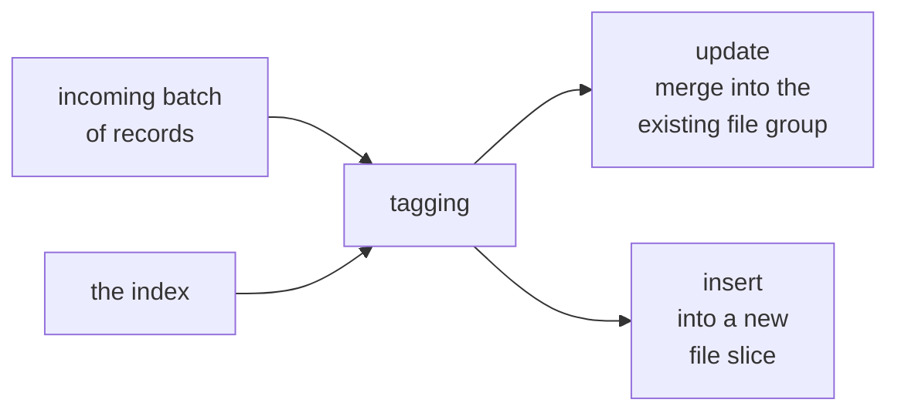

* content
{:toc}

> **TL;DR**
>
> * The index answers one question on every write: for this record key, which file group already holds it? Answering it well is what keeps upsert cost proportional to your batch instead of your table.
> * `hoodie.index.type` has no default of its own. Spark and Java fall back to `SIMPLE`, Flink to `INMEMORY`, decided in code rather than in the config file.
> * The 1.x line gives the record index two clearer names: `GLOBAL_RECORD_LEVEL_INDEX` for keys unique table-wide, and `RECORD_LEVEL_INDEX` for keys unique within a partition. `RECORD_INDEX` is the older name for the global one.
> * Each has its own enabling config and its own sizing defaults, tuned to what it stores: 10 to 10000 file groups for the global index, 1 to 10 for the partitioned one.
> * The old key `hoodie.metadata.record.index.enable` is a registered alias, so upgrades are uneventful. It resolves to the global index, so use the new names when you want the partitioned one.

There is a particular shape of complaint about upsert jobs that always turns out
to be the same thing. The job was fine in month one. By month six it takes
noticeably longer, and the batch has not grown; the table has. Somebody adds
executors, which helps for a while.

The batch is not what the job is spending its time on. Before Hudi can apply a
single update it has to find out, for every incoming key, whether that key
already exists and which file group holds it. That step is called tagging, and
on the default configuration its cost tracks the size of the table rather than
the size of the batch. Grow the table, and you grow the work that happens before
any real work starts.

Choosing an index is choosing how that lookup happens. It is one of the more
tractable decisions Hudi asks of you, because the two things that decide the
answer, how big your batches are relative to your table and how your keys are
distributed, are both things you can just look at.

Written against the **latest Hudi release, 1.2.0 as of now**, whose Spark bundles
are published for Spark 3.3 through 4.1. Every config key, default and enum value
below was read from the
[`release-1.2.0`](https://github.com/apache/hudi/tree/release-1.2.0) tag rather
than recalled, which matters here because several of these names changed across
1.1.0 and 1.2.0; where a claim is specific to a version, the version is named. Two terms used throughout: a **file
group** is the unit of record locality in a Hudi table, identified by a file ID,
and a **file slice** is one version of a file group, a base file plus any log
files written against it.

## What does the index actually decide?

Everything downstream of tagging depends on its answer: whether a record becomes
an insert into a new file slice or an update merged into an existing one, how
much data gets rewritten, and how much shuffle the write incurs.



The obvious way to do it is a join: read the record keys out of every file in
the table, join the incoming batch against them, done. That is essentially what
`SIMPLE` does, and it is correct, predictable and easy to reason about. Its cost
just happens to track the table.

Every other index type is a different strategy for skipping that scan. Hudi
ships enough of them that one will fit your key distribution.

## What are the options?

`HoodieIndex.IndexType` is the authoritative list, and it has ten values:

| Index type | Uniqueness scope | Lookup mechanism |
|:--|:--|:--|
| `INMEMORY` | partition | In-memory hash map (Spark, Java); Flink in-memory state |
| `BLOOM` | partition | Bloom filters built from record keys, optionally pruned by key ranges |
| `GLOBAL_BLOOM` | table | Same, enforced across all partitions |
| `SIMPLE` | partition | Join the batch against keys read from storage |
| `GLOBAL_SIMPLE` | table | Same, enforced across all partitions |
| `BUCKET` | partition | Hash the key to a bucket, so no lookup at all |
| `FLINK_STATE` | partition | Flink state backend, internal to the Flink writer |
| `RECORD_INDEX` | table | Key to location map in the metadata table. Deprecated in 1.2.0 |
| `GLOBAL_RECORD_LEVEL_INDEX` | table | Replacement for `RECORD_INDEX` |
| `RECORD_LEVEL_INDEX` | partition | Partition path plus key maps to a location. New in 1.1.0 |

"Global" is the word to read carefully. A global index enforces that a record
key is unique across the whole table, which also lets it move a record between
partitions when its partition value changes. A non-global index only guarantees
uniqueness inside a partition, so the same key can legitimately live in two
partitions and an update has to be told which one it means.

That is a data-model decision, not a performance one, and your schema already
answers it. If a customer row is partitioned by `country` and the customer moves
country, a global index updates the existing record and removes it from the old
partition, leaving one live row. A non-global index treats the two partitions
independently, which is the correct behaviour when a key legitimately repeats
across partitions.

One thing worth doing regardless of which you pick: write the choice down.
`hoodie.index.type` is declared with `noDefaultValue()`, and the real default is
picked in `HoodieIndexConfig.Builder#getDefaultIndexType` based on the engine:

```java
switch (engineType) {
  case SPARK:
  case JAVA:
    return HoodieIndex.IndexType.SIMPLE.name();
  case FLINK:
    return HoodieIndex.IndexType.INMEMORY.name();
  ...
}
```

So a Spark writer that never sets the key is running `SIMPLE`. That is a
reasonable place to start, and setting it explicitly costs one line and makes
the decision visible to whoever reads the config next.

## Architecture: where does the index live?

The metadata-backed indexes are the interesting ones, so it is worth being
concrete about where they sit.

Hudi keeps an internal Hudi table inside your table, at
`<base_path>/.hoodie/metadata`, from
`HoodieTableMetaClient.METADATA_TABLE_FOLDER_PATH`. It is itself a Merge-on-Read
table, which is how it absorbs high-frequency updates without rewriting
everything, and it is on by default: `hoodie.metadata.enable` has defaulted to
`true` since 0.7.0.

Each kind of metadata lives in its own partition of that table:

```
s3a://lakehouse-prod/warehouse/trips/
├── .hoodie/
│   ├── metadata/                       <- the internal metadata table
│   │   ├── files/                      <- partition to file listing
│   │   ├── column_stats/               <- per-column min/max per file
│   │   ├── bloom_filters/              <- bloom filters, for BLOOM lookups
│   │   ├── record_index/               <- record key to file group
│   │   ├── partition_stats/
│   │   ├── expr_index_<name>/
│   │   └── secondary_index_<name>/
│   └── <instant files: .commit, .deltacommit, .clean, ...>
├── city_id=sf/
│   ├── 8f3a1c92-....parquet            <- base file of one file slice
│   └── .8f3a1c92-....log.1_0-...       <- log file, Merge-on-Read
└── city_id=nyc/
```

The `record_index` partition is the key-to-location map, sharded across file
groups whose IDs are prefixed `record-index-`. Tagging with a record index is a
point lookup into those file groups rather than a scan of the data table, and
its cost scales with the incoming batch. That is the whole point.

It is worth separating the write path from the read path here, because the two
get conflated constantly. Tagging uses `record_index`. Query-side data skipping
uses `column_stats` and `partition_stats`, which let an engine prune file groups
by column ranges before reading data. Turning on a record index therefore does
nothing for query performance, and turning on column stats does nothing for
upsert cost. Same table, different partitions, separate configs.

The trade: a record index buys batch-proportional tagging at the cost of a
second table to keep consistent. Every write to the data table also writes to the
metadata table, the metadata table needs its own compaction
(`hoodie.metadata.compact.max.delta.commits`), and the index has to be
bootstrapped over existing data before it is usable.

## Which record index, global or partition-scoped?

In 0.14.0 Hudi added one record index, enabled with
`hoodie.metadata.record.index.enable`, exposed as `RECORD_INDEX`. It was global:
keys unique across the table.

1.1.0 added a partition-scoped variant, and in 1.2.0 the original enum value
carries `@Deprecated`, with the replacement named in its own description. The
configs were renamed to match, keeping the old names as registered alternatives:

| Concern | Global record index | Partitioned record index |
|:--|:--|:--|
| Index type | `GLOBAL_RECORD_LEVEL_INDEX` | `RECORD_LEVEL_INDEX` |
| Enable config | `hoodie.metadata.global.record.level.index.enable` | `hoodie.metadata.record.level.index.enable` |
| Old alias | `hoodie.metadata.record.index.enable` | none |
| Default | `false` | `false` |
| Since | 0.14.0 | 1.1.0 |
| Min file groups | 10 | 1 |
| Max file groups | 10000 | 10 |
| Uniqueness | Record key, table-wide | Partition path plus record key |

Two things to take from that table.

**The old key is an alias for the global one.** `withAlternatives` means
`hoodie.metadata.record.index.enable=true` still resolves, and it resolves to
`GLOBAL_RECORD_LEVEL_INDEX`, so nothing breaks when you upgrade. If your keys
are only unique per partition, moving to `RECORD_LEVEL_INDEX` is a two-line
change that buys a smaller index and less metadata to maintain.

**The file-group defaults are matched to what each one stores.** The global index
shards a map of every key in the table, so it floors at 10 file groups and
ceilings at 10000. The partitioned index maps keys within a partition, so its
defaults are 1 and 10. Let each keep its own defaults and the sizing looks after
itself. The one thing worth avoiding is carrying the global counts across to the
partitioned index, which creates far more file groups than the data needs.

Sizing has two more inputs, both unchanged across these releases: file groups cap
at `hoodie.metadata.record.index.max.filegroup.size` (1 GiB, because a large file
group takes longer to compact), and the estimate of how many you need multiplies
the current record count by `hoodie.metadata.record.index.growth.factor`
(`2.0`) to leave headroom.

Here is a partitioned table whose keys are unique within a city, in Spark SQL:

```sql
CREATE TABLE IF NOT EXISTS trips (
  trip_id      STRING,
  city_id      STRING,
  rider_id     STRING,
  fare_amount  DECIMAL(10,2),
  started_at   TIMESTAMP,
  updated_at   TIMESTAMP
) USING hudi
PARTITIONED BY (city_id)
LOCATION 's3a://lakehouse-prod/warehouse/trips'
TBLPROPERTIES (
  type = 'mor',
  primaryKey = 'trip_id',
  orderingFields = 'updated_at',
  -- trip_id is unique per city, not across cities, so the partition-scoped
  -- index is both the correct one and the cheaper one.
  hoodie.index.type = 'RECORD_LEVEL_INDEX',
  hoodie.metadata.enable = 'true',
  hoodie.metadata.record.level.index.enable = 'true'
);
```

If the key is a true primary key across the whole table, the same definition
takes the global pair instead:

```sql
  hoodie.index.type = 'GLOBAL_RECORD_LEVEL_INDEX',
  hoodie.metadata.enable = 'true',
  hoodie.metadata.global.record.level.index.enable = 'true'
```

Decide this when you create the table rather than later. Prefer those names over `hoodie.metadata.record.index.enable` even though the
old one still resolves, because the explicit name says which of the two indexes
you meant.

A related rename to follow rather than fix: `orderingFields` above is the SQL
spelling of `hoodie.table.ordering.fields`, which keeps
`hoodie.table.precombine.field` as an alias. On the DataFrame side
`hoodie.datasource.write.precombine.field` is marked `@Deprecated` in 1.2.0 but
still works, because `DataSourceOptions.ORDERING_FIELDS` resolves to it.

## What about bucket, bloom and simple?

The record index is not always the answer.

**`BUCKET` does no lookup at all.** It hashes the key to a fixed number of
buckets and derives the file group from the hash, so tagging costs nothing and
there is no index to maintain or bootstrap. The price is that the bucket count
becomes part of your physical layout. `hoodie.bucket.index.num.buckets` sets it
and `hoodie.bucket.index.hash.field` defaults to the record key field. Get the
count wrong and every file group is either tiny or enormous, with no incremental
way out, which is exactly why `hoodie.index.bucket.engine` offers a
consistent-hashing engine alongside the simple one: buckets can then split and
merge (`hoodie.bucket.index.split.threshold`,
`hoodie.bucket.index.merge.threshold`). Bucket index buys free tagging at the
cost of committing to a partitioning of the key space up front.

**`BLOOM` prunes candidate files instead of scanning them.** Hudi writes a bloom
filter per file, tests incoming keys against the filters, and only opens the
files that might hold a match. `hoodie.bloom.index.prune.by.ranges` narrows it
further using min and max key ranges, and `hoodie.bloom.index.use.metadata`
reads the filters from the metadata table's `bloom_filters` partition rather
than from file footers. It shines when keys are roughly ordered, because narrow
ranges let it skip most files. With random keys such as UUIDs the ranges overlap
and there is less to prune, which is where a record index takes over.

**`SIMPLE` is the dependable one.** It joins, and it has no index to bootstrap or
keep in step with the data. For small tables, or batch jobs that rewrite most of
the table anyway, that simplicity is worth more than a faster lookup.

## Which one should I pick?

A decision order that holds for most tables:

| If | Use |
|:--|:--|
| Keys are random, uniqueness is per partition | `RECORD_LEVEL_INDEX` |
| Keys are random, uniqueness is table-wide, partitions can change | `GLOBAL_RECORD_LEVEL_INDEX` |
| Very high write throughput, key space can be partitioned up front | `BUCKET` with the consistent-hashing engine |
| Keys are time-ordered or otherwise clustered | `BLOOM` |
| Small table, or you rewrite most of it every run | `SIMPLE` |
| Append-only, no updates at all | No index. Use `insert` or `bulk_insert` |

That last row is worth saying out loud, because part of choosing well is
recognising when you need less machinery. An append-only pipeline can set
`hoodie.datasource.write.operation` to `insert` or `bulk_insert`, skip tagging
entirely, and avoid maintaining a second table to answer a question whose answer
is always "not present".

On Flink, `INMEMORY` and `FLINK_STATE` are the engine defaults because the Flink
writer already holds the index in its state backend, so you get fast tagging
without configuring anything.

## How do I confirm it is working?

A well-matched index is easy to check, and each signal points at a specific
adjustment if you want one.

| What you observe | What it tells you |
|:--|:--|
| Upsert time tracks batch size, not table size | The index is doing point lookups. This is the goal |
| Upsert time tracks table size | `hoodie.index.type` is probably unset, so `SIMPLE` is in use |
| One live row per key after a partition value changes | A global index is in play, as intended for a table-wide key |
| Several rows per key across partitions | A non-global index, correct when keys repeat per partition |
| Metadata compaction is a small share of write time | Record-index file groups are sized well |
| Bloom index pruning most files | Your keys are ordered enough for range pruning to pay off |

Two checks worth building into a review. Read the table's `hoodie.properties`
alongside the writer configs and confirm `hoodie.index.type` is a value somebody
chose. Then list `<base_path>/.hoodie/metadata/record_index/` and count file
groups: a handful for a partitioned index, and tens to hundreds for a global one
on a large table, is the shape you want.

## Frequently asked questions

**Can I change the index type on an existing table?**
Not casually. The index is how Hudi locates existing records, so switching types
means the new index has to be built over the data already there. Plan it as a
migration with a bootstrap step, not as a config edit between two runs.

**Does a record index speed up my queries?**
No. Tagging is a write-path concern. Query-side skipping comes from
`column_stats` and `partition_stats`, and from secondary indexes for non-key
columns. They are separate partitions of the metadata table with separate
configs.

**My keys are UUIDs. Is `BLOOM` a bad idea?**
It works, it just has less to prune. Bloom pruning leans on key ranges being
narrow enough to skip files, and random keys spread across every range. That is
the case a record index was built for.

**Do I need to turn the metadata table on separately?**
`hoodie.metadata.enable` has defaulted to `true` since 0.7.0, so usually not. You
do need to enable the specific index you want, since both record-index enable
flags default to `false`.

**What happens if I set `RECORD_INDEX` in 1.2.0?**
It still works. It is deprecated, not removed, and it means the global index.
`GLOBAL_RECORD_LEVEL_INDEX` is the same thing under the name you should be
writing now.

## Conclusion

Back to the job that got slower as the table grew. The reframe that makes that
tractable is to stop thinking about index types and ask one question instead:
does this write's cost track my batch, or my table? If write time stays flat
while the table grows, the index is doing its job and you can spend your tuning
attention somewhere else. If it climbs with the table, tagging is scanning, and
the table above tells you what to reach for.

The 1.2.0 naming is a real improvement worth adopting. `RECORD_INDEX` and
`hoodie.metadata.record.index.enable` keep working, so the upgrade is
uneventful, and the new pair makes the choice explicit: `GLOBAL_RECORD_LEVEL_INDEX`
when a key identifies a row across the whole table, `RECORD_LEVEL_INDEX` when it
identifies a row within a partition. Partitioned tables get the cheaper index
and a much smaller metadata footprint for two config lines.

Treat the decision order here as a starting point and then measure on your own
data. Both inputs, your batch size relative to your table and how your keys are
distributed, are things you can observe directly rather than guess at, which is
what makes this one of the friendlier tuning decisions Hudi puts in front of you.

## References

* [Hudi indexing documentation](https://hudi.apache.org/docs/indexes) for the conceptual overview and engine support
* [`HoodieIndex.java` at release-1.2.0](https://github.com/apache/hudi/blob/release-1.2.0/hudi-client/hudi-client-common/src/main/java/org/apache/hudi/index/HoodieIndex.java), the authoritative `IndexType` list and the deprecation note
* [`HoodieMetadataConfig.java` at release-1.2.0](https://github.com/apache/hudi/blob/release-1.2.0/hudi-common/src/main/java/org/apache/hudi/common/config/HoodieMetadataConfig.java) for the record-index keys, aliases and file-group defaults
* [`HoodieIndexConfig.java` at release-1.2.0](https://github.com/apache/hudi/blob/release-1.2.0/hudi-client/hudi-client-common/src/main/java/org/apache/hudi/config/HoodieIndexConfig.java) for `hoodie.index.type` and the per-engine default
* [Hudi metadata table documentation](https://hudi.apache.org/docs/metadata/) for the partitions under `.hoodie/metadata` and their compaction
