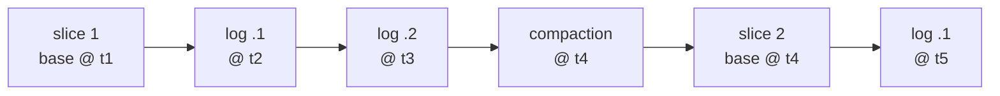

* content
{:toc}

> **TL;DR**
>
> * Merge-on-Read appends each write to a log file beside the base Parquet file instead of rewriting it. The base file plus its logs, at a moment in time, is a file slice.
> * A log file is not a Parquet file. It is a Hudi container of blocks separated by the marker `#HUDI#`, and one of the seven block types exists purely to mark an earlier block as rolled back.
> * The same file slice answers three different questions. `snapshot` merges base plus logs, `read_optimized` reads only the base file, and `hudi_table_changes` returns what changed between two instants.
> * Compaction folds the logs back into a new base file, and for Spark writers it is opt-in: `hoodie.compact.inline` defaults to `false`. Deciding who runs it is the one setup step the table asks of you.
> * `hudi_filesystem_view` gives you the health check in one query: it reports log file count and unscheduled log size per file group.

The question I hear most often about Merge-on-Read goes something like this. The
writes are great. A change stream lands every minute, the job finishes in
seconds, nobody is rewriting hundred-megabyte Parquet files any more. But the
dashboards on the same table have been getting a little slower each week, and
nothing in the pipeline changed.

Nothing is broken when that happens. Merge-on-Read is doing exactly what it
promises: it takes the cost of an update off the writer and puts it somewhere
else. The useful thing to know is precisely where that somewhere else is, and
that Hudi leaves one decision about it to you rather than making it silently.

So let us open the format up. By the end you should be able to read a
Merge-on-Read directory listing and say which writes are still waiting to be
compacted, pick a compaction trigger from how your writes actually arrive, and
predict what each query type will return before you run it.

Written against the **latest Hudi release, 1.2.0 as of now**, whose Spark bundles
cover Spark 3.3 through 4.1. Every config key, default, enum value and on-disk
path below was read from that release's tag rather than recalled, and where a
claim is specific to a version the version is named. Useful background: the Hudi
[table types](https://hudi.apache.org/docs/table_types) page.

## Architecture: what the table looks like on disk

Start with the artefact, because it answers most of the questions by itself.
Here is one partition of a trips table:

```
s3a://lakehouse-prod/warehouse/trips/city_id=sf/
├── 8f3a1c92-4f1e-4c77-9a2b-4b1d2e3f4a5b-0_0-24-1893_20260915090000123.parquet
├── .8f3a1c92-4f1e-4c77-9a2b-4b1d2e3f4a5b-0_20260915090000123.log.1_0-31-2104
└── .8f3a1c92-4f1e-4c77-9a2b-4b1d2e3f4a5b-0_20260915090000123.log.2_0-38-2415
```

One Parquet file and two log files, and all three share the leading UUID. That
UUID is the **file ID**, and it names a **file group**: Hudi's unit of record
locality. Once a record key lands in a file group, every later update to that
key goes to the same group. That is the whole reason an update can be a local
operation rather than a table-wide one.

Read the log file name left to right and it explains itself. `HoodieLogFile`
sets `LOG_FILE_PREFIX` to `.`, which is why log files are hidden from a plain
listing, and why a casual `ls` on a Merge-on-Read partition can look exactly
like Copy-on-Write. Then the file ID, then the **base instant time** the log was
written against, then `.log` from `DELTA_EXTENSION`, a version number, and a
write token.

That base instant in the log name is the piece doing the real work. It ties each
log to its base file, which is how a reader assembles the pair without relying
on any directory convention. Base file plus its logs at a moment in time is a
**file slice**, and a new base file starts a new slice:



## Why append instead of rewriting the file?

Because of what the alternative costs. Copy-on-Write, Hudi's other table type,
applies a correction to one trip by reading the Parquet file that holds it,
merging the change, and writing a whole new file. Change one row in a 120 MB
file and you have written 120 MB.

That is a perfectly good trade when writes are occasional and reads are
constant. It stops being a good trade when the change stream delivers every
minute, because then you are rewriting a large share of the table every minute,
and each rewrite is competing with the batch behind it.

Merge-on-Read takes the opposite side. The change is appended beside the base
file and the write returns. Nothing large is rewritten. The cost moves to the
reader, which now reconciles base with logs, and to a compaction job that
eventually folds the logs back into a fresh base file.

One sentence worth carrying: **Merge-on-Read buys low write latency at the cost
of read-side merge work and a compaction job somebody operates.**

## What is actually inside a log file?

This is where Merge-on-Read stops resembling anything else on the lake, and
opening it up explains several behaviours that otherwise look arbitrary.

A Hudi log file is a container of blocks. `HoodieLogFormat` separates them with
a six-byte magic marker:

```java
byte[] MAGIC = new byte[] {'#', 'H', 'U', 'D', 'I', '#'};
```

Each block carries a type, a header map, a payload and a footer. `HoodieLogBlockType`
has seven values:

| Block type | What it carries |
|:--|:--|
| `AVRO_DATA_BLOCK` | Records in Avro, the default row-oriented payload |
| `HFILE_DATA_BLOCK` | Records in HFile, key-ordered for point lookups |
| `PARQUET_DATA_BLOCK` | Records in Parquet, a columnar payload inside the log |
| `DELETE_BLOCK` | Keys deleted since the base file |
| `CDC_DATA_BLOCK` | Change-data-capture records for incremental consumers |
| `COMMAND_BLOCK` | An instruction rather than data, used to roll back an earlier block |
| `CORRUPT_BLOCK` | A block that failed to parse, kept so the reader can step over it |

Two of those repay a second look.

**`COMMAND_BLOCK` is how rollback works without deleting anything.** A failed
write leaves its blocks sitting in the log. Instead of rewriting the log to
remove them, Hudi appends a command block naming the instant to invalidate, and
readers skip the blocks it points at. Append-only storage stays append-only, and
rollback stays a metadata operation.

**`CORRUPT_BLOCK` is a deliberate choice, not an accident.** A truncated write on
object storage leaves a partial block behind. Rather than failing the read, the
reader classifies it as corrupt and scans forward to the next magic marker. One
bad append does not cost you the file.

The block headers carry what a reader needs to reconcile. `HeaderMetadataType`
includes `INSTANT_TIME`, `TARGET_INSTANT_TIME`, `SCHEMA`,
`COMMAND_BLOCK_TYPE`, `COMPACTED_BLOCK_TIMES`, `RECORD_POSITIONS`,
`BLOCK_IDENTIFIER`, `IS_PARTIAL` and `BASE_FILE_INSTANT_TIME_OF_RECORD_POSITIONS`.

`SCHEMA` in that list is why schema evolution survives the read path: a block
written under an older schema carries that schema along with it, so a reader on
the current schema can still interpret it. `RECORD_POSITIONS` enables positional
merging, where a reader applies changes by position instead of joining on the
record key.

Block size is bounded by `hoodie.logfile.data.block.max.size` at 256 MiB, and
the log file itself rolls over at `hoodie.logfile.max.size`, 1 GiB.

## What do the three query types return?

A file slice does not have one answer. It has three, and Hudi asks you to say
which one you want:

| Query type | What it reads | Freshness | Cost |
|:--|:--|:--|:--|
| `snapshot` (default) | Base file merged with its logs | Latest committed state | Pays the merge |
| `read_optimized` | Base file only | As of the last compaction | A plain Parquet read |
| Incremental | Records changed between two instants | A window, not a state | Scales with the change |

In Spark SQL the first two come from the `hudi_query` table-valued function,
whose second argument accepts exactly `snapshot` or `read_optimized`:

```sql
-- Everything committed, including whatever is still sitting in log files.
SELECT count(*) FROM hudi_query('trips', 'snapshot');

-- Base files only: misses everything written since the last compaction, and in
-- exchange reads like ordinary Parquet with no merge.
SELECT count(*) FROM hudi_query('trips', 'read_optimized');
```

Incremental reads are a separate function, because they take an instant range
rather than a mode:

```sql
-- What changed after this instant. 'earliest' is also accepted as a start.
SELECT trip_id, city_id, fare_amount, status, updated_at
FROM hudi_table_changes('trips', 'latest_state', '20260915090000123');
```

The gap between the first two counts is exactly the set of writes not yet
compacted, which turns the pair into a free diagnostic. Equal counts mean
compaction has caught up. A gap that widens week over week is the slow dashboard
from the top of this post, showing up as a number before anyone complains.

On a Copy-on-Write table the two are always identical, because there are no logs
to merge. Worth remembering when somebody reports that `read_optimized` "does
nothing": on Copy-on-Write, correctly, it does nothing.

## Who runs compaction?

Compaction reads a file slice, merges the base file with its logs, and writes a
new base file that begins the next slice. It is scheduled on the timeline as a
`compaction` action and moves through `.requested`, `.inflight` and completed
like any other Hudi action.

Here are the defaults that decide when that happens:

```
hoodie.compact.inline                     false
hoodie.compact.inline.max.delta.commits   5
hoodie.compact.inline.max.delta.seconds   3600
hoodie.compact.inline.trigger.strategy    NUM_COMMITS
hoodie.compaction.strategy                LogFileSizeBasedCompactionStrategy
hoodie.compaction.target.io               512000
```

The first line is the one to notice. `hoodie.compact.inline` is `false`, so a
Spark writer on the defaults never compacts as part of the write. Something else
has to: an async compaction service, a scheduled offline job, or simply turning
inline compaction on. This is the decision Hudi hands you rather than guessing,
and it is a sensible thing to leave open, because on a busy table you usually do
not want compaction sharing a critical path with ingestion.

Inline is the simplest answer, and it goes in the table definition:

```sql
CREATE TABLE IF NOT EXISTS trips (
  trip_id      STRING,
  city_id      STRING,
  driver_id    STRING,
  fare_amount  DECIMAL(10,2),
  status       STRING,
  updated_at   TIMESTAMP
) USING hudi
PARTITIONED BY (city_id)
LOCATION 's3a://lakehouse-prod/warehouse/trips'
TBLPROPERTIES (
  type = 'mor',
  primaryKey = 'trip_id',
  orderingFields = 'updated_at',
  -- Compact inside the writer every fifth delta commit. Easy to reason about,
  -- and it makes every fifth write noticeably slower.
  hoodie.compact.inline = 'true',
  hoodie.compact.inline.max.delta.commits = '5',
  hoodie.compact.inline.trigger.strategy = 'NUM_COMMITS'
);
```

Off the write path, the procedures do the same job on your schedule:

```sql
-- What is pending, and how much of it is there?
CALL show_compaction(table => 'trips', limit => 10);

-- Schedule a compaction instant, then execute it. `op` selects the phase.
CALL run_compaction(op => 'schedule', table => 'trips');
CALL run_compaction(op => 'run', table => 'trips');
```

Inline compaction buys operational simplicity at the cost of latency on the
triggering commit. Async or offline compaction buys steady write latency at the
cost of a second thing to schedule and watch.

## When should compaction trigger?

`CompactionTriggerStrategy` offers five options, and the right one
usually falls straight out of how your writes arrive:

| Strategy | Triggers when | Suits |
|:--|:--|:--|
| `NUM_COMMITS` | N delta commits since the last completed compaction | Steady, predictable write frequency |
| `NUM_COMMITS_AFTER_LAST_REQUEST` | N delta commits since the last completed or requested compaction | Keeps the queue bounded when compaction lags |
| `TIME_ELAPSED` | N seconds since the last compaction | Irregular or bursty writes |
| `NUM_AND_TIME` | Both conditions met | Conservative, compacts less often |
| `NUM_OR_TIME` | Either condition met | Responsive, compacts more often |

The difference between the first two only shows up when compaction is falling
behind. Under `NUM_COMMITS`, requests keep being scheduled because none have
*completed*, and the backlog grows. Counting from the last request instead keeps
the queue bounded, which is why it is the safer choice on a table that has ever
lagged.

A second knob decides *what* gets compacted in one run.
`hoodie.compaction.strategy` defaults to `LogFileSizeBasedCompactionStrategy`,
taking the file groups with the largest total log size first, bounded by
`hoodie.compaction.target.io`. That bound is in MB and defaults to `512000`, or
500 GB per run, so on most tables the default means "everything eligible". When
that is too blunt, `LogFileNumBasedCompactionStrategy` sorts by log file count,
`DayBasedCompactionStrategy` and `PartitionRegexBasedCompactionStrategy` scope
by partition, and `CompositeCompactionStrategy` chains several together.

The arithmetic you actually need is simple. Divide your commit frequency by your
trigger and you have the worst staleness a `read_optimized` reader will ever
see. Commits every minute with `max.delta.commits = 5` means that reader is at
most five minutes behind, and a `snapshot` query merges at most five log files.

## How do I tell the table is healthy?

One query answers it. `hudi_filesystem_view` reports the physical state of every
file group, and its schema (from `FileSystemRelation`) is exactly the set of
columns this question needs:

```sql
SELECT File_ID,
       Partition_Path,
       Base_Instant_Time,
       Log_File_Count,
       Log_File_Scheduled,
       Log_File_Unscheduled
FROM hudi_filesystem_view('trips')
ORDER BY Log_File_Unscheduled DESC
LIMIT 20;
```

`Log_File_Unscheduled` is the column to watch: log bytes that no compaction has
even been planned for yet. A small, steady number across file groups means the
trigger matches the write rate. A number that climbs week over week means
compaction is not keeping up, and it climbs long before anyone notices a slow
query.

A healthy Merge-on-Read table has a handful of recognisable properties:

| What you observe | What it tells you |
|:--|:--|
| `snapshot` and `read_optimized` counts converge after each compaction | Compaction is keeping up |
| `Log_File_Count` per file group stays bounded | The trigger strategy matches your write rate |
| Write latency flat with periodic spikes | Inline compaction, working as configured |
| Write latency flat with no spikes, logs still bounded | Async compaction, working |
| `compaction` instants completing on the timeline regularly | The job really is running |

Put one of these on a schedule rather than running it when somebody complains,
because this signal is a quiet one. Nothing raises an error when compaction
stops; `snapshot` queries simply merge a little more each hour.

## When is Copy-on-Write the better choice?

Merge-on-Read is not Hudi's default: `type` defaults to `cow`. That is the right
default for plenty of tables, and picking it deliberately is a good outcome too.

If writes arrive a few times a day, there is not much to win. Copy-on-Write
rewrites base files on each write, but a handful of rewrites a day is cheap, and
every read is then a plain Parquet scan with no merge and no compaction job in
the picture.

If reads vastly outnumber writes and have to be fast, Copy-on-Write puts the
cost where you have the most slack. Merge-on-Read moves work from the rare
operation to the frequent one, which is the wrong direction for a table read
constantly and written nightly.

And if no one is going to own the compaction job yet, Copy-on-Write is the
kinder choice. You can always convert later once someone does.

Merge-on-Read earns its keep when writes are frequent, each batch is small
relative to the table, and either you can absorb the merge on read or your
heaviest consumers are happy on `read_optimized`.

## Frequently asked questions

**Why does my Merge-on-Read partition look like Copy-on-Write?**
Log files begin with a dot, so most listings hide them. Use
`hudi_filesystem_view` instead of a directory listing and the log file counts
appear.

**Do I have to compact to read the latest data?**
No. A `snapshot` query always returns the latest committed state, compacted or
not. Compaction changes what that read costs, not what it returns.

**Can I query a Merge-on-Read table from Trino or Athena?**
Yes, and which query type you get depends on the table name the engine was
given. Hive sync registers a Merge-on-Read table under two names, and
`HiveSyncTool` spells the suffixes out: `_rt` serves snapshot reads and `_ro`
serves read-optimized reads. If an external engine looks a commit behind, check
which of the two the catalog handed it.

**What happens if a compaction job fails halfway?**
Nothing a reader can see. Compaction is an instant on the timeline like any
other, so an incomplete run sits at `.inflight` and the base file it was going
to replace is untouched. Hudi rolls failed instants back, and `HoodieCompactor`
takes `--retry-last-failed-job` to roll back and re-execute the last failed plan
rather than planning a new one.

**Should I change `hoodie.logfile.max.size`?**
Rarely. At 1 GiB the default rolls a log file over long before it becomes
unwieldy, and lowering it mostly produces more small files for compaction to
deal with.

**Does the metadata table matter here?**
More than on Copy-on-Write. Planning a Merge-on-Read query means resolving file
slices across base and log files, and the metadata table is what keeps that
listing work off the critical path.

## Conclusion

Back to the dashboards getting slower. In almost every case the table was
working precisely as designed, and the one decision Merge-on-Read asks for,
who runs compaction, had never quite been made. Once it was, the curve went flat
and stayed flat.

The design underneath is worth knowing because it turns a set of odd-looking
behaviours into a single idea. Log files hide behind a leading dot. Rollback
deletes nothing, it appends a command block. A truncated write does not break a
read, because corrupt blocks are a first-class block type. Schema evolution
survives the log, because every block carries the schema it was written under.
All of that follows from one choice: an append-only container instead of
mutation in place.

If you are setting up a Merge-on-Read table this week, two decisions carry most
of the outcome, and both are above. Pick a compaction trigger that matches how
your writes actually arrive, and decide which consumers need `snapshot` and
which are perfectly happy on `read_optimized`. Get those right and the table
stays flat and predictable for a long time.

## References

* [Hudi table types](https://hudi.apache.org/docs/table_types) for Copy-on-Write versus Merge-on-Read and the query types each supports
* [Hudi compaction documentation](https://hudi.apache.org/docs/compaction/) for inline, async and offline scheduling
* [`HoodieLogBlock.java` at release-1.2.0](https://github.com/apache/hudi/blob/release-1.2.0/hudi-common/src/main/java/org/apache/hudi/common/table/log/block/HoodieLogBlock.java), the block types and header metadata described above
* [`HoodieCompactionConfig.java` at release-1.2.0](https://github.com/apache/hudi/blob/release-1.2.0/hudi-client/hudi-client-common/src/main/java/org/apache/hudi/config/HoodieCompactionConfig.java) for every compaction key and its default
* [Open table formats in practice]() for how this compares with Iceberg and Delta Lake
