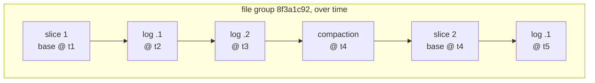

* content
{:toc}

> **TL;DR**
>
> * Merge-on-Read splits a table's data into file groups. Each group holds a base Parquet file plus append-only log files, and that pair at a point in time is a file slice. A write appends a log block instead of rewriting the base file.
> * A log file is not a Parquet file. It is a Hudi container: blocks separated by the magic marker `#HUDI#`, each block carrying a type, headers and a payload. In 1.2.0 there are seven block types, and one of them exists purely to mark a previous block as rolled back.
> * The three query types are three different reconciliations of the same file slice. `snapshot` merges base plus logs, `read_optimized` reads only the base file, and `incremental` returns records changed between two instants.
> * Compaction is what turns logs back into a base file, and it is off by default for Spark writers: `hoodie.compact.inline` defaults to `false`. Something has to run it.
> * The knob that decides how much read-side work you are buying is `hoodie.compact.inline.max.delta.commits`, which defaults to `5`.

## The problem Merge-on-Read solves

Take a table of ride events on object storage, updated by a change stream. A
correction arrives for one trip. With Copy-on-Write, Hudi's other table type,
applying it means reading the Parquet file that holds the trip, merging the
change, and writing a whole new file. For one changed row in a 120 MB file, you
have rewritten 120 MB.

That is a fine trade when writes are infrequent and reads are constant. It stops
being fine when the change stream delivers every minute, because you now rewrite
a large share of your table every minute, and each rewrite competes with the next
batch.

Merge-on-Read makes the opposite trade. The change is appended to a log file
beside the base file and the write returns. Nothing large is rewritten. The cost
moves to the reader, which now has to reconcile the base file with any logs, and
to a background job that eventually folds the logs back into a new base file.

The sentence worth carrying: **Merge-on-Read buys low write latency at the cost
of read-side merge work and a compaction job you have to operate.**

This guide is written against **Hudi 1.2.0**, whose Spark bundles cover Spark 3.3
through 4.1. Every config key, default, enum value and on-disk path below was read
from the `release-1.2.0` tag while writing.

Prerequisites: the Hudi [table types](https://hudi.apache.org/docs/table_types)
page and comfort with Spark. Terms specific to Hudi are defined on first use.

By the end you should be able to read a Merge-on-Read directory listing and say
which writes are pending compaction, choose a compaction trigger from your write
frequency, and predict what each of the three query types will return.

## Architecture: the units on disk

Four terms carry the whole design, and they nest.

A **file group** is Hudi's unit of record locality, identified by a file ID that
does not change for the life of the group. Once a record key lands in a file
group, updates to that key go to the same group. That is what makes an update a
local operation rather than a table-wide one.

A **file slice** is one version of a file group: a base file plus any log files
written against it. A new base file starts a new slice.

A **base file** is columnar, Parquet by default, and holds the merged state as of
the instant that produced it.

A **log file** holds changes written since that base file. It is append-only,
row-oriented, and named to sort alongside its base file.



On disk this is visible directly. A partition of a Merge-on-Read table looks like
this, and the naming is mechanical:

```
s3a://lakehouse-prod/warehouse/trips/city_id=sf/
├── 8f3a1c92-4f1e-4c77-9a2b-4b1d2e3f4a5b-0_0-24-1893_20260915090000123.parquet
├── .8f3a1c92-4f1e-4c77-9a2b-4b1d2e3f4a5b-0_20260915090000123.log.1_0-31-2104
└── .8f3a1c92-4f1e-4c77-9a2b-4b1d2e3f4a5b-0_20260915090000123.log.2_0-38-2415
```

Read the log file name left to right. `HoodieLogFile` sets `LOG_FILE_PREFIX` to
`.`, which is why log files are hidden from a naive listing and why a plain `ls`
on a Merge-on-Read partition looks deceptively like Copy-on-Write. Then comes the
file ID, an underscore, the **base instant time** the log is written against,
the `.log` extension from `DELTA_EXTENSION`, a version number, and a write token.

The base instant in the log file name is the thing to notice: it ties the log to
its base file, which is how a reader assembles a slice without a directory
convention.

## What is actually inside a log file

This is where Merge-on-Read stops resembling anything else, and it is worth
opening because it explains several behaviours that look strange from outside.

A Hudi log file is a container of blocks. `HoodieLogFormat` defines the separator
as a six-byte magic marker:

```java
byte[] MAGIC = new byte[] {'#', 'H', 'U', 'D', 'I', '#'};
```

Each block carries a type, a header map, a payload and a footer. In 1.2.0 the
`HoodieLogBlockType` enum has seven values:

| Block type | What it carries |
|:--|:--|
| `AVRO_DATA_BLOCK` | Records in Avro, the default row-oriented payload |
| `HFILE_DATA_BLOCK` | Records in HFile, key-ordered for point lookups |
| `PARQUET_DATA_BLOCK` | Records in Parquet, columnar payload inside the log |
| `DELETE_BLOCK` | Keys deleted since the base file |
| `CDC_DATA_BLOCK` | Change-data-capture records for incremental consumers |
| `COMMAND_BLOCK` | An instruction rather than data, used to roll back a previous block |
| `CORRUPT_BLOCK` | A block that failed to parse, preserved so the reader can skip it |

Two of these repay attention.

**`COMMAND_BLOCK` is how rollback works without deleting anything.** A failed
write leaves its blocks in the log. Rather than rewriting the log to remove them,
Hudi appends a command block that names the instant to invalidate, and the
reader skips the blocks it points at. Append-only storage stays append-only, and
rollback stays a metadata operation.

**`CORRUPT_BLOCK` is a deliberate design choice.** A truncated write on object
storage leaves a partial block. Rather than failing the read, the reader
classifies it as corrupt and moves to the next magic marker. One bad append does
not cost you the file.

Block headers carry the metadata a reader needs to reconcile. The
`HeaderMetadataType` enum in 1.2.0 includes `INSTANT_TIME`,
`TARGET_INSTANT_TIME`, `SCHEMA`, `COMMAND_BLOCK_TYPE`, `COMPACTED_BLOCK_TIMES`,
`RECORD_POSITIONS`, `BLOCK_IDENTIFIER`, `IS_PARTIAL` and
`BASE_FILE_INSTANT_TIME_OF_RECORD_POSITIONS`.

`SCHEMA` in the header is the reason schema evolution works on the read path: a
log block written under an older schema carries that schema with it, so a reader
on the current schema can still interpret it. `RECORD_POSITIONS` supports
positional merging, which lets a reader apply changes by position rather than by
joining on the record key.

Block size is bounded by `hoodie.logfile.data.block.max.size`, which defaults to
256 MiB, and the log file itself rolls over at `hoodie.logfile.max.size`, default
1 GiB.

## The three query types

A file slice does not have one answer. It has three, and Hudi makes you choose
which one you want. The values come from `DataSourceReadOptions`:

| `hoodie.datasource.query.type` | What it reads | Freshness | Cost |
|:--|:--|:--|:--|
| `snapshot` (default) | Base file merged with its log files | Latest committed state | Pays the merge |
| `read_optimized` | Base file only | As of the last compaction | Plain Parquet read |
| `incremental` | Records changed between two instants | A window, not a state | Proportional to the change |

The same table, queried three ways:

```python
base_path = "s3a://lakehouse-prod/warehouse/trips"

# snapshot: everything committed, including uncompacted log files
snapshot = spark.read.format("hudi").load(base_path)

# read_optimized: base files only. Misses everything since the last compaction,
# and in exchange reads like ordinary Parquet.
read_opt = (spark.read.format("hudi")
    .option("hoodie.datasource.query.type", "read_optimized")
    .load(base_path))

# incremental: just what changed after a given instant
changed = (spark.read.format("hudi")
    .option("hoodie.datasource.query.type", "incremental")
    .option("hoodie.datasource.read.begin.instanttime", "20260915090000123")
    .load(base_path))
```

The gap between `snapshot` and `read_optimized` is exactly the set of writes not
yet compacted, which makes the pair a useful diagnostic. If the two return
different counts, you are looking at pending compaction work:

```python
print("snapshot rows:      ", snapshot.count())
print("read-optimized rows:", read_opt.count())
# A widening gap over time means compaction is not keeping up.
```

On a Copy-on-Write table the two are always identical, because there are no log
files. That is worth remembering when someone reports that `read_optimized`
"does nothing": on Copy-on-Write, correctly, it does nothing.

## Compaction: turning logs back into a base file

Compaction reads a file slice, merges the base file with its log files, and
writes a new base file that starts the next slice. It is scheduled on the
timeline as a `compaction` action and runs like any other Hudi action, through
`.requested`, `.inflight` and completed states.

### It does not run by default

The most consequential default in this whole post:

```
hoodie.compact.inline                     false
hoodie.compact.inline.max.delta.commits   5
hoodie.compact.inline.max.delta.seconds   3600
hoodie.compact.inline.trigger.strategy    NUM_COMMITS
hoodie.compaction.strategy                LogFileSizeBasedCompactionStrategy
hoodie.compaction.target.io               512000
```

`hoodie.compact.inline` is `false`, so a Spark writer using the defaults never
compacts as part of the write. Something else must do it: an async compaction
service, a scheduled offline job, or turning inline compaction on. A
Merge-on-Read table whose logs grow forever is almost always a table where nobody
made that choice explicitly.

### Choosing when it triggers

`CompactionTriggerStrategy` in 1.2.0 offers five options, and the right one falls
out of how your writes arrive:

| Strategy | Triggers when | Suits |
|:--|:--|:--|
| `NUM_COMMITS` | N delta commits since the last completed compaction | Steady, predictable write frequency |
| `NUM_COMMITS_AFTER_LAST_REQUEST` | N delta commits since the last completed **or requested** compaction | Avoids piling up requests when compaction lags |
| `TIME_ELAPSED` | N seconds since the last compaction | Irregular or bursty writes |
| `NUM_AND_TIME` | Both conditions met | Conservative, compacts less often |
| `NUM_OR_TIME` | Either condition met | Responsive, compacts more often |

The difference between `NUM_COMMITS` and `NUM_COMMITS_AFTER_LAST_REQUEST` only
shows up when compaction is falling behind. With `NUM_COMMITS`, requests keep
being scheduled because none have *completed*, and the backlog grows. Counting
from the last request instead keeps the queue bounded.

### Choosing what it compacts

`hoodie.compaction.strategy` decides which file slices are in scope for one run,
which matters because compacting everything at once on a large table is rarely
what you want. 1.2.0 ships several, and the default is
`LogFileSizeBasedCompactionStrategy`:

| Strategy | Picks slices by |
|:--|:--|
| `LogFileSizeBasedCompactionStrategy` | Largest total log size first, bounded by target IO. The default |
| `LogFileNumBasedCompactionStrategy` | Most log files first |
| `BoundedIOCompactionStrategy` | Whatever fits in the IO budget |
| `UnBoundedCompactionStrategy` | Everything pending |
| `DayBasedCompactionStrategy` | Most recent day partitions first |
| `PartitionRegexBasedCompactionStrategy` | Partitions matching a pattern |
| `BoundedPartitionAwareCompactionStrategy` | Recent partitions, within an IO bound |
| `CompositeCompactionStrategy` | Several of the above, chained |

The IO bound is `hoodie.compaction.target.io`, in MB, defaulting to `512000`,
which is 500 GB per compaction run. On a table far smaller than that, the default
effectively means "compact everything eligible".

### Running it

Inline, where compaction happens as part of the write:

```python
hudi_options = {
    "hoodie.table.name": "trips",
    "hoodie.datasource.write.table.type": "MERGE_ON_READ",
    "hoodie.datasource.write.recordkey.field": "trip_id",
    "hoodie.datasource.write.partitionpath.field": "city_id",
    "hoodie.datasource.write.operation": "upsert",

    # Compact within the writer every 5 delta commits. Simple to reason about,
    # and it makes every fifth write noticeably slower.
    "hoodie.compact.inline": "true",
    "hoodie.compact.inline.max.delta.commits": "5",
    "hoodie.compact.inline.trigger.strategy": "NUM_COMMITS",
}

(trips_df.write.format("hudi")
    .options(**hudi_options)
    .mode("append")
    .save(base_path))
```

Or on demand, through the SQL procedures, which is the better fit when you want
compaction off the write path:

```sql
-- What is pending? Parameters are table (or path) and limit.
CALL show_compaction(table => 'trips', limit => 10);

-- Schedule a compaction instant, then execute it. `op` selects the phase.
CALL run_compaction(op => 'schedule', table => 'trips');
CALL run_compaction(op => 'run', table => 'trips');
```

Inline compaction buys operational simplicity at the cost of write latency on
the triggering commit. Async or offline compaction buys steady write latency at
the cost of a second thing to schedule and monitor.

## A worked sequence

Following one file group through five writes makes the mechanics concrete. Times
are instants on the timeline, and the table is configured with
`hoodie.compact.inline.max.delta.commits = 5`.

| Instant | Action | On disk in the file group | `snapshot` sees | `read_optimized` sees |
|:--|:--|:--|:--|:--|
| t1 | `deltacommit` | base file @ t1 | t1 | t1 |
| t2 | `deltacommit` | base @ t1, log .1 | t1 + t2 | t1 |
| t3 | `deltacommit` | base @ t1, logs .1 .2 | t1 + t2 + t3 | t1 |
| t4 | `deltacommit` | base @ t1, logs .1 .2 .3 | through t4 | t1 |
| t5 | `deltacommit` then `compaction` | base @ t5, new slice | through t5 | t5 |

Two things to take from the table. The `read_optimized` column stays frozen at
t1 for four commits, which is the freshness cost of reading base files only. And
the log count grows monotonically until compaction, which is the read cost of
`snapshot` growing with it.

If your dashboards can tolerate data as of the last compaction, pointing them at
`read_optimized` removes the merge from your most frequent queries and leaves
`snapshot` for the consumers that genuinely need the latest state.

The practical way to use the table above is to run it with your own numbers.
Divide your commit frequency by your compaction trigger and you have the maximum
staleness a `read_optimized` reader will ever see: commits every minute with
`max.delta.commits = 5` means that reader is at most five minutes behind, and at
most five log files are merged on any `snapshot` query.

## Confirming it is healthy

A Merge-on-Read table behaving well has a few observable properties, and each has
a direct check.

| What you observe | What it tells you |
|:--|:--|
| `snapshot` and `read_optimized` counts converge after each compaction | Compaction is keeping up |
| Log file count per file group stays bounded | The trigger strategy matches your write rate |
| Write latency flat, with periodic spikes | Inline compaction, working as configured |
| Write latency flat, no spikes, logs still bounded | Async compaction, working |
| A `compaction` instant completing on the timeline regularly | The job is actually running |

Two commands worth putting in a runbook. List the timeline and look for
completed `compaction` instants:

```sql
CALL show_compaction(table => 'trips');
```

And count log files in a busy partition. A handful per file group is normal; tens
means the trigger is too loose or compaction is not running:

```bash
aws s3 ls s3a://lakehouse-prod/warehouse/trips/city_id=sf/ --recursive \
  | grep -c '\.log\.'
```

The failure you are looking for is quiet rather than loud. Nothing errors when
compaction stops; `snapshot` queries simply get slower every hour as each read
merges more log blocks. That is why the count comparison above is worth
scheduling rather than running only when someone complains.

## When Copy-on-Write is the better choice

Merge-on-Read is not the default table type in Hudi:
`hoodie.datasource.write.table.type` defaults to Copy-on-Write. That is the right
default for a lot of tables.

If writes arrive a few times a day, there is little to gain. Copy-on-Write
rewrites base files on each write, but a handful of rewrites a day is cheap, and
in exchange every read is a plain Parquet scan with no merge and no compaction
job to operate.

If reads vastly outnumber writes and must be fast, Copy-on-Write puts the cost
where you have the most slack. Merge-on-Read moves work from the rare operation
to the frequent one, which is the wrong direction for a table read constantly and
written nightly.

And if nobody will own the compaction job, choose Copy-on-Write. A Merge-on-Read
table without compaction degrades steadily and silently, and "we will set up
async compaction later" is a decision with an expiry date.

Merge-on-Read earns its keep when writes are frequent, the batches are small
relative to the table, and either you can tolerate the merge on read or your main
consumers can read `read_optimized`.

## Production tips

* **Decide who runs compaction before going to production.** `hoodie.compact.inline` is `false` by default, so absent a decision, nobody does.
* **Match the trigger strategy to your write pattern.** `NUM_COMMITS` for steady streams, `TIME_ELAPSED` for bursty ones, `NUM_COMMITS_AFTER_LAST_REQUEST` when compaction has ever fallen behind.
* **Point heavy dashboards at `read_optimized`** when last-compaction freshness is acceptable. It removes the merge from your most frequent queries.
* **Alert on the gap between `snapshot` and `read_optimized` counts**, not on query duration. The gap widens first.
* **Leave `hoodie.logfile.max.size` alone** unless you have a reason. At 1 GiB it rolls over long before a log file becomes unwieldy.
* **Remember log files are hidden files.** A listing that appears to show a Copy-on-Write table may be hiding the logs behind the leading dot.
* **Keep the metadata table enabled.** Planning a Merge-on-Read query means resolving file slices, and the metadata table is what keeps that off the critical path.
* **Set `hoodie.index.type` explicitly.** Compaction is about the read path; the index decides how expensive the write path is, and the default on Spark is `SIMPLE`.

## Conclusion

The thing worth carrying away from Merge-on-Read is that it does not make updates
cheaper, it moves their cost. A write that would have rewritten a 120 MB Parquet
file instead appends a block to a log, and the work that write avoided is now
split between every subsequent reader and a compaction job. Whether that is a
good trade is entirely a question of how often you write compared with how often
you read, and of whether somebody owns the compaction.

The design underneath is worth understanding because it explains the behaviours
that otherwise look arbitrary. Log files are hidden because they carry a leading
dot. Rollback does not delete anything because it appends a command block instead.
A truncated write does not break a read because corrupt blocks are a first-class
block type. Schema evolution survives the log because each block carries the
schema it was written under. None of that is incidental; it all follows from
choosing an append-only container over mutation.

If you are setting up a Merge-on-Read table today, the two decisions that matter
most are both in this post: pick a compaction trigger that matches how your
writes actually arrive, and decide which consumers read `snapshot` and which can
live with `read_optimized`. Get those right and the table stays flat and
predictable. Get them wrong and nothing fails, which is exactly what makes it
worth checking.

## References

* [Hudi table types](https://hudi.apache.org/docs/table_types) for Copy-on-Write versus Merge-on-Read and the query types each supports
* [Hudi compaction documentation](https://hudi.apache.org/docs/compaction/) for inline, async and offline scheduling
* [`HoodieLogBlock.java` at release-1.2.0](https://github.com/apache/hudi/blob/release-1.2.0/hudi-common/src/main/java/org/apache/hudi/common/table/log/block/HoodieLogBlock.java), the block types and header metadata described above
* [`HoodieCompactionConfig.java` at release-1.2.0](https://github.com/apache/hudi/blob/release-1.2.0/hudi-client/hudi-client-common/src/main/java/org/apache/hudi/config/HoodieCompactionConfig.java) for every compaction key and its default
* [Open table formats in practice]() for how this compares with Iceberg and Delta Lake
