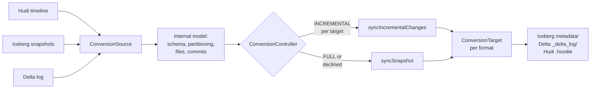

* content
{:toc}

> **TL;DR**
>
> * XTable (incubating) converts table *metadata*, not data. One set of Parquet files gets a second and third set of metadata so Iceberg and Delta readers can see a Hudi table without a copy.
> * `SyncMode` has two values, `FULL` and `INCREMENTAL`. `INCREMENTAL` is a request that XTable validates against the source before honouring it, which is what makes the result trustworthy.
> * The decision is made **per target format**. In one run Iceberg can sync incrementally while Delta rebuilds a full snapshot.
> * Incremental needs the source to still hold history back to the last sync. `isIncrementalSyncSafeFrom` checks that per format: a live commit on the Hudi timeline, an unbroken Iceberg snapshot chain, an active Delta commit at or before the instant.
> * Keeping source retention comfortably longer than your sync interval is the one setting that keeps you on the incremental path, and a single log string confirms it.

## What XTable gives you

A lakehouse table is Parquet files plus metadata that says which files are live,
what the schema is, and how the table has changed over time. The files are
ordinary Parquet. The metadata is what makes it a Hudi, Iceberg or Delta table.

[Apache XTable](https://xtable.apache.org/) (incubating) works from that
observation. Rather than copying data between formats, it reads the source
table's metadata into a format-agnostic internal model and writes out metadata in
the target formats alongside it. The Parquet files are never rewritten and never
duplicated. Point Trino at the Iceberg metadata and Databricks at the Delta
metadata and both read the same bytes.

That design means correctness is not the thing you tune. The lever worth
understanding is cost: whether XTable appends the last few commits to the target
metadata or rebuilds it from scratch, which is the difference between a sync that
finishes in seconds and one that reads the whole table.

This post is written against **XTable 0.4.0-incubating**. Class and method
references are to the
[`0.4.0-incubating`](https://github.com/apache/incubator-xtable/tree/0.4.0-incubating)
tag.

At that release, `TableFormat` declares `HUDI`, `ICEBERG`, `DELTA`, `PAIMON` and
`PARQUET`, with `values()` returning the first four. Prerequisites: the
[XTable docs](https://xtable.apache.org/docs/how-to) and a working knowledge of
at least one of the three main formats.

## Architecture: the internal model and the two sync paths

XTable is deliberately not an N-by-N set of converters. Every source is read into
one internal model, and every target is written from that model, so adding a
format is two adapters rather than six.



`ConversionController` is where the mode is chosen, and the two paths it can take
are `syncIncrementalChanges` and `syncSnapshot`:

* **`syncSnapshot`** extracts an `InternalSnapshot`: every file relevant to the
  table at a point in time. The comment on `SyncMode.FULL` puts it plainly, it
  "will create a checkpoint of ALL the files relevant at a certain point in
  time". Cost scales with the table.
* **`syncIncrementalChanges`** extracts the differential structures needed to
  move the target from its last synced instant to the current one. Cost scales
  with what changed.

On a table with a million files, that difference is the difference between a
sync that finishes in a scheduled window and one that does not.

## The decision, from source

Two methods decide this. The first, `getFormatsToSyncIncrementally`, filters the
target formats down to those that can go incremental:

```java
if (syncMode == SyncMode.FULL) {
  // Full sync requested by config, hence no incremental sync.
  return Collections.emptyMap();
}
return conversionTargetByFormat.entrySet().stream()
    .filter(entry -> {
      Optional<Instant> lastSyncInstant = ...getLastInstantSynced();
      List<Instant> pendingInstants = ...getInstantsToConsiderForNextSync();
      return isIncrementalSyncSufficient(conversionSource, lastSyncInstant, pendingInstants);
    })
    .collect(Collectors.toMap(Map.Entry::getKey, Map.Entry::getValue));
```

The `.filter` is worth reading closely, because it is a nice piece of design:
the predicate is evaluated **per target format**. Each target carries its own
`TableSyncMetadata` with its own last-synced instant, so one target catching up
never forces the others to redo work. Add Delta as a new target to a job that has
been syncing Iceberg for six months and that run will bootstrap Delta from a full
snapshot while Iceberg continues incrementally, in the same job.

The second method, `isIncrementalSyncSufficient`, is the actual test:

```java
Optional<Instant> earliestInstant =
    lastSyncInstant
        .map(instant -> Stream.concat(Stream.of(instant), pendingInstantsStream)
            .min(Instant::compareTo))
        .orElseGet(() -> pendingInstantsStream.min(Instant::compareTo));

if (!earliestInstant.isPresent()) {
  log.info("No previous InternalTable sync for target. Falling back to snapshot sync.");
  return false;
}

boolean isIncrementalSafeFromInstant =
    conversionSource.isIncrementalSyncSafeFrom(earliestInstant.get());
if (!isIncrementalSafeFromInstant) {
  log.info("Incremental sync is not safe from instant {}. Falling back to snapshot sync.",
      earliestInstant);
  return false;
}
return true;
```

Note that the instant it validates is the *earliest* of the last synced instant
and any instants left pending from a previous run. That is the conservative and
correct choice, and it is worth knowing about: pending instants widen the history
window the source needs to retain, so clearing them keeps the window tight.

There are exactly two conditions under which XTable chooses a snapshot instead,
and both announce themselves with a log line ending in "Falling back to snapshot
sync".

## What "safe from this instant" means per format

`isIncrementalSyncSafeFrom` is implemented by each source, and each
implementation maps onto a retention setting you already manage, which makes the
requirement concrete.

**Hudi** requires the commit to still be on the timeline and to be untouched by
cleaning:

```java
public boolean isIncrementalSyncSafeFrom(Instant instant) {
  return doesCommitExistsAsOfInstant(instant) && !isAffectedByCleanupProcess(instant);
}
```

Both halves matter. Archival moves old instants off the active timeline, and
cleaning removes old file slices, so a replayable commit needs both to have left
it alone. Keeping `hoodie.cleaner.commits.retained` generous relative to your sync
interval is all it takes to stay on the incremental path.

**Iceberg** walks the snapshot parent chain backwards from the current snapshot
looking for one at or before the instant, and gives up if the chain runs out or
is broken:

```java
Snapshot parentSnapshot = iceTable.snapshot(parentSnapshotId);
if (parentSnapshot == null) {
  // chain is broken due to expired snapshot
```

`expire_snapshots` governs this. Whatever `history.expire.max-snapshot-age-ms`
you have chosen, XTable needs the chain intact back to its last sync, so those
two numbers are worth setting together.

**Delta** asks the history manager for the active commit at that time and checks
it really is at or before the instant, because the API returns the earliest
commit when you ask for something older than the table:

```java
DeltaHistoryManager.Commit deltaCommitAtOrBeforeInstant =
    deltaLog.history().getActiveCommitAtTime(Timestamp.from(instant), true, false, true);
// There is a chance earliest commit of the table is returned if the instant is before the
// earliest commit of the table, hence the additional check.
Instant deltaCommitInstant = Instant.ofEpochMilli(deltaCommitAtOrBeforeInstant.getTimestamp());
return deltaCommitInstant.equals(instant) || deltaCommitInstant.isBefore(instant);
```

Log retention and `VACUUM` govern this one.

One rule covers all three: **keep the source's history retention comfortably
longer than your sync interval.** It is a single, checkable relationship between
two numbers, and getting it right is what keeps every run incremental.

## Running it

The `RunSync` utility takes a YAML dataset config and a small set of options.
The config shape comes from `RunSync.DatasetConfig`:

```yaml
# trips-sync.yaml
sourceFormat: HUDI
targetFormats:
  - ICEBERG
  - DELTA
datasets:
  - tableBasePath: s3://lakehouse-prod/warehouse/trips
    tableName: trips
    partitionSpec: city_id:VALUE
    namespace: analytics
```

`partitionSpec` is a comma-separated list of `field:TRANSFORM` entries, with an
optional third `:format` part. The transform comes from `PartitionTransformType`,
which at this release is `YEAR`, `MONTH`, `DAY`, `HOUR`, `VALUE` or `BUCKET`, so
`city_id:VALUE` means "partitioned by the literal value of `city_id`" and
`event_date:DAY:yyyy-MM-dd` would describe a day-partitioned table with an
explicit date format.

`sourceFormat` can be auto-detected, but the field's own documentation
recommends setting it explicitly "for cases where the directory contains
metadata of multiple formats", which is precisely the situation XTable creates.
Set it.

The utilities bundle is not published to Maven Central, so build it from the
release tag. Only `xtable-api`, `xtable-core_2.12`, `xtable-spark-runtime_2.12`
and a few others are published; `xtable-utilities` is not among them.

```bash
git clone https://github.com/apache/incubator-xtable.git
cd incubator-xtable
git checkout 0.4.0-incubating
mvn clean package -DskipTests

java -jar xtable-utilities/target/xtable-utilities_2.12-0.4.0-incubating-bundled.jar \
  --datasetConfig trips-sync.yaml \
  --hadoopConfig /etc/hadoop/conf/core-site.xml \
  --icebergCatalogConfig iceberg-catalog.yaml
```

The full option set at 0.4.0-incubating:

| Option | Short | Purpose |
|:--|:--|:--|
| `--datasetConfig` | `-d` | The YAML above. Required |
| `--hadoopConfig` | `-p` | Hadoop XML for filesystem access, overrides defaults |
| `--convertersConfig` | `-c` | Override the built-in converter configurations |
| `--icebergCatalogConfig` | `-i` | Catalog config used for any Iceberg source or target |
| `--continuousMode` | `-m` | Run on a scheduled loop instead of once |
| `--continuousModeInterval` | `-t` | Loop interval in seconds, default 5 |
| `--help` | `-h` | Usage |

`--continuousMode` is the option to reach for. It reloads the config file on
every iteration, so tables can be added to or removed from a running job without
a restart, and it keeps the sync interval short, which is the most effective way
to stay comfortably inside your source's retention window.

## Confirming you are on the incremental path

XTable tells you which path it took, which makes this easy to monitor. A
snapshot sync is announced with an `INFO` line, and there are only two of them to
know:

| Log line | What it means | What to do |
|:--|:--|:--|
| `No previous InternalTable sync for target. Falling back to snapshot sync.` | First sync for this target format, so it is bootstrapping | Expected once per target. Seeing it settle after the first run is the signal you want |
| `Incremental sync is not safe from instant ... Falling back to snapshot sync.` | The source no longer holds history back to that instant | Lengthen source retention or shorten the sync interval, then it stays incremental |

One command confirms a healthy job:

```bash
grep -c "Falling back to snapshot sync" xtable-sync.log
```

Zero on a steady-state job means every target is on the incremental path, which
is exactly what you are aiming for. A count matching your number of target
formats on the first run and zero afterwards is the normal, healthy pattern.

Because the decision is per target, the message also names the format, so you can
tell a target that is still bootstrapping from a retention window worth widening.

## Where XTable fits best

XTable is at its best when several readers need different metadata over the same
files, and it solves that cleanly. A Hudi ingest pipeline serving an Iceberg
based query engine, or a Databricks team reading Delta over data another team
writes as Hudi, are exactly the shapes it was built for, and it handles them
without a second copy of the data.

Two adjacent problems have better tools, and knowing the boundary makes XTable
more useful rather than less.

If you have decided to move formats permanently, a one-off migration is simpler
than a sync you run forever, since it leaves you with one metadata tree to
maintain instead of two or three.

If writers on both sides need to write, keep the source format authoritative.
XTable's targets are derived metadata, rebuilt from the source, so the clean
pattern is one writer on the source and readers everywhere else.

And if a single engine needs a single format it does not read natively, check for
a connector first. When one exists it is less machinery than a sync job with its
own schedule.

## Production tips

* **Set `sourceFormat` explicitly.** After the first sync the directory holds
  metadata for several formats, so naming the source removes any ambiguity.
* **Make source retention exceed the sync interval with margin.** For Hudi that
  is the cleaner and archival configs, for Iceberg `expire_snapshots`, for Delta
  log retention and `VACUUM`.
* **Alert on "Falling back to snapshot sync"** rather than on job duration. It
  is the leading indicator, and it is a single string to match.
* **Prefer `--continuousMode` with a short interval** over an external scheduler
  with a long one, both for the shorter history window and the config reload.
* **Add all target formats at once** where you can, so the one-off bootstrap
  snapshot happens once for every target rather than on separate days.
* **Keep pending instants clear.** The safety check uses the earliest of the
  last synced and pending instants, so an empty pending list keeps the required
  history window as tight as possible.

## Conclusion

The useful mental model for XTable is that `INCREMENTAL` is a request rather than
a switch. You ask for it in config, `ConversionController` checks per target
format whether the source can still support it, and when it cannot it produces a
correct result the slower way. That is the right trade to make by default: you
never get a subtly wrong target table, and the conservative path is always
available as a fallback.

What makes this worth understanding rather than just monitoring is that the one
thing standing between you and permanently cheap syncs lives outside XTable.
Incremental sync works while the source still holds history back to your last
sync, which puts the Hudi cleaner config, the Iceberg snapshot expiry and the
Delta vacuum schedule squarely in your control. They are ordinary settings you
already own, and aligning them with your sync interval is a one-time
conversation with whoever runs the source pipeline.

So two numbers are worth writing down for any XTable deployment: the source's
effective history retention, and the sync interval. Keep the first comfortably
larger than the second and every run takes the incremental path. Add one alert on
"Falling back to snapshot sync" and you will know immediately if that ever
changes.

## References

* [Apache XTable documentation](https://xtable.apache.org/docs/how-to) for setup and the dataset config
* [`ConversionController.java` at 0.4.0-incubating](https://github.com/apache/incubator-xtable/blob/0.4.0-incubating/xtable-core/src/main/java/org/apache/xtable/conversion/ConversionController.java), where the per-target FULL versus INCREMENTAL decision is made
* [`SyncMode.java` at 0.4.0-incubating](https://github.com/apache/incubator-xtable/blob/0.4.0-incubating/xtable-api/src/main/java/org/apache/xtable/model/sync/SyncMode.java), the two modes and their definitions
* [`RunSync.java` at 0.4.0-incubating](https://github.com/apache/incubator-xtable/blob/0.4.0-incubating/xtable-utilities/src/main/java/org/apache/xtable/utilities/RunSync.java) for the CLI options and the dataset config schema
* [Choosing a Hudi index](), if the source side of your sync is a Hudi table you are still tuning
