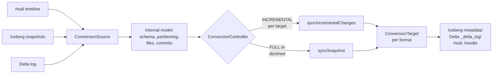

* content
{:toc}

> **TL;DR**
>
> * XTable (incubating) converts table *metadata*, not data. One set of Parquet files gets a second and third set of metadata so Iceberg and Delta readers can see a Hudi table without a copy.
> * `SyncMode` has two values, `FULL` and `INCREMENTAL`, but you do not get to pick per run. `INCREMENTAL` is a request that XTable validates and can decline.
> * The decision is made **per target format**. In one run Iceberg can sync incrementally while Delta rebuilds a full snapshot.
> * Incremental is declined when there is no previous sync, or when `isIncrementalSyncSafeFrom` says the source no longer has the history: for Hudi a cleaned or missing commit, for Iceberg an expired snapshot breaking the parent chain, for Delta an instant before the earliest active commit.
> * Both refusals log a line containing "Falling back to snapshot sync". That string is the whole diagnostic.

## What XTable actually does

A lakehouse table is Parquet files plus metadata that says which files are live,
what the schema is, and how the table has changed over time. The files are
ordinary Parquet. The metadata is what makes it a Hudi, Iceberg or Delta table.

[Apache XTable](https://xtable.apache.org/) (incubating) works from that
observation. Rather than copying data between formats, it reads the source
table's metadata into a format-agnostic internal model and writes out metadata in
the target formats alongside it. The Parquet files are never rewritten and never
duplicated. Point Trino at the Iceberg metadata and Databricks at the Delta
metadata and both read the same bytes.

That is why the interesting failure mode is not a corrupt row. It is metadata
that is expensive to produce, or quietly more expensive than you expected,
because XTable decided it had to rebuild the whole thing rather than append the
last few commits.

This post is written against **XTable 0.4.0-incubating**. Class and method
references are to the
[`0.4.0-incubating`](https://github.com/apache/incubator-xtable/tree/0.4.0-incubating)
tag.

At that release, `TableFormat` declares `HUDI`, `ICEBERG`, `DELTA`, `PAIMON` and
`PARQUET`, with `values()` returning the first four. Prerequisites: the
[XTable docs](https://xtable.apache.org/docs/how-to) and a working knowledge of
at least one of the three main formats.

## Architecture: the internal model and the two sync paths

XTable is deliberately not an N-by-N set of converters. Every source is read into
one internal model, and every target is written from that model, so adding a
format is two adapters rather than six.



`ConversionController` is where the mode is chosen, and the two paths it can take
are `syncIncrementalChanges` and `syncSnapshot`:

* **`syncSnapshot`** extracts an `InternalSnapshot`: every file relevant to the
  table at a point in time. The comment on `SyncMode.FULL` puts it plainly, it
  "will create a checkpoint of ALL the files relevant at a certain point in
  time". Cost scales with the table.
* **`syncIncrementalChanges`** extracts the differential structures needed to
  move the target from its last synced instant to the current one. Cost scales
  with what changed.

On a table with a million files, that difference is the difference between a
sync that finishes in a scheduled window and one that does not.

## The decision, from source

Two methods decide this. The first, `getFormatsToSyncIncrementally`, filters the
target formats down to those that can go incremental:

```java
if (syncMode == SyncMode.FULL) {
  // Full sync requested by config, hence no incremental sync.
  return Collections.emptyMap();
}
return conversionTargetByFormat.entrySet().stream()
    .filter(entry -> {
      Optional<Instant> lastSyncInstant = ...getLastInstantSynced();
      List<Instant> pendingInstants = ...getInstantsToConsiderForNextSync();
      return isIncrementalSyncSufficient(conversionSource, lastSyncInstant, pendingInstants);
    })
    .collect(Collectors.toMap(Map.Entry::getKey, Map.Entry::getValue));
```

Read the `.filter` carefully, because it is the detail that explains confusing
runs: the predicate is evaluated **per target format**. Each target carries its
own `TableSyncMetadata` with its own last-synced instant. If you added Delta as a
target last week and Iceberg has been syncing for six months, this run will sync
Iceberg incrementally and rebuild Delta from a full snapshot, in the same job,
with no error.

The second method, `isIncrementalSyncSufficient`, is the actual test:

```java
Optional<Instant> earliestInstant =
    lastSyncInstant
        .map(instant -> Stream.concat(Stream.of(instant), pendingInstantsStream)
            .min(Instant::compareTo))
        .orElseGet(() -> pendingInstantsStream.min(Instant::compareTo));

if (!earliestInstant.isPresent()) {
  log.info("No previous InternalTable sync for target. Falling back to snapshot sync.");
  return false;
}

boolean isIncrementalSafeFromInstant =
    conversionSource.isIncrementalSyncSafeFrom(earliestInstant.get());
if (!isIncrementalSafeFromInstant) {
  log.info("Incremental sync is not safe from instant {}. Falling back to snapshot sync.",
      earliestInstant);
  return false;
}
return true;
```

Note that the instant it validates is the *earliest* of the last synced instant
and any instants left pending from a previous run. A single stuck pending instant
therefore drags the required history window backwards, which is how a table that
synced incrementally for months can start rebuilding snapshots without anything
obvious having changed.

So there are exactly two reasons XTable declines, and both produce a log line
ending in "Falling back to snapshot sync".

## What "safe from this instant" means per format

`isIncrementalSyncSafeFrom` is implemented by each source, and the three
implementations fail for format-specific reasons that map directly onto retention
settings you already have.

**Hudi** requires the commit to still be on the timeline and to be untouched by
cleaning:

```java
public boolean isIncrementalSyncSafeFrom(Instant instant) {
  return doesCommitExistsAsOfInstant(instant) && !isAffectedByCleanupProcess(instant);
}
```

Both halves matter. Archival removes old instants from the active timeline, so
the commit stops existing. Cleaning removes old file slices, so even a commit
still on the timeline can no longer be replayed into a set of file changes. An
aggressive `hoodie.cleaner.commits.retained` plus a sync that runs less often
than the cleaner is exactly the combination that produces permanent full
snapshots.

**Iceberg** walks the snapshot parent chain backwards from the current snapshot
looking for one at or before the instant, and gives up if the chain runs out or
is broken:

```java
Snapshot parentSnapshot = iceTable.snapshot(parentSnapshotId);
if (parentSnapshot == null) {
  // chain is broken due to expired snapshot
```

`expire_snapshots` is the cause. Whatever your `history.expire.max-snapshot-age-ms`
is, XTable needs the chain intact back to its last sync.

**Delta** asks the history manager for the active commit at that time and checks
it really is at or before the instant, because the API returns the earliest
commit when you ask for something older than the table:

```java
DeltaHistoryManager.Commit deltaCommitAtOrBeforeInstant =
    deltaLog.history().getActiveCommitAtTime(Timestamp.from(instant), true, false, true);
// There is a chance earliest commit of the table is returned if the instant is before the
// earliest commit of the table, hence the additional check.
Instant deltaCommitInstant = Instant.ofEpochMilli(deltaCommitAtOrBeforeInstant.getTimestamp());
return deltaCommitInstant.equals(instant) || deltaCommitInstant.isBefore(instant);
```

Log retention and `VACUUM` are the causes here.

The rule that falls out of all three: **the source's history retention must
exceed your sync interval, with margin.** That is a constraint linking two
systems that are usually configured by different people.

## Running it

The `RunSync` utility takes a YAML dataset config and a small set of options.
The config shape comes from `RunSync.DatasetConfig`:

```yaml
# trips-sync.yaml
sourceFormat: HUDI
targetFormats:
  - ICEBERG
  - DELTA
datasets:
  - tableBasePath: s3://lakehouse-prod/warehouse/trips
    tableName: trips
    partitionSpec: city_id:VALUE
    namespace: analytics
```

`partitionSpec` is a comma-separated list of `field:TRANSFORM` entries, with an
optional third `:format` part. The transform comes from `PartitionTransformType`,
which at this release is `YEAR`, `MONTH`, `DAY`, `HOUR`, `VALUE` or `BUCKET`, so
`city_id:VALUE` means "partitioned by the literal value of `city_id`" and
`event_date:DAY:yyyy-MM-dd` would describe a day-partitioned table with an
explicit date format.

`sourceFormat` can be auto-detected, but the field's own documentation
recommends setting it explicitly "for cases where the directory contains
metadata of multiple formats", which is precisely the situation XTable creates.
Set it.

The utilities bundle is not published to Maven Central, so build it from the
release tag. Only `xtable-api`, `xtable-core_2.12`, `xtable-spark-runtime_2.12`
and a few others are published; `xtable-utilities` is not among them.

```bash
git clone https://github.com/apache/incubator-xtable.git
cd incubator-xtable
git checkout 0.4.0-incubating
mvn clean package -DskipTests

java -jar xtable-utilities/target/xtable-utilities_2.12-0.4.0-incubating-bundled.jar \
  --datasetConfig trips-sync.yaml \
  --hadoopConfig /etc/hadoop/conf/core-site.xml \
  --icebergCatalogConfig iceberg-catalog.yaml
```

The full option set at 0.4.0-incubating:

| Option | Short | Purpose |
|:--|:--|:--|
| `--datasetConfig` | `-d` | The YAML above. Required |
| `--hadoopConfig` | `-p` | Hadoop XML for filesystem access, overrides defaults |
| `--convertersConfig` | `-c` | Override the built-in converter configurations |
| `--icebergCatalogConfig` | `-i` | Catalog config used for any Iceberg source or target |
| `--continuousMode` | `-m` | Run on a scheduled loop instead of once |
| `--continuousModeInterval` | `-t` | Loop interval in seconds, default 5 |
| `--help` | `-h` | Usage |

`--continuousMode` is worth knowing about beyond the convenience: it reloads the
config file on every iteration, so tables can be added to or removed from a
running job without a restart. It also keeps the sync interval short, which is
the single most effective defence against the retention problem above.

## What failure looks like

There is no exception and no non-zero exit. A declined incremental sync is an
`INFO` log line and a job that takes much longer than it used to.

| Log line | Meaning | Fix |
|:--|:--|:--|
| `No previous InternalTable sync for target. Falling back to snapshot sync.` | First sync for this target format, or its sync metadata is gone | Expected once. Repeating means target metadata is being lost between runs |
| `Incremental sync is not safe from instant ... Falling back to snapshot sync.` | Source history no longer covers the instant | Raise source retention, or shorten the sync interval |

The one-line check on any XTable job:

```bash
grep -c "Falling back to snapshot sync" xtable-sync.log
```

Zero on a steady-state job is what you want. A count equal to your number of
target formats, on every run, means you are paying for a full metadata rebuild
every time and the incremental path is never being taken.

Because the decision is per target, also check *which* format is in the message.
One format falling back while another does not is a target-metadata problem, not
a source-retention problem.

## When not to use XTable

XTable solves one problem: readers that need different metadata over the same
files. It is the right tool when a Hudi ingest pipeline has to serve an Iceberg
based query engine, or when a Databricks team needs Delta over data another team
writes as Hudi.

It is the wrong tool if you have decided to migrate. A conversion you keep
running forever is a permanent second and third metadata tree to maintain,
compact and reason about, and every retention setting on the source becomes a
dependency of the sync job. If the destination is genuinely "we are an Iceberg
shop now", do the migration once and delete the pipeline.

It is also the wrong tool if writers on both sides need to write. XTable's
targets are derived metadata. Writing to the Iceberg view of a Hudi table and
then syncing again does not merge the two; the source of truth is the source
format, and the target is rebuilt from it.

And if what you actually need is one engine reading one format it does not
support natively, check whether the engine has a connector first. A connector is
less machinery than a metadata sync job with its own schedule and failure modes.

## Production tips

* **Set `sourceFormat` explicitly.** After the first sync the directory contains
  metadata for several formats and auto-detection is guessing.
* **Make source retention exceed the sync interval with margin.** For Hudi that
  is the cleaner and archival configs, for Iceberg `expire_snapshots`, for Delta
  log retention and `VACUUM`.
* **Alert on "Falling back to snapshot sync"** rather than on job duration. It is
  the leading indicator; duration is the lagging one.
* **Prefer `--continuousMode` with a short interval** over an external scheduler
  with a long one, both for the shorter history window and the config reload.
* **Add all target formats at once** where you can. Adding one later forces a
  full snapshot for that format while the others stay incremental, which makes a
  confusing first run.
* **Watch for stuck pending instants.** The safety check uses the earliest of the
  last synced and pending instants, so one stuck instant widens the history
  window the source has to retain.

## Conclusion

The useful mental model for XTable is that `INCREMENTAL` is a request, not a
setting. You ask for it in config; `ConversionController` decides per target
format whether it can honour the request; and when it cannot, it does the correct
thing rather than the fast thing and rebuilds the snapshot. That design is right,
and it is also why the failure is invisible: nothing is broken, the output is
correct, and the only evidence is an `INFO` line and a bigger cloud bill.

What makes this worth understanding rather than just monitoring is that the
constraint it imposes is not inside XTable at all. Incremental sync is possible
only while the source format still holds the history back to your last sync, so
the cleaner config on a Hudi table, the snapshot expiry on an Iceberg table and
the vacuum schedule on a Delta table are now inputs to whether your conversion is
cheap. Those settings are usually owned by whoever runs the source pipeline, and
they were almost certainly not chosen with a downstream metadata sync in mind.

Two numbers are worth writing down for any XTable deployment: the source's
effective history retention, and the sync interval. As long as the first
comfortably exceeds the second, incremental sync works. When someone tightens
retention to save storage, it stops, and nothing tells them.

## References

* [Apache XTable documentation](https://xtable.apache.org/docs/how-to) for setup and the dataset config
* [`ConversionController.java` at 0.4.0-incubating](https://github.com/apache/incubator-xtable/blob/0.4.0-incubating/xtable-core/src/main/java/org/apache/xtable/conversion/ConversionController.java), where the per-target FULL versus INCREMENTAL decision is made
* [`SyncMode.java` at 0.4.0-incubating](https://github.com/apache/incubator-xtable/blob/0.4.0-incubating/xtable-api/src/main/java/org/apache/xtable/model/sync/SyncMode.java), the two modes and their definitions
* [`RunSync.java` at 0.4.0-incubating](https://github.com/apache/incubator-xtable/blob/0.4.0-incubating/xtable-utilities/src/main/java/org/apache/xtable/utilities/RunSync.java) for the CLI options and the dataset config schema
* [Choosing a Hudi index](), if the source side of your sync is a Hudi table you are still tuning
