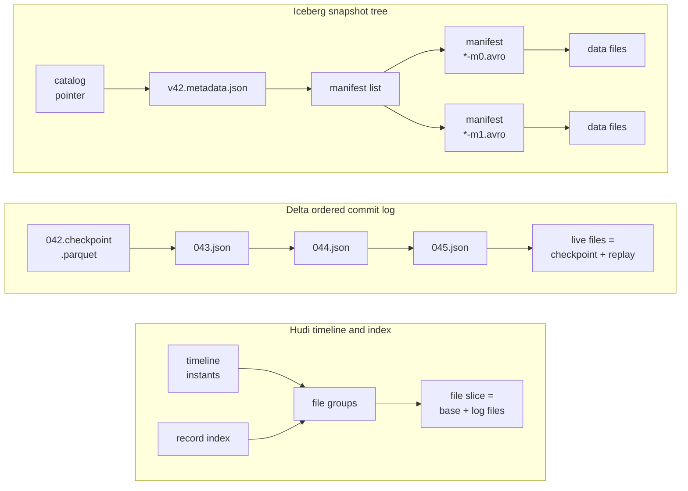

* content
{:toc}

> **TL;DR**
>
> * All three solve the same original problem: a directory of Parquet on object storage has no atomic commit, no row-level update and no cheap way to know which files are live. Each adds a metadata layer that answers "which files make up the table right now".
> * The real difference is the shape of that metadata. Iceberg keeps a tree of immutable snapshots behind one atomic pointer, Delta an ordered log of JSON commits with periodic Parquet checkpoints, and Hudi a timeline of instants plus an index mapping a record key to a file group.
> * That shape decides everything downstream. Hudi's index makes it the natural fit for high-frequency upserts by primary key; Iceberg's and Delta's per-commit file lists make them the natural fit for large snapshot-oriented writes.
> * Copy-on-write versus merge-on-read is a choice in all three, not a property of one. Iceberg 1.11.0 defaults `write.delete.mode`, `write.update.mode` and `write.merge.mode` to `copy-on-write`, Delta needs `delta.enableDeletionVectors`, and Hudi asks at table creation.
> * You can defer the decision. Apache XTable converts metadata between all three over one copy of the Parquet, so the choice of writer no longer dictates the choice of reader.

Every comparison of these three formats hands you the same table. ACID commits:
yes, yes, yes. Time travel: yes, yes, yes. Schema evolution: yes, yes, yes.
Every row ticks three times, and you finish the article knowing roughly as much
as when you started.

That checklist is not wrong. It is just describing the part where the formats
converged. They all started from the same broken thing and they all fixed it.
What none of those tables tell you is the part where they did not converge: the
shape each one chose for its metadata, which is decided once, early, and then
quietly determines how expensive your updates are, how your writes behave when
two of them collide, and how much maintenance you inherit.

So this post skips the checklist. One question separates the three, and once you
can answer it for each format, most of the rest follows.

Written against the latest release of each on Spark, which as of now means
**Iceberg 1.11.0**, **Hudi 1.2.0** and **Delta Lake 4.4.0**. Versions are named
throughout rather than assumed, because several of the defaults below are exactly
the kind of thing that moves between releases. Every version claim, config
key, default and on-disk path below was read from those release tags. By the end
you should be able to look at a table directory and name the format that wrote
it, explain what each one does when you update a single row, and choose from the
shape of your own workload.

## Why do these formats exist at all?

The architecture they replaced was a directory of Parquet files on object storage
with a Hive Metastore partition list on top. It works until you need one of five
things.

**There is no atomic commit.** A job that writes 400 files and fails at file 250
leaves 250 files that queries can already see. The usual defence is writing to a
staging path and renaming, which on S3 is a copy rather than a rename, and is not
atomic across many files.

**There is no row-level update.** Correcting one row means rewriting the
partition that contains it. An erasure request for one customer becomes a rewrite
of every partition that customer appears in.

**Listing is the query.** To plan a scan the engine lists directories. At a few
hundred partitions this is invisible. At a hundred thousand it is most of your
planning time, and on object storage each `LIST` is a paginated API call.

**Readers see torn state.** Without a commit protocol, a reader that starts while
a writer is mid-flight sees some new files and some old ones, and there is no way
to ask for the table as it stood ten minutes ago.

**Schema changes are a convention, not a contract.** Renaming a column in the
metastore does not rename it in the files, and positional column matching means
adding a column in the middle silently shifts every value to the right.

All three answer the same way: stop asking the filesystem what the table
contains, and keep an authoritative record instead. Every difference between them
follows from the shape they chose for that record.

## Which files make up this table right now?

That is the question. Ask it of each format and you get three structurally
different answers.



**Iceberg answers with a tree.** A catalog holds one pointer to the current
`metadata.json`. That file names the current snapshot. The snapshot points at a
manifest list, which points at manifests, which list data files with their
partition values and column statistics. A commit writes a new `metadata.json` and
atomically swaps the catalog pointer. Nothing is ever mutated, so an old snapshot
stays readable as long as it is retained.

**Delta answers with a log.** The history is an ordered sequence of numbered JSON
files in `_delta_log`, each recording `add` and `remove` actions, and the live
file set is the result of replaying them. Because replaying 200,000 commits would
be slow, Delta periodically writes a checkpoint: a Parquet file holding complete
state at one version, so readers replay only from there.

**Hudi answers with a timeline plus an index.** The timeline is a directory of
instants, each an action with a state. Data is organised into file groups, and a
file group's current contents are a file slice: a base file plus any log files
written against it. Uniquely among the three, Hudi also keeps an index mapping a
record key to the file group that holds it, which is what lets it locate a single
record without scanning.

| | Iceberg 1.11.0 | Delta Lake 4.4.0 | Hudi 1.2.0 |
|:--|:--|:--|:--|
| State record | Immutable snapshot tree | Ordered JSON commit log | Timeline of instants |
| Commit mechanism | Atomic swap of a catalog pointer | Atomic creation of the next numbered log file | Atomic creation of a completed instant |
| Read planning | Walk manifests, prune on stats | Checkpoint plus log replay | Timeline plus file slices |
| Record identity | None required | None required | Record key, required |
| Key to file lookup | Not available | Not available | Index, several types |
| Scales planning by | Manifest pruning | Checkpoint frequency | Metadata table |

One row in that table carries more weight than the rest, and it is **record
identity**. Iceberg and Delta describe a table as a set of files; neither has a
notion of "the row with this primary key". Hudi requires a record key at table
creation and maintains an index over it.

That single decision is why Hudi is the natural fit for a change-data-capture
(CDC) stream keyed by primary key, where each message is an insert, update or
delete of one known row, and why Iceberg and Delta are the natural fit for
snapshot-oriented batch writes. Everything below is detail on top of it.

## Architecture: what does each one put on disk?

Recognising a format from its directory listing is a genuinely useful skill, so
here is what each one writes. Same table throughout: `trips`, ride events
partitioned by city.

### Iceberg

```
s3a://lakehouse-prod/warehouse/trips/
├── metadata/
│   ├── v1.metadata.json
│   ├── v2.metadata.json                              <- current, per the catalog
│   ├── snap-7241925443479918015-1-a1c2....avro       <- manifest list
│   ├── a1c2f3b4-....-m0.avro                         <- manifest
│   └── a1c2f3b4-....-m1.avro
└── data/
    ├── city_id=sf/00000-0-a1c2f3b4-....parquet
    └── city_id=nyc/00000-1-a1c2f3b4-....parquet
```

Two things are worth noticing. The `data/` directory is laid out by partition for
human convenience, but the engine never relies on it: partition values are read
from the manifests, which is what makes partition evolution possible. And nothing
in the table itself says which `metadata.json` is current. That is the catalog's
job, which is why Iceberg without a catalog is only half a table.

`FileContent` in 1.11.0 enumerates what a manifest entry can describe: `DATA`,
`POSITION_DELETES`, `EQUALITY_DELETES`, `DATA_MANIFEST` and `DELETE_MANIFEST`.
The two delete kinds are how Iceberg represents row-level deletions without
rewriting data.

All of this is queryable, which is the fastest way to understand a table you did
not create. Iceberg exposes `snapshots`, `history`, `files`, `data_files`,
`delete_files`, `manifests`, `partitions`, `entries`, `refs`,
`metadata_log_entries` and their `all_` variants. `SELECT * FROM prod.trips.snapshots`
is usually the first thing worth running.

### Delta Lake

Delta's protocol specification gives this layout, and the filenames are exact:

```
s3a://lakehouse-prod/warehouse/trips/
├── _delta_log/
│   ├── 00000000000000000042.json
│   ├── 00000000000000000042.checkpoint.parquet
│   ├── 00000000000000000043.json
│   ├── 00000000000000000044.json
│   ├── 00000000000000000045.json
│   └── _last_checkpoint
├── _change_data/
│   └── cdc-00000-924d9ac7-....snappy.parquet
├── deletion_vector-0c6cbaaf-....bin
└── city_id=sf/part-00000-3935a07c-....snappy.parquet
```

The version number is zero-padded to 20 digits, which is what makes a plain
lexicographic `LIST` return commits in version order. `_last_checkpoint` is a
small pointer file so a reader does not have to list the whole log to find the
newest checkpoint. `_change_data` holds change-data-feed files, and
`deletion_vector-*.bin` files hold bitmaps of logically deleted rows.

The commit protocol follows directly from the naming: commit `N+1` is the file
`...0000N+1.json`, and the writer that successfully creates that exact filename
wins. On a store with atomic put-if-absent that is clean mutual exclusion. On
plain S3 it historically was not, which is why Delta on S3 with multiple writers
needs a commit coordinator.

### Hudi

Hudi 1.x moved the timeline into its own directory, so a 1.x table looks
different from the 0.x tables most tutorials show. `hoodie.timeline.path`
defaults to `timeline` and `hoodie.timeline.history.path` to `history`:

```
s3a://lakehouse-prod/warehouse/trips/
├── .hoodie/
│   ├── hoodie.properties
│   ├── timeline/
│   │   ├── 20260911093000123.deltacommit.requested
│   │   ├── 20260911093000123.deltacommit.inflight
│   │   ├── 20260911093000123_20260911093004881.deltacommit   <- completed
│   │   └── history/                                          <- archived instants
│   ├── metadata/                                             <- the metadata table
│   │   ├── files/
│   │   ├── column_stats/
│   │   └── record_index/
│   └── .index_defs/index.json
└── city_id=sf/
    ├── 8f3a1c92-...-0_0-24-1893_20260911093000123.parquet    <- base file
    └── .8f3a1c92-...-0_20260911093000123.log.1_0-24-1893     <- log file
```

An instant moves through three states and the filename changes with it:
`.requested`, `.inflight`, then the completed form. A filter written against
`.deltacommit` will not match a pending write, which is deliberate, because
readers only ever see completed instants.

Hudi 1.2.0's timeline has twelve action types, and knowing them saves time when
reading a real table: `commit`, `deltacommit`, `clean`, `rollback`, `savepoint`,
`replacecommit`, `clustering`, `compaction`, `logcompaction`, `restore`,
`indexing` and `schemacommit`.

`.hoodie/metadata` is an internal Hudi table holding file listings, column
statistics and the record index. It exists so planning does not require listing
data directories, which is Hudi's answer to the same scale problem Iceberg solves
with manifests and Delta with checkpoints.

## What happens when you update one row?

This is where the formats are most often described wrongly, so it is worth being
precise. Copy-on-write and merge-on-read are strategies available in all three,
not a distinguishing feature of one.

**Copy-on-write** means an update rewrites whole data files: read the file, apply
the change, write a new file, mark the old one removed. Reads stay as fast as
plain Parquet because there is nothing to reconcile. Writes pay to rewrite files
that mostly did not change.

**Merge-on-read** means an update records the change separately, as a delete
marker or a log entry, and the reader reconciles at query time. Writes are cheap.
Reads pay a merge, and something must eventually compact the accumulated changes.

**Iceberg** decides per operation, and the defaults surprise people.
`TableProperties` in 1.11.0 sets `write.delete.mode`, `write.update.mode` and
`write.merge.mode` all to `copy-on-write`. A fresh Iceberg table rewrites files
on `DELETE`, `UPDATE` and `MERGE` unless you say otherwise:

```sql
ALTER TABLE prod.trips SET TBLPROPERTIES (
  'write.delete.mode' = 'merge-on-read',
  'write.update.mode' = 'merge-on-read',
  'write.merge.mode'  = 'merge-on-read'
);
```

In merge-on-read, Iceberg writes delete files instead of rewriting data. Position
deletes name a data file and the row positions within it, which is precise and
cheap to apply. Equality deletes name column values, which avoids having to know
positions but forces the reader to apply the predicate more widely. Format
version 3 adds deletion vectors, stored as Puffin blobs, which 1.11.0 implements
in `DeletionVector.java` and its `puffin` package. On versions: 1.11.0 defaults
new tables to format version 2 (`DEFAULT_TABLE_FORMAT_VERSION = 2`) but reads and
writes up to version 4 (`SUPPORTED_TABLE_FORMAT_VERSION = 4`), with row lineage
requiring at least version 3.

**Delta** uses deletion vectors, gated on a table property. The protocol is
explicit that writers only create new deletion vectors when
`delta.enableDeletionVectors` is `true`, and equally explicit that readers must
handle deletion vectors whether or not the property is set, because the table may
already contain them:

```sql
ALTER TABLE trips SET TBLPROPERTIES ('delta.enableDeletionVectors' = 'true');
```

**Hudi** asks at table creation, through the table type. `COPY_ON_WRITE` rewrites
base files on update. `MERGE_ON_READ` appends to log files beside the base file,
and a `compaction` action later merges them into a new base file. Hudi's version
of the choice is the most consequential of the three, because it also changes
which query types are available.

| | Iceberg 1.11.0 | Delta Lake 4.4.0 | Hudi 1.2.0 |
|:--|:--|:--|:--|
| Granularity of the choice | Per operation, per table property | Per table property | Per table, at creation |
| Default | `copy-on-write` for delete, update and merge | Copy-on-write until deletion vectors are enabled | Chosen explicitly |
| Merge-on-read artefact | Position deletes, equality deletes, deletion vectors (v3) | `deletion_vector-*.bin` | Log files beside the base file |
| Reader must reconcile | Delete files against data files | Deletion vector bitmaps | Log files against the base file |
| Compaction | `rewrite_data_files` procedure | `OPTIMIZE` | `compaction` action, inline or async |

The trade is the same sentence in all three cases: **merge-on-read buys low write
latency at the cost of read-side merge work and a compaction job you must
operate.** Copy-on-write buys simple, fast reads at the cost of rewriting files
that mostly did not change.

## What does the same table look like in all three?

One schema throughout: ride events arriving as a CDC stream, keyed by `trip_id`,
partitioned by `city_id`, with `updated_at` deciding which version of a record
wins.

Each format needs its own runtime jar and catalog wiring:

```bash
# Iceberg 1.11.0
spark-sql \
  --packages org.apache.iceberg:iceberg-spark-runtime-3.5_2.12:1.11.0 \
  --conf spark.sql.extensions=org.apache.iceberg.spark.extensions.IcebergSparkSessionExtensions \
  --conf spark.sql.catalog.prod=org.apache.iceberg.spark.SparkCatalog \
  --conf spark.sql.catalog.prod.type=hive \
  --conf spark.sql.catalog.prod.uri=thrift://metastore.internal:9083

# Delta Lake 4.4.0 (Spark 4.x; use delta-spark 3.x for Spark 3.5)
spark-sql \
  --packages io.delta:delta-spark_2.13:4.4.0 \
  --conf spark.sql.extensions=io.delta.sql.DeltaSparkSessionExtension \
  --conf spark.sql.catalog.spark_catalog=org.apache.spark.sql.delta.catalog.DeltaCatalog

# Hudi 1.2.0
spark-sql \
  --packages org.apache.hudi:hudi-spark3.5-bundle_2.12:1.2.0 \
  --conf spark.serializer=org.apache.spark.serializer.KryoSerializer \
  --conf spark.sql.extensions=org.apache.spark.sql.hudi.HoodieSparkSessionExtension \
  --conf spark.sql.catalog.spark_catalog=org.apache.spark.sql.hudi.catalog.HoodieCatalog
```

### Creating it

The interesting difference is how much each one needs to be told.

```sql
-- Iceberg. No record key. Partitioning is a transform on a column, and the
-- engine hides it from queries, so filters on started_at prune days.
CREATE TABLE prod.trips (
  trip_id      STRING,
  city_id      STRING,
  rider_id     STRING,
  fare_amount  DECIMAL(10,2),
  started_at   TIMESTAMP,
  updated_at   TIMESTAMP
) USING iceberg
PARTITIONED BY (city_id, days(started_at));
```

```sql
-- Delta. No record key either. Liquid clustering replaces partitioning for
-- most tables, and can be changed later without rewriting the layout contract.
CREATE TABLE trips (
  trip_id      STRING,
  city_id      STRING,
  rider_id     STRING,
  fare_amount  DECIMAL(10,2),
  started_at   TIMESTAMP,
  updated_at   TIMESTAMP
) USING delta
CLUSTER BY (city_id, started_at)
LOCATION 's3a://lakehouse-prod/warehouse/trips';
```

```sql
-- Hudi. The record key and the ordering field are part of the table contract,
-- which is what enables key-based upserts and deletes later.
CREATE TABLE trips (
  trip_id      STRING,
  city_id      STRING,
  rider_id     STRING,
  fare_amount  DECIMAL(10,2),
  started_at   TIMESTAMP,
  updated_at   TIMESTAMP
) USING hudi
PARTITIONED BY (city_id)
LOCATION 's3a://lakehouse-prod/warehouse/trips'
TBLPROPERTIES (
  type = 'mor',                        -- log files now, compaction later
  primaryKey = 'trip_id',
  -- Renamed in 1.x. `preCombineField` still resolves as a registered
  -- alternative, and both map to hoodie.table.ordering.fields.
  orderingFields = 'updated_at'
);
```

### Upserting a CDC batch

```sql
-- Iceberg and Delta: MERGE is the upsert, and you write the matching logic.
MERGE INTO prod.trips t
USING trip_updates s
  ON t.trip_id = s.trip_id
WHEN MATCHED AND s.updated_at > t.updated_at THEN UPDATE SET *
WHEN NOT MATCHED THEN INSERT *;
```

```sql
-- Hudi: the record key and ordering field are already declared, so the
-- matching logic lives in the table rather than in the statement.
MERGE INTO trips t
USING trip_updates s
  ON t.trip_id = s.trip_id
WHEN MATCHED THEN UPDATE SET *
WHEN NOT MATCHED THEN INSERT *;
```

The difference is not the syntax, it is what runs underneath. Iceberg and Delta
plan a join between the incoming batch and the table to find which files hold the
matching keys, so the cost scales with how much of the table that join touches.
Hudi looks each key up in its index and goes straight to the file group, so the
cost scales with the size of the batch. On a small batch against a large table,
that difference is the whole ballgame.

### Travelling back in time

All three support it. The syntax and the unit differ.

```sql
-- Iceberg: by snapshot id or by timestamp
SELECT count(*) FROM prod.trips VERSION AS OF 7241925443479918015;
SELECT count(*) FROM prod.trips TIMESTAMP AS OF '2026-09-10 09:00:00';

-- Delta: by version number or by timestamp
SELECT count(*) FROM trips VERSION AS OF 42;
SELECT count(*) FROM trips TIMESTAMP AS OF '2026-09-10 09:00:00';

-- Hudi: by instant time, or by a plain timestamp. The documented forms are
-- yyyyMMddHHmmssSSS, yyyy-MM-dd HH:mm:ss.SSS and yyyy-MM-dd.
SELECT count(*) FROM trips TIMESTAMP AS OF '20260911093000123';
SELECT count(*) FROM trips TIMESTAMP AS OF '2026-09-10 09:00:00.000';
```

### Reading only what changed

Incremental consumption is where the three diverge most in capability.

```sql
-- Iceberg: build a changelog view between two snapshots, then query it.
-- The view gains _change_type, _change_ordinal and _commit_snapshot_id columns.
CALL prod.system.create_changelog_view(
  table => 'prod.trips',
  changelog_view => 'trips_changes',
  options => map('start-snapshot-id', '7241925443479918015'),
  identifier_columns => array('trip_id')
);

SELECT trip_id, fare_amount, _change_type, _change_ordinal
FROM trips_changes
ORDER BY _change_ordinal;
```

```sql
-- Delta: change data feed, once enabled on the table
ALTER TABLE trips SET TBLPROPERTIES ('delta.enableChangeDataFeed' = 'true');

SELECT * FROM table_changes('trips', 43, 45);
```

```sql
-- Hudi: a table-valued function, with instants read off the timeline.
CALL show_commits(table => 'trips', limit => 5);

SELECT trip_id, city_id, fare_amount, updated_at
FROM hudi_table_changes('trips', 'latest_state', '20260911093000123');
```

Hudi's incremental read is the oldest and most developed of the three, because
incremental consumption was the workload it was built for. Delta's change data
feed is opt-in per table and has to be enabled before the changes you want to
read. Iceberg's changelog scan covers appends well and asks for more help with
updates and deletes, which is what the `compute_updates` and `identifier_columns`
parameters are for.

### Deleting one person's rows

The erasure case, which is where record identity earns its keep.

```sql
-- Iceberg and Delta: a predicate delete. The engine finds the files, then
-- either rewrites them (copy-on-write) or writes delete markers.
DELETE FROM prod.trips WHERE rider_id = 'rider-8814f2';
DELETE FROM trips     WHERE rider_id = 'rider-8814f2';
```

```sql
-- Hudi: the same SQL works, and a keyed delete can go straight to the file
-- groups through the index without scanning to find them.
DELETE FROM trips WHERE rider_id = 'rider-8814f2';
```

In all three the delete is logical until maintenance runs. The data is still in
the old files until copy-on-write rewrites them or compaction merges the markers
away, and the old snapshot remains readable until retention expires it. For a
genuine right-to-erasure obligation the delete is not complete until retention
has expired the versions that still contain the row, which makes
`expire_snapshots` on Iceberg, `VACUUM` on Delta and cleaning on Hudi part of the
compliance story rather than housekeeping.

## Where do they really diverge?

Two places: what you can change about the table's shape after the fact, and what
happens when two writers meet.

Every format supports adding, dropping, renaming and reordering columns without
rewriting data, because all three track columns by an assigned id rather than by
position in the file. The edges are where they differ:

| Capability | Iceberg 1.11.0 | Delta Lake 4.4.0 | Hudi 1.2.0 |
|:--|:--|:--|:--|
| Add, drop, rename, reorder | Yes | Yes, `columnMapping` needed for rename and drop | Yes |
| Type promotion | Yes, within safe widenings | Yes, within safe widenings | Yes, within safe widenings |
| Partition evolution | Yes, old data keeps its old spec | Not the same way, `CLUSTER BY` changes are the modern path | Limited |
| Hidden partitioning | Yes, transforms on a column | Liquid clustering plays this role | No, partition path is explicit |

**Partition evolution is Iceberg's clearest structural advantage.** Because
partition values live in manifests rather than in directory names, Iceberg can
change the partition spec and keep reading old data under its original spec. The
usual example is a table partitioned by month that grows enough to want daily
partitions: in Iceberg that is a metadata change, and files written before it
keep working.

**Hidden partitioning is the second.** A query filtering on `started_at` prunes
day partitions without the writer ever mentioning a `dt` column, because the
partition is declared as `days(started_at)`. Tables in the other two formats
typically carry an explicit partition column, and a query that forgets to filter
on it scans everything. Delta's answer to layout is liquid clustering rather than
partition evolution, declared with `CLUSTER BY`, which can be changed later and
does not bake the layout into directory paths.

On concurrency, the honest summary is that all three need help beyond their
defaults. **Iceberg** uses optimistic concurrency: a writer reads the current
metadata, prepares a new snapshot, and commits by swapping the catalog pointer,
which fails if another writer moved it first. **Delta** relies on creating the
next numbered log file, so two writers both attempting
`...00000000000000000046.json` means one must lose, which requires put-if-absent
from the storage layer; the `catalogManaged` table feature in 4.4.0 reflects the
move toward catalogs owning commits. **Hudi** ships optimistic concurrency
control with an external lock provider, and its file-group model means two
writers touching different file groups do not conflict at all.

Notice what those three have in common: the strength of the commit protocol is a
property of the catalog or the storage layer, not of the format. An Iceberg table
on a REST catalog and the same table on a filesystem catalog have different
correctness guarantees under concurrent writes, and look identical on disk.
Choose the catalog with the same care as the format, and treat "which component
provides the atomic compare-and-swap" as a question you can answer for your
stack.

## What do you have to operate?

None of the three are maintenance-free, and underestimating this is the most
common reason a lakehouse project gets into trouble six months in.

| Job | Iceberg | Delta | Hudi |
|:--|:--|:--|:--|
| Compact small files | `CALL prod.system.rewrite_data_files` | `OPTIMIZE` | `compaction`, inline or async |
| Expire old versions | `CALL prod.system.expire_snapshots` | `VACUUM` | Cleaner, `hoodie.cleaner.*` |
| Remove unreferenced files | `CALL prod.system.remove_orphan_files` | `VACUUM` | Cleaner |
| Shrink metadata | `CALL prod.system.rewrite_manifests` | Checkpoints, automatic | Timeline archival to `history/` |
| Re-sort for locality | `rewrite_data_files` with a sort order | `OPTIMIZE ... ZORDER BY`, liquid clustering | `clustering` action |

The cost of skipping each is specific. Never compacting gives you a table of tiny
files where planning dominates query time. Never expiring gives you storage that
grows without bound and, for Iceberg and Delta, a metadata layer that grows with
it. Never compacting a Hudi merge-on-read table means readers merge an
ever-growing stack of log files on every query.

A useful way to hold the difference: Iceberg and Delta ask you to schedule
maintenance as separate jobs, while Hudi can run compaction and cleaning inline
with writes. Inline is easier to get right and makes writes slower; scheduled is
faster on the write path and easier to forget.

## Which one should I pick?

Reduce it to properties of your workload rather than feature counts.

| If your workload is | Reach for | Because |
|:--|:--|:--|
| CDC or streaming upserts keyed by a primary key, high frequency | Hudi | The record index turns an upsert into a point lookup rather than a join against the table |
| Large batch appends and snapshot-style rewrites | Iceberg or Delta | Neither pays for index maintenance you would not use |
| Partitioning you expect to get wrong and want to change later | Iceberg | Partition evolution and hidden partitioning are structural, not bolted on |
| Layout you want managed for you, or a Databricks-centred platform | Delta | Liquid clustering removes most partition-design decisions, and the format and the Spark engine are developed together |
| Many query engines, strong catalog story | Iceberg | The broadest engine support and a REST catalog spec others implement |
| Incremental consumption as a first-class pattern | Hudi | Incremental queries were the original design goal, not an added feature |
| Undecided, or different teams want different things | Any, plus XTable | Metadata conversion means the writer's choice stops dictating the reader's |

There is a row missing from that table, and it is worth saying out loud: **plain
partitioned Parquet is still a good answer for some tables.** A table format is a
commit protocol plus a metadata layer, and both cost something. If your data is
append-only, read by one engine, small enough that listing is not a problem, and
never needs a row corrected, Parquet with a Hive Metastore is less machinery and
will not surprise you. The formats start paying for themselves when you need
atomic commits across many files, row-level mutation, time travel, or planning
that does not scale with partition count.

Equally, adopting two of them in one platform wants a reason. The maintenance
jobs, retention semantics and failure modes all differ, and running two sets of
them doubles the operational surface for no analytical gain.

## Can I avoid choosing?

Increasingly, yes. [Apache XTable](https://xtable.apache.org/) (incubating) reads
one format's metadata into a format-agnostic model and writes the other formats'
metadata beside it, over the same Parquet files. The data is never copied or
rewritten.

That changes the decision usefully. A Hudi ingestion pipeline can keep the
index-backed upserts it needs while a Trino-based analytics team reads the same
tables as Iceberg, and neither side has to move. The cost is a metadata sync job
with its own schedule, plus one constraint worth knowing up front: incremental
sync only works while the source format still retains history back to the last
sync, which makes your cleaner and snapshot-expiry settings an input to whether
the sync stays cheap.

XTable is the right tool when several readers genuinely need different metadata
over one copy of the data. It is the wrong tool for avoiding a decision you are
able to make.

## How do I know it is working?

Most of what these formats do wrong announces itself. These are the signals worth
being able to read:

| Symptom | Likely cause |
|:--|:--|
| `Cannot commit: stale table metadata` or a retry storm on Iceberg | Two writers contending. Check the catalog supports atomic swaps |
| Query planning slower than query execution | Small files, or metadata never compacted |
| Storage growing far faster than data | Snapshots or log versions never expired |
| A Hudi merge-on-read table getting steadily slower to read | Compaction not running, so log files accumulate per file slice |
| Delta reader errors mentioning a required table feature | The table uses a feature your reader version does not implement |
| A deleted row still visible via time travel | Working as designed. Retention has not expired that version yet |
| Duplicate keys after a partition value changed, in Hudi | A non-global index, where the key moved partitions |

The one to read carefully is the commit conflict, because it looks like a problem
and usually is not. A writer that fails with a conflict after doing all its work
is the system behaving correctly. The genuine pathology is the opposite: two
writers that both succeed and one silently loses rows, which is what happens when
the atomicity assumption underneath the commit protocol does not hold.

## Frequently asked questions

**Is one of these faster than the others?**
Not in a way that survives contact with your workload. The structural differences
decide cost: an index lookup beats a join when the batch is small relative to the
table, manifest pruning beats log replay at very high commit counts. Benchmark on
your own data and hardware, because published numbers rarely share your shape.

**Do I need a catalog, or can I point at a path?**
Iceberg genuinely needs one, because nothing inside the table says which
`metadata.json` is current. Delta and Hudi can be read from a path, but you still
want a catalog for discovery, and Delta 4.x is moving commit responsibility
toward catalogs with `catalogManaged`.

**Can I convert an existing Parquet dataset without rewriting it?**
Yes, in all three, and it is worth knowing before planning a migration. Iceberg
has `add_files`, Delta has `CONVERT TO DELTA`, and Hudi has a `BOOTSTRAP`
operation that generates metadata pointing at the files already there.

**Which one handles schema evolution best?**
They are closer than most comparisons suggest. All three track columns by id, so
add, drop, rename and reorder work without rewriting data. The real gap is
partition evolution, where Iceberg is alone in letting old data keep its original
spec.

**If I pick wrong, how expensive is it to change?**
Much less than it used to be. XTable converts metadata between all three over one
copy of the data, so the escape hatch is a sync job rather than a full rewrite.
That is a good reason to decide and move, not a reason to never decide.

**Does merge-on-read mean I do not need compaction?**
It means the opposite. Merge-on-read defers the work, and compaction is where
that work happens. All three want the job scheduled and watched.

## Conclusion

Back to the checklist that started this. It is accurate and it is useless,
because it describes the part where these three formats agree. Ask instead what
each one writes down to answer "which files are live", and the differences stop
being a list of features and become one structural choice you can reason about:
an immutable tree of snapshots behind an atomic pointer, an ordered log replayed
from a checkpoint, or a timeline of instants over indexed file groups.

The single most predictive question is whether your writes are keyed. If records
arrive as a stream of changes to known primary keys, Hudi's index is doing work
the other two would ask a join to do, and the difference grows as the table grows
relative to the batch. If records arrive as large batches that replace or append
to partitions, the index is overhead and Iceberg or Delta will be simpler to run.
Partition evolution and hidden partitioning are the strongest reasons to prefer
Iceberg specifically, because they are the two things genuinely hard to retrofit
later.

What has changed recently is that this stopped being a one-way door. Metadata
conversion means a table written by one format can be read as another over the
same files, so choosing imperfectly costs less than it did when these comparisons
started being written. Pick the format that matches how your data arrives,
operate its maintenance jobs properly, and treat interoperability as the escape
hatch it is rather than as a reason to defer the decision indefinitely.

## References

* [Apache Iceberg table specification](https://iceberg.apache.org/spec/) for snapshots, manifests, delete files and format versions
* [Delta Lake protocol specification](https://github.com/delta-io/delta/blob/v4.4.0/PROTOCOL.md) at v4.4.0, the authoritative description of `_delta_log`, checkpoints and table features
* [Apache Hudi overview](https://hudi.apache.org/docs/overview) and [table types](https://hudi.apache.org/docs/table_types) for the timeline, file groups and Copy-on-Write versus Merge-on-Read
* [`TableProperties.java` at apache-iceberg-1.11.0](https://github.com/apache/iceberg/blob/apache-iceberg-1.11.0/core/src/main/java/org/apache/iceberg/TableProperties.java), where the copy-on-write defaults for delete, update and merge are set
* [Apache XTable](https://xtable.apache.org/docs/how-to) for converting metadata between all three over one copy of the data
