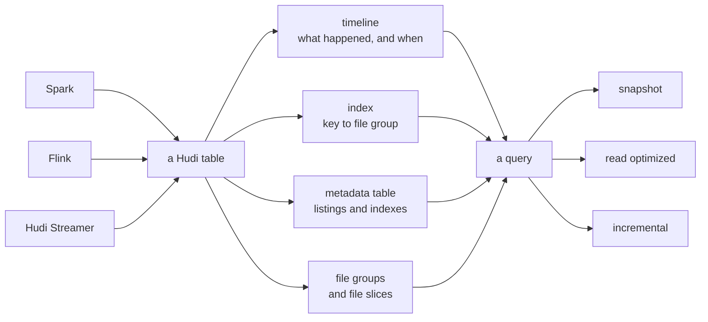
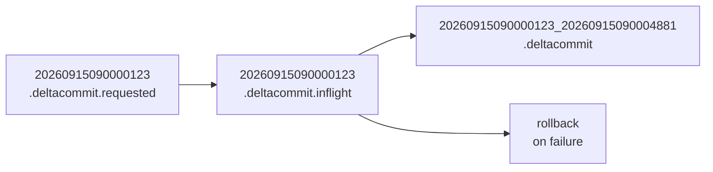
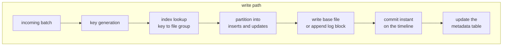
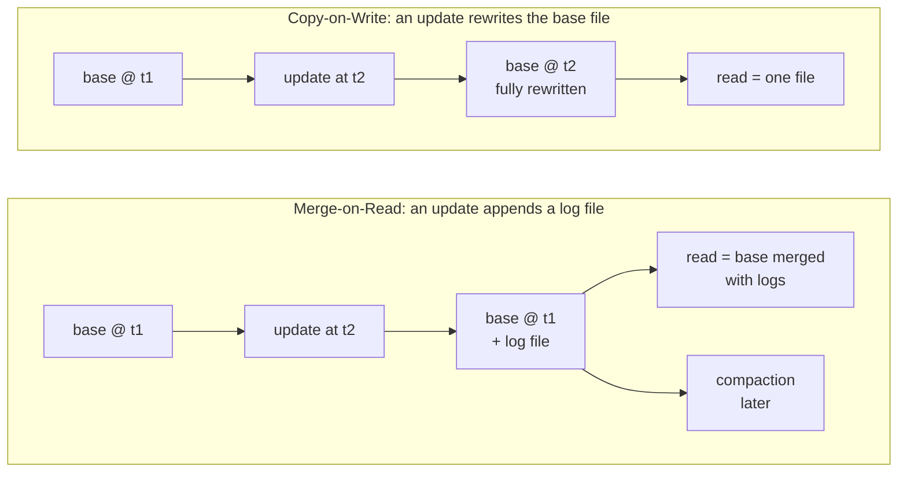
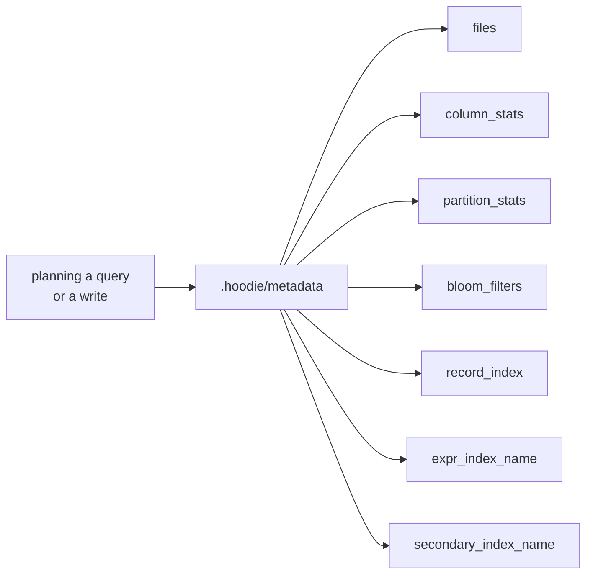
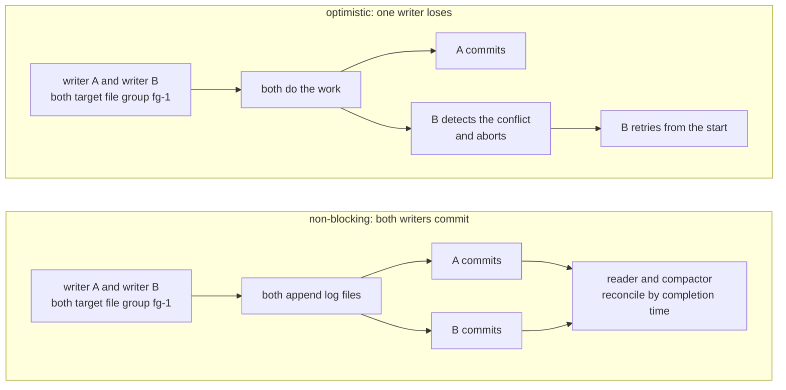

* content
{:toc}

> **TL;DR**
>
> * Hudi is a lakehouse platform whose defining choice is that a table has record identity. You declare a record key, Hudi indexes it, and an update becomes a point lookup rather than a scan.
> * The architecture rests on four primitives: the timeline of instants, file groups and file slices, the index, and the metadata table. Everything else is built from those.
> * Two table types make the write-versus-read trade explicit. Copy-on-Write rewrites base files for fast reads; Merge-on-Read appends log files for fast writes and compacts later.
> * Three capabilities have no direct equivalent in the other table formats: a record-level index, incremental queries as a first-class read mode, and non-blocking concurrency control, which lets two writers touch the same file group and resolves the conflict at read and compaction time.
> * The metadata table is not just a file listing. It holds seven kinds of index, including column stats, bloom filters, expression indexes and secondary indexes.

The first time you meet Apache Hudi it looks like the other table formats with
more configuration attached. There is a record key you have to declare, a table
type you have to pick, and a compaction job somebody has to own, none of which
Iceberg or Delta ask of you on day one.

Then you hit the workload it was built for: a change stream where one row in a
hundred million moves every minute, against a table far too large to rewrite. The
extra configuration stops looking like overhead and starts looking like the point.

The useful thing to understand about Hudi is not its feature list, which now
overlaps heavily with everyone else's. It is one decision the project made early
and never backed away from: **records have identity**. Every distinctive thing
below is downstream of that.

## What is Apache Hudi?

An open lakehouse platform: a table format on object storage plus the services
needed to keep such a table healthy. Its own documentation describes it as
bringing database functionality to data lakes, including tables, transactions,
upserts and deletes, indexes and compaction.

The project has been going since late 2016, and the docs list Uber, Amazon,
ByteDance and Robinhood among the organisations running it in production.

Its age matters less than its starting point. Hudi was not a general-purpose
table format that later grew update support. It was designed around one problem:
a continuous stream of changes to known records, landing on a data lake, needing
to be applied efficiently and consumed incrementally. Every architectural choice
below follows from that, which is why Hudi looks different from formats that
started by describing a set of immutable files.

This guide tracks the **latest Hudi release, which is 1.2.0 as of now**, and its
Spark bundles cover Spark 3.3 through 4.1. Everything below was read from that
release's tag rather than recalled, so where a claim is specific to a version the
version is named; where it is not, it holds across the 1.x line. If you are
reading this on a later release, the release table in the next section is the
thing to re-check first.

Prerequisites: comfort with Spark and SQL. No prior Hudi knowledge is assumed,
and every Hudi-specific term is defined on first use.

## Which Hudi release are you on?

Hudi's numbering changed shape at 1.0.0, so it helps to see the recent line laid
out. Dates are release dates; the table version is the on-disk format version
that release introduced, taken from `HoodieTableVersion`.

| Release | Date | Table version | Timeline layout |
|:--|:--|:--|:--|
| 0.14.0 | 2023-10-05 | 6 | v1, instants directly in `.hoodie/` |
| 0.15.0 | 2024-06-06 | 6 | v1 |
| 1.0.0 | 2024-12-11 | 8 | v2, instants in `.hoodie/timeline/` |
| 1.1.0 | 2025-11-17 | 9 | v2 |
| 1.2.0 | 2026-05-23 | 9 | v2 |

Patch releases exist on most of those lines, currently up to `0.15.1`, `1.0.2`
and `1.1.1`. Table version 7 appears in the enum mapped to a `0.16.0` that was
never released, so in practice you will meet versions 6, 8 and 9.

The jump from 6 to 8 is the one to plan for. It changes the timeline layout, so
a 0.x reader will not understand a 1.x table's timeline directory. Three
capabilities this guide relies on arrived across that boundary, each carrying a
`sinceVersion` in its own config definition:

| Capability | Since |
|:--|:--|
| Global record index (`hoodie.metadata.global.record.level.index.enable`) | 0.14.0 |
| Record merge modes (`hoodie.record.merge.mode`) | 1.0.0 |
| Partition-scoped record index (`hoodie.metadata.record.level.index.enable`) | 1.1.0 |

If you are on a 0.x release, most of the architecture in this guide still
applies, but expect the timeline to sit directly in `.hoodie/` and the
partition-scoped record index to be unavailable.

## What problem was it built for?

The architecture Hudi replaced was Parquet files in partitioned directories with
a Hive Metastore on top. Four failures drove its design, and each has a symptom
you may have hit.

**Updating one record meant rewriting a partition.** With immutable files and no
record identity, correcting a single row means reading the partition, merging,
and writing it back. A change stream delivering a few thousand updates an hour
turns into rewriting most of your table every hour.

**There was no way to ask what changed.** Downstream consumers either reprocessed
everything or maintained their own high-water marks over a timestamp column,
which breaks the moment a late record arrives with an older timestamp.

**Writes were not atomic.** A job that failed part way left readers seeing half a
batch, and there was no way to roll back to the previous state.

**Freshness and query speed were in direct conflict.** Writing small files often
kept data fresh and made queries slow; writing large files in batches made
queries fast and data stale.

Hudi's answer to all four is the same: give the table an authoritative record of
its own state, give records an identity, and make the freshness-versus-speed
trade a configuration choice rather than an architectural one.

## What is Hudi built from?



Almost everything in Hudi is built from four things. Learn these and the rest of
the system reads as composition.

### Record key and ordering field

A Hudi table declares a **record key**, the column or columns that identify a
record. It is not optional in the way a primary key is optional in a plain
Parquet table: it is part of the table contract, and it is what makes an update
addressable.

Alongside it sits an **ordering field**, used to decide which version of a record
wins when two arrive for the same key. On the 1.x line the SQL property is
`orderingFields`, with `preCombineField` kept as a registered alternative; both
resolve to the table property `hoodie.table.ordering.fields`.

How the winner is chosen is itself configurable, through `RecordMergeMode`:

| Merge mode | Winner is |
|:--|:--|
| `COMMIT_TIME_ORDERING` | The record from the later transaction |
| `EVENT_TIME_ORDERING` | The record with the larger ordering-field value, regardless of transaction time |
| `CUSTOM` | Whatever your merge implementation decides |

`EVENT_TIME_ORDERING` is the one that matters for late-arriving data. A correction
that was generated earlier but arrived later will not overwrite a newer value,
which is exactly what you want from a change stream and what a naive
last-write-wins upsert gets wrong.

### The timeline

The **timeline** is Hudi's record of everything that has happened to the table.
Each entry is an **instant**: an action, a time, and a state. In 1.x the timeline
lives in its own directory, since `hoodie.timeline.path` defaults to `timeline`
and `hoodie.timeline.history.path` to `history`.

An instant moves through three states, and the filename changes with each:



Readers only ever see the completed form, which is where atomicity comes from: a
half-finished write is visible on the timeline as `.inflight`, and invisible to
queries. A filter written against `.deltacommit` will not match a pending write,
which is deliberate.

The current release defines twelve action types:

| Action | What it records |
|:--|:--|
| `commit` | A write to a Copy-on-Write table |
| `deltacommit` | A write to a Merge-on-Read table |
| `compaction` | Merging log files into a new base file |
| `logcompaction` | Merging log blocks without rewriting the base file |
| `clustering` | Reorganising data layout without changing content |
| `replacecommit` | A write that replaces existing file groups |
| `clean` | Removing file slices no longer needed |
| `rollback` | Undoing a failed write |
| `savepoint` | Marking a state to protect from cleaning |
| `restore` | Returning the table to a savepoint |
| `indexing` | Building an index asynchronously |
| `schemacommit` | Recording a schema change |

### File groups and file slices

Data is organised into **file groups**, each identified by a file ID that never
changes. A record key, once assigned to a file group, stays there. A **file
slice** is one version of a group: a base file plus any log files written
against it.

This is the unit that makes an update local. Without it, "update this record"
has to be answered against the whole table; with it, the question becomes "which
file group", which an index can answer directly.

### The index

The **index** maps a record key to the file group holding it. This is the piece
with no equivalent in the other major table formats, and it is why Hudi behaves
differently on write-heavy workloads.

`hoodie.index.type` has no default value of its own. The Spark and Java clients
fall back to `SIMPLE` and Flink to `INMEMORY`, chosen in code rather than in the
config, so a writer that never sets it is running `SIMPLE`. The full set is
`INMEMORY`, `BLOOM`, `GLOBAL_BLOOM`, `SIMPLE`, `GLOBAL_SIMPLE`, `BUCKET`,
`FLINK_STATE`, `RECORD_INDEX`, `GLOBAL_RECORD_LEVEL_INDEX` and
`RECORD_LEVEL_INDEX`.

The distinction that runs through them is global versus partition-scoped. A
global index enforces that a key is unique across the whole table and can move a
record between partitions when its partition value changes. A partition-scoped
index allows the same key in several partitions, which is correct when your
partitioning is itself part of the identity.

## Architecture: what does a table look like on disk?

Those four primitives produce a specific on-disk shape. A Merge-on-Read table,
partitioned by city:

```
s3a://lakehouse-prod/warehouse/trips/
├── .hoodie/
│   ├── hoodie.properties                       <- the table contract
│   ├── timeline/
│   │   ├── 20260915090000123.deltacommit.requested
│   │   ├── 20260915090000123.deltacommit.inflight
│   │   ├── 20260915090000123_20260915090004881.deltacommit
│   │   └── history/                            <- archived instants
│   ├── metadata/                               <- the metadata table
│   │   ├── files/
│   │   ├── column_stats/
│   │   └── record_index/
│   └── .index_defs/index.json
└── city_id=sf/
    ├── 8f3a1c92-...-0_0-24-1893_20260915090000123.parquet    <- base file
    └── .8f3a1c92-...-0_20260915090000123.log.1_0-31-2104     <- log file
```

Note that log files begin with a dot, so a plain listing hides them. A
Merge-on-Read partition can look deceptively like Copy-on-Write at a glance.

### The write path



The index lookup is the step that distinguishes Hudi. On a table format without
record identity, the equivalent step is a join between the incoming batch and the
table, whose cost scales with how much of the table the join has to touch. With
an index, it is a lookup whose cost scales with the batch. On a small batch
against a large table, that is the whole difference.

### The read path

Reading is a reconciliation, and Hudi lets you choose how much reconciliation you
want. The three query types come from `DataSourceReadOptions`:

| Query type | Reads | On Copy-on-Write | On Merge-on-Read |
|:--|:--|:--|:--|
| `snapshot` (default) | Latest committed state | Base files | Base files merged with log files |
| `read_optimized` | Base files only | Same as snapshot | State as of the last compaction |
| `incremental` | Records changed between two instants | Supported | Supported |

`read_optimized` on a Copy-on-Write table is identical to `snapshot`, because
there are no log files to skip. On Merge-on-Read the gap between the two is
exactly the set of writes not yet compacted, which makes comparing their row
counts a useful health check.

## Copy-on-Write or Merge-on-Read?

Hudi makes you state the trade at table creation, which is more honest than
burying it in a property you discover later.

| | Copy-on-Write | Merge-on-Read |
|:--|:--|:--|
| Update applies by | Rewriting the base file | Appending a log file |
| Write latency | Higher, proportional to the files touched | Lower, proportional to the change |
| Write amplification | High: a whole base file per update | Low |
| Read latency | Low, plain columnar read | Higher on `snapshot`, merge at query time |
| Freshness | Immediate | Immediate on `snapshot`, last compaction on `read_optimized` |
| Compaction needed | No | Yes |
| Storage overhead | Lower | Higher until compaction |
| Suits | Read-heavy tables written a few times a day | Write-heavy tables fed by a change stream |



Stated as a sentence each: **Copy-on-Write buys cheap, simple reads at the cost
of rewriting a whole base file per update. Merge-on-Read buys low write latency
at the cost of read-side merge work and a compaction job you have to operate.**

The default is Copy-on-Write: `hoodie.datasource.write.table.type` defaults to
the Copy-on-Write value. Choose Merge-on-Read deliberately, and only if someone
will own compaction.

## What does it look like end to end?

One schema throughout: ride events arriving as a change stream, keyed by
`trip_id`, partitioned by `city_id`, ordered by `updated_at`. Every statement
below is literal, with the rows written inline, so you can paste the whole
section into a shell and watch a real table take shape on local disk.

Everything runs in one `spark-sql` session. Hudi's Spark SQL surface covers DDL,
upserts, incremental reads and the maintenance procedures, so nothing here needs
the DataFrame API. Swap the bundle for the one matching your Spark line, and the
`LOCATION` for your own warehouse path when you move off a laptop.

```bash
spark-sql \
  --packages org.apache.hudi:hudi-spark3.5-bundle_2.12:1.2.0 \
  --conf spark.serializer=org.apache.spark.serializer.KryoSerializer \
  --conf spark.sql.extensions=org.apache.spark.sql.hudi.HoodieSparkSessionExtension \
  --conf spark.sql.catalog.spark_catalog=org.apache.spark.sql.hudi.catalog.HoodieCatalog
```

### 1. Create the table

```sql
CREATE TABLE trips (
  trip_id      STRING,
  rider_id     STRING,
  fare_amount  DECIMAL(10,2),
  started_at   TIMESTAMP,
  updated_at   TIMESTAMP,
  city_id      STRING          -- partition column, declared last
) USING hudi
PARTITIONED BY (city_id)
LOCATION 'file:///tmp/hudi-demo/trips'
TBLPROPERTIES (
  type = 'mor',                     -- append log files, compact later
  primaryKey = 'trip_id',
  -- Renamed in 1.x; preCombineField still resolves as an alternative.
  orderingFields = 'updated_at',
  -- Late corrections must not overwrite newer values.
  recordMergeMode = 'EVENT_TIME_ORDERING',
  -- trip_id is unique within a city, so the partition-scoped index is both
  -- correct and cheaper than the global one.
  'hoodie.index.type' = 'RECORD_LEVEL_INDEX',
  'hoodie.metadata.record.level.index.enable' = 'true'
);
```

### 2. Insert the first batch

```sql
INSERT INTO trips
  (trip_id, rider_id, fare_amount, started_at, updated_at, city_id)
VALUES
  ('trip-1001', 'rider-8814f2', 24.50,
   TIMESTAMP '2026-09-15 08:12:04', TIMESTAMP '2026-09-15 08:31:10', 'sf'),
  ('trip-1002', 'rider-33c9a1', 11.75,
   TIMESTAMP '2026-09-15 08:19:47', TIMESTAMP '2026-09-15 08:29:02', 'sf'),
  ('trip-1003', 'rider-70b4de', 38.20,
   TIMESTAMP '2026-09-15 08:22:15', TIMESTAMP '2026-09-15 08:44:51', 'nyc');

SELECT trip_id, city_id, fare_amount, updated_at FROM trips ORDER BY trip_id;
```

Two small conventions there are worth copying. The partition column is declared
last, which is how Hudi's own DDL examples are written, and the `INSERT` names
its columns rather than relying on position. Together they mean you never have to
work out whether the table's column order is the order you typed.

Three rows, two partitions. Because the table declared `trip_id` as its primary
key, those keys are now addressable: the next statement can change one of them by
name rather than by rewriting a partition.

### 3. Upsert a batch of changes

The interesting batch is one that mixes an update, a correction that arrived
late, and a brand new trip. Writing it inline makes the ordering rule visible:

```sql
MERGE INTO trips t
USING (
  SELECT * FROM VALUES
    -- An ordinary update: the fare was adjusted after the trip closed.
    ('trip-1001', 'rider-8814f2', 27.00,
     TIMESTAMP '2026-09-15 08:12:04', TIMESTAMP '2026-09-15 09:05:33', 'sf'),
    -- A late arrival: generated BEFORE the row Hudi already holds. With
    -- EVENT_TIME_ORDERING this must not win, even though it lands last.
    ('trip-1002', 'rider-33c9a1', 99.99,
     TIMESTAMP '2026-09-15 08:19:47', TIMESTAMP '2026-09-15 08:15:00', 'sf'),
    -- A key Hudi has not seen, so it becomes an insert.
    ('trip-1004', 'rider-70b4de', 16.40,
     TIMESTAMP '2026-09-15 09:01:58', TIMESTAMP '2026-09-15 09:12:20', 'nyc')
  AS v(trip_id, rider_id, fare_amount, started_at, updated_at, city_id)
) s
  ON t.trip_id = s.trip_id
WHEN MATCHED THEN UPDATE SET *
WHEN NOT MATCHED THEN INSERT *;

SELECT trip_id, fare_amount, updated_at FROM trips ORDER BY trip_id;
```

Read the result rather than trusting the statement. `trip-1001` takes the new
fare because its `updated_at` moved forward. `trip-1002` keeps `11.75`, because
the incoming row carries an older `updated_at` and the table was created with
`recordMergeMode = 'EVENT_TIME_ORDERING'`. `trip-1004` is inserted. That second
row is the one worth internalising: a last-write-wins upsert would have accepted
the stale `99.99`, and a change stream will hand you that case eventually.

The record key and ordering field are part of the table contract, so `MERGE` did
not have to restate the conflict rule. That is the difference between declaring
identity once and re-deriving it in every statement.

### 4. Read only what changed

The current release registers table-valued functions, so an incremental read is
ordinary SQL. `hudi_table_changes` takes the table, a format of `latest_state` or `cdc`,
a start instant, and optionally an end instant:

```sql
-- Which instants exist? commit_time is returned newest first.
CALL show_commits(table => 'trips', limit => 5);

-- Everything that changed after a given instant.
SELECT trip_id, city_id, fare_amount, updated_at
FROM hudi_table_changes('trips', 'latest_state', '20260915090000123');

-- Or from the beginning of retained history, using the literal `earliest`.
SELECT count(*) FROM hudi_table_changes('trips', 'latest_state', 'earliest');
```

Two companion functions are worth knowing. `hudi_query` picks a query type
without a read option, and `hudi_metadata` exposes the metadata table as a
queryable relation:

```sql
-- Base files only, skipping the log-file merge.
SELECT count(*) FROM hudi_query('trips', 'read_optimized');

-- What the metadata table knows about this table.
SELECT type, key FROM hudi_metadata('trips') LIMIT 20;
```

### 5. Delete

```sql
-- Logical delete. The row stops being returned immediately.
DELETE FROM trips WHERE rider_id = 'rider-8814f2';
```

The data still exists in older file slices until cleaning removes them. For a
right-to-erasure obligation the delete is not complete until retention has
expired those slices, so the cleaner is part of the compliance story rather than
just housekeeping.

## What features do you get?

Before the parts that are distinctive, here is the baseline. These are the
capabilities a Hudi table has because it is a modern table format, and they are
what you are adopting whichever one you pick.

| Feature | What it means on a Hudi table |
|:--|:--|
| ACID transactions | Writes commit atomically as a completed instant on the timeline. A half-finished write is `.inflight` and invisible to queries |
| Snapshot isolation | Writers, table services and readers each see a consistent snapshot, so compaction running does not change what a query returns mid-flight |
| Upserts and deletes | `MERGE INTO`, `UPDATE` and `DELETE` are ordinary SQL, resolved by record key rather than by rewriting partitions |
| Schema evolution | Add, reorder and widen columns without rewriting data, with a stricter and a more flexible mode (below) |
| Time travel | Read the table as of an instant or a timestamp with `TIMESTAMP AS OF` |
| Rollback and restore | A failed write is rolled back automatically; `savepoint` and `restore` take the whole table back to a marked state |
| Incremental queries | Read only the records that changed between two instants, as a first-class query type |
| Change data capture | A `cdc` read format returns before and after images of changed records |
| Partitioning and clustering | Partition on a column, then reorganise layout with the `clustering` action without changing content |
| Automatic file sizing | Small files are grown toward a target size as part of writing, rather than by a separate job |
| Cleaning and retention | The cleaner removes file slices past retention, which is what bounds storage and completes a delete |
| Multi-engine reads | Spark, Flink, Trino, Presto and Hive read the table; Spark and Flink write it |

Two of those have enough nuance to be worth a paragraph.

**Schema evolution comes in two modes, and the second one is a one-way door.**
The default, schema evolution on write, handles the common cases: adding columns,
reordering them, and type promotions within safe widenings. The more flexible
mode, schema evolution on read, additionally allows columns (including nested
ones) to be deleted, modified, moved and renamed, and operations on nested array
columns. You turn it on with `hoodie.schema.on.read.enable=true` as a writer
config or a table property. Two caveats from the documentation are worth knowing
before you do: it is described as experimental support for backward-incompatible
changes resolved at read time, and once enabled it cannot be disabled again,
because the table will already have accepted changes that depend on it.

**Time travel reads an old state; restore makes it current again.** They are
different guarantees and it is easy to conflate them. `TIMESTAMP AS OF` gives you
a query against a past instant while the table stays where it is. `restore`
returns the table itself to a savepoint, which is point-in-time recovery. Both
are bounded by your cleaner settings: you can only travel back as far as the file
slices retention has kept.

## What is special about Hudi?

Everything in the table above, every table format now offers in some form, which
is why a feature checklist is a poor way to choose between them. The eight
capabilities below are the ones that are either unique to Hudi or materially
further along here than elsewhere, and each maps to a workload where the
difference shows up.

| Capability | What it replaces | Where you feel it |
|:--|:--|:--|
| Record-level index | A join to find the rows to update | Upserts on a large table from a small batch |
| Multi-modal index | A file listing, and a full scan on non-key columns | Planning time, and filters off the key |
| Incremental query | A watermark column and a custom diff | Chained pipelines, medallion layers |
| Non-blocking concurrency | Retry-on-conflict between writers | Several streams into one table |
| Self-running table services | Maintenance procedures you must schedule | Day-two operations |
| Savepoint and restore | Restoring a table from a backup copy | Recovering from a bad batch |
| Bootstrap | Rewriting an existing dataset to adopt a format | Migrating terabytes of Parquet |
| Hudi Streamer | An ingestion job you write and maintain | Getting from a source to a table |

### 1. A record-level index

No other major table format maps a record key to the file that holds it. Iceberg
and Delta describe a table as a set of files; neither has a notion of "the row
with this key", so an update is planned as a join.

Hudi's index turns that into a lookup. The record index comes in two
scopes, `GLOBAL_RECORD_LEVEL_INDEX` for keys unique table-wide and
`RECORD_LEVEL_INDEX` for keys unique within a partition, with the older
`RECORD_INDEX` name kept as the deprecated spelling of the global one. Their
sizing defaults differ deliberately: 10 to 10000 file groups for the global
index, 1 to 10 for the partitioned one.

### 2. A multi-modal index, not just a file listing

The metadata table at `.hoodie/metadata` is an internal Hudi table, and it holds
seven kinds of index, each in its own partition:



| Partition | Holds |
|:--|:--|
| `files` | Partition to file listing, so planning does not list object storage |
| `column_stats` | Per-column min/max per file, for data skipping |
| `partition_stats` | Column statistics aggregated per partition |
| `bloom_filters` | Bloom filters for `BLOOM` index lookups |
| `record_index` | Record key to file group, the index above |
| `expr_index_<name>` | An index over an expression rather than a raw column |
| `secondary_index_<name>` | An index on a non-key column |

Expression and secondary indexes are the notable ones. A secondary index lets a
query filter efficiently on a column that is not the record key, which is
otherwise a full scan. An expression index covers a derived value, so a filter on
a function of a column can still prune.

### 3. Incremental queries as a first-class read mode

`hoodie.datasource.query.type = incremental` returns the records that changed
between two instants. This is not a change-data-feed bolted on later; it is one
of the three query types the format was designed around, and it is why Hudi is
often the source of a chained pipeline where each stage consumes only its
upstream's changes.

### 4. Four kinds of concurrency control

Most table formats have one concurrency story. Hudi documents four, because it
draws a line between three kinds of process that touch a table: **writers** that
issue write operations, **table services** that rewrite data or metadata for
optimisation and bookkeeping, and **readers** that run queries. Different pairs
of those get different mechanisms.

| Control | Governs | What it gives you |
|:--|:--|:--|
| Snapshot isolation | Writers, table services and readers, all three | Everyone operates on a consistent snapshot of the table |
| Multiversion concurrency control (MVCC) | Writer against table service, and table service against table service | Compaction and cleaning run while a writer is working, without blocking it |
| Optimistic concurrency control (OCC) | Writer against writer | Standard relational database semantics, with lock-based conflict resolution |
| Non-blocking concurrency control (NBCC) | Writer against writer | Streaming semantics, with no live-locks or starvation between writers |

The first two are why you can run compaction against a live table at all, and
they need no configuration: MVCC is how a table service and a writer share a file
group without either waiting. The second two are the choice you actually make,
and they are selected through `WriteConcurrencyMode`:

| Mode | Behaviour |
|:--|:--|
| `SINGLE_WRITER` | One active writer. The default, and the highest throughput |
| `OPTIMISTIC_CONCURRENCY_CONTROL` | Multiple writers with lock-based conflict resolution; if two write to the same file group, only one succeeds |
| `NON_BLOCKING_CONCURRENCY_CONTROL` | Multiple writers into the same file group, with conflicts resolved by the reader and the compactor |



The last row is the interesting one. Under optimistic concurrency, which is what
Iceberg and Delta use, two writers touching the same data means one does all its
work and then loses. Non-blocking concurrency control lets both succeed and defers the
reconciliation to read and compaction time. For a Merge-on-Read table fed by
several concurrent streams, that is the difference between throughput and a retry
storm.

Two constraints keep this honest. The default is `SINGLE_WRITER`, so multi-writer
support is opt-in and the optimistic mode needs a lock provider configured. And
non-blocking concurrency control is not general: the docs scope it to
Merge-on-Read tables using the simple bucket index or the partition-level bucket
index, and it is not supported between an ingestion writer and clustering, where
you still use the optimistic mode. Serialization order comes from each commit's
completion time, which is also what file slicing is based on.

The optimistic mode is not standing still either. Since 0.13.0 Hudi detects
conflicts early, using markers to spot an overlapping write during the job rather
than at commit time, so a losing writer wastes less compute before it retries.

### 5. Table services that run themselves

Hudi ships the maintenance as part of the platform rather than as procedures you
remember to call, and each can run inline with writes or asynchronously:

| Service | Does | Timeline action |
|:--|:--|:--|
| Compaction | Merges log files into a new base file | `compaction` |
| Log compaction | Merges log blocks without rewriting the base file | `logcompaction` |
| Clustering | Reorganises layout, sorting and file sizing | `clustering` |
| Cleaning | Removes file slices past retention | `clean` |
| Indexing | Builds an index without blocking writers | `indexing` |

### 6. Savepoint and restore

`savepoint` marks a state and protects it from cleaning; `restore` returns the
table to it. Together they are a point-in-time recovery mechanism at the table
level, which is a different guarantee from time travel: time travel lets you read
an old state, restore makes it current again.

### 7. Write operations beyond insert and upsert

`WriteOperationType` includes `INSERT`, `UPSERT`, `BULK_INSERT`,
`DELETE`, `BOOTSTRAP`, `INSERT_OVERWRITE`, `INSERT_OVERWRITE_TABLE`,
`DELETE_PARTITION`, `BUCKET_RESCALE`, `CLUSTER`, `COMPACT`, `LOG_COMPACT`,
`INDEX` and `ALTER_SCHEMA`.

`BOOTSTRAP` deserves a mention: it turns an existing Parquet dataset into a Hudi
table by generating metadata that points at the existing files, rather than
rewriting terabytes to adopt the format.

### 8. Hudi Streamer

The project ships a managed ingestion utility, `HoodieStreamer` in
`hudi-utilities`, which reads from a source, applies transformations and writes a
Hudi table with checkpointing and schema handling built in. Most table formats
leave ingestion entirely to you.

## Which engines can read and write it?

| Engine | Snapshot | Read-optimized | Incremental | Writes |
|:--|:--|:--|:--|:--|
| Spark | Yes | Yes | Yes | Yes |
| Flink | Yes | Yes | Yes | Yes |
| Trino | Yes | Yes | Through the connector | No |
| Presto | Yes | Yes | Through the connector | No |
| Hive | Yes | Yes | Limited | No |

Writes are a Spark and Flink story; the other engines read. If your ingestion is
neither Spark nor Flink, that is worth confirming before adopting Hudi.

## When does a simpler choice win?

Hudi's design assumes records have identity and change over time. Where that
assumption holds, everything above earns its keep. Where it does not, there are
good simpler answers, and recognising them is part of using the tool well.

**Append-only tables** need no index and no merge. `bulk_insert` skips tagging
entirely, and if you never correct a row, plain partitioned Parquet is less
machinery with fewer surprises.

**Read-heavy tables written a few times a day** do well on Copy-on-Write with
inline table services, which keeps every read a plain columnar scan and leaves
nothing to schedule.

**Teams still building operational capacity** are better served by Copy-on-Write
with inline services than by Merge-on-Read. You can move to Merge-on-Read later,
once someone owns compaction, and the table type is a decision you make per table
rather than once for the platform.

**Ingestion outside Spark and Flink** wants a check against the table above
first, since those two are where the write support lives.

## Production tips

* **Set `hoodie.index.type` explicitly.** An absent value still resolves to `SIMPLE` on Spark, whose cost scales with table size rather than batch size.
* **Choose the index scope from your data model.** Global versus partition-scoped changes correctness when partition values mutate, not just speed.
* **Use `EVENT_TIME_ORDERING`** when late-arriving corrections must not overwrite newer values.
* **Decide who runs compaction before production.** `hoodie.compact.inline` is `false` by default.
* **Leave the metadata table enabled.** The metadata-backed indexes need it, and planning without it means listing object storage.
* **Point heavy dashboards at `read_optimized`** on Merge-on-Read tables when last-compaction freshness is acceptable.
* **Configure a lock provider before the second writer exists**, and consider non-blocking concurrency control for Merge-on-Read tables with concurrent streams.
* **Treat cleaning as part of your erasure story**, not as housekeeping.

## Frequently asked questions

**Do I have to use Merge-on-Read?**
No, and it is not the default. `hoodie.datasource.write.table.type` defaults to
Copy-on-Write, which is the right choice for most tables written a few times a
day. Merge-on-Read is the option you reach for when writes are frequent and
someone will own compaction.

**What if my data has no natural primary key?**
Hudi can build one. `hoodie.datasource.write.keygenerator.class` selects a key
generator, and composite keys built from several columns are ordinary. If nothing
in the row identifies it and nothing ever updates, that is a strong sign an
append-only pattern suits you better than an indexed one.

**Can I read a Hudi table from Trino or Snowflake?**
Trino and Presto read it through their connectors, per the table above. Beyond
that, Apache XTable converts Hudi metadata into Iceberg or Delta metadata over
the same Parquet files, so an engine that speaks one of those can read a table
Hudi writes without the data being copied.

**Is the metadata table optional?**
Technically, but leave it on. `hoodie.metadata.enable` has defaulted to `true`
since 0.7.0, the metadata-backed indexes require it, and planning without it
means listing object storage on every query.

**How do I move a 0.x table to 1.x?**
Through the table version. 0.x tables are version 6 and 1.x tables are version 8
or 9, and the jump changes the timeline layout, so a 0.x reader will not
understand a 1.x timeline directory. Upgrade readers and writers together rather
than one at a time.

**Does declaring a record key slow down writes?**
It adds the tagging step, and how much that costs is entirely the index's doing.
With `SIMPLE`, tagging scans and the cost tracks your table. With a record index
it is a point lookup and the cost tracks your batch. That is why setting
`hoodie.index.type` deliberately matters more than almost anything else here.

## Conclusion

Back to the configuration that looks like overhead on day one. The record key,
the table type and the compaction job are not accessories bolted onto a table
format; they are the three places where the decision that records have identity
becomes something you have to act on. The index exists because keys are
addressable. Incremental queries exist because the timeline knows which records
changed in each instant. Non-blocking concurrency is possible because file groups
localise where a change lands. Formats that describe a table only as a set of
files cannot offer those things without first adding the concept Hudi started
with.

That choice has a cost, and it is worth being clear about. An index has to be
maintained, table services have to be operated, and a Merge-on-Read table that
nobody compacts gets slower every day without ever raising an error. Hudi asks
more of its operators than a format designed for append-mostly batch writes, and
it repays that in workloads where small batches of changes arrive continuously
against a large table.

If you are evaluating it, the most predictive question is whether your writes are
keyed. A stream of inserts, updates and deletes to known primary keys is the
shape Hudi was built for, and the index is doing work that other formats ask a
join to do. Large batch appends that replace partitions are the shape where that
machinery is overhead. Start there, pick the table type from your write
frequency, and decide who owns compaction before you need it.

## References

* [Apache Hudi overview](https://hudi.apache.org/docs/overview) for the project's own description and capability list
* [Hudi table types](https://hudi.apache.org/docs/table_types) for Copy-on-Write versus Merge-on-Read and the query types each supports
* [Hudi indexes](https://hudi.apache.org/docs/indexes) for choosing between the index types described above
* [Hudi configuration reference](https://hudi.apache.org/docs/configurations/) for every `hoodie.*` key with its default and since-version
* [Open table formats in practice]() for how Hudi compares with Iceberg and Delta Lake
