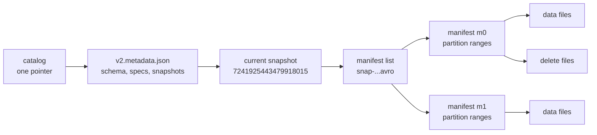
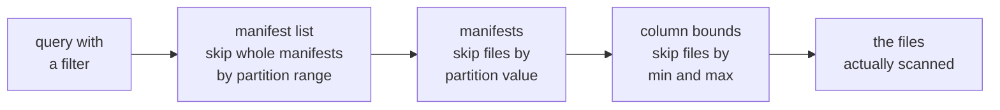
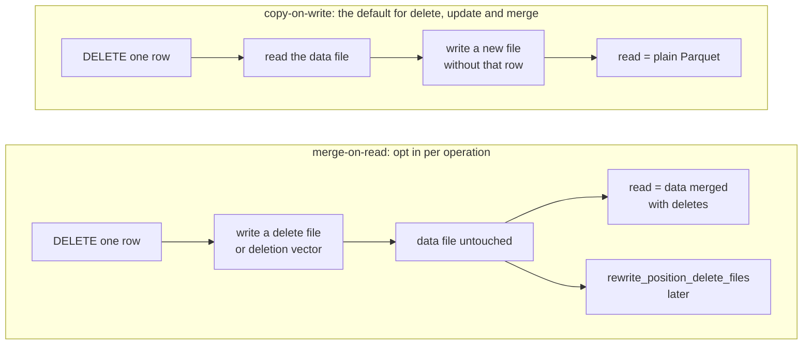
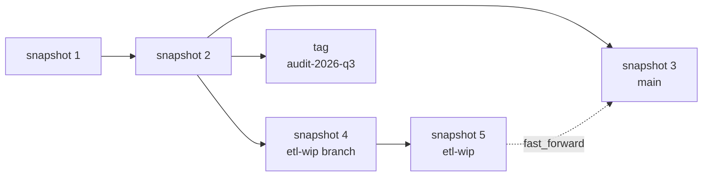

* content
{:toc}

> **TL;DR**
>
> * Iceberg describes a table as an immutable tree: a catalog pointer to `metadata.json`, which names a snapshot, which points at a manifest list, which points at manifests, which list data files.
> * The catalog is not optional. Nothing inside the table says which `metadata.json` is current, so commit atomicity is a property of the catalog, not of the format.
> * The default that surprises everyone: `write.delete.mode`, `write.update.mode` and `write.merge.mode` all default to `copy-on-write`, so a fresh table rewrites whole files on `DELETE`, `UPDATE` and `MERGE`.
> * Hidden partitioning means you declare `days(started_at)` and queries filtering on `started_at` prune automatically, with no separate `dt` column to remember.
> * New tables are format version 2 by default (`DEFAULT_TABLE_FORMAT_VERSION`), and 1.11.0 reads and writes up to version 4.

This is the Iceberg companion to the [Hudi cheat sheet](), in the same shape: every section is a
lookup, each row gives you the concept, a literal example you can copy, and the
one or two sentences that tell you whether you want it.

Written against the **latest Iceberg release, 1.11.0 as of now**, on Spark. Every
property, default, enum value and procedure name below was read from the
`apache-iceberg-1.11.0` tag rather than recalled. Diagrams captioned *Source: Apache
Iceberg documentation* come from the project's own site assets, &copy; The Apache
Software Foundation, used under the
[Apache License 2.0](https://www.apache.org/licenses/LICENSE-2.0); the rest are
my own. Where a claim is specific to a
version, the version is named.

## 1. History and major releases

| Date | Milestone |
|:--|:--|
| 2018-11-16 | Entered the Apache incubator as a table format for large, slow-moving tabular data |
| 2018-12-10 | Software grant agreement filed |
| 2019-06-23 | The specification moved to git and the ASF site, making the format itself the deliverable |
| 2020-05-20 | Graduated to a Top-Level Project, the same day as Apache Hudi |
| 2021-01-26 | **0.11.0**, the line where Spark 3 support and row-level operations matured |
| 2022-10-17 | **1.0.0**, the format declared stable |
| 2023-10-04 | **1.4.0** |
| 2025-02-13 | **1.8.0** |
| 2026-05-19 | **1.11.0**, the current release |

| Line | What it brought |
|:--|:--|
| 0.x | The snapshot tree, hidden partitioning, partition and schema evolution, format version 2 with position and equality deletes, the first Spark and Flink integrations |
| 1.0 to 1.3 | API stability, `rewrite_data_files` and the maintenance procedure surface, branches and tags, Puffin statistics files |
| 1.4 to 1.7 | The REST catalog spec maturing, view support, changelog scans, broader engine adoption |
| 1.8 to 1.11 | Format version 3 with deletion vectors and row lineage, format version 4, `compute_table_stats` and `compute_partition_stats`, `rewrite_table_path` |

The pattern to notice is that the *specification* is the project, and the engine
integrations follow it. That is why an Iceberg table written by Spark is readable
by Trino or Snowflake without a translation step, and why "which format version"
is a more useful question than "which library version".

## 2. Core architecture

| Concept | Example | Description |
|:--|:--|:--|
| Catalog pointer | Hive Metastore, REST, Glue, JDBC, Nessie | Holds the single pointer to the current `metadata.json`. Provides the atomic compare-and-swap that makes a commit a commit |
| Table metadata | `metadata/v2.metadata.json` | Schema, partition specs, sort orders, properties, snapshot log and the current snapshot id. Rewritten in full on every commit |
| Snapshot | snapshot id `7241925443479918015` | The complete set of data files at one point in time. Immutable, and readable for as long as retention keeps it |
| Manifest list | `metadata/snap-7241925443479918015-1-a1c2....avro` | One per snapshot. Lists the manifests in it, with partition ranges so whole manifests can be skipped at plan time |
| Manifest | `metadata/a1c2f3b4-....-m0.avro` | Lists data files with partition values, record counts and per-column bounds. This is what planning reads instead of listing storage |
| Data file | `data/city_id=sf/00000-0-a1c2f3b4-....parquet` | The rows. The directory layout is human convenience only; partition values come from the manifest |
| Delete file | position or equality deletes, or a Puffin deletion vector | How a row is removed without rewriting its data file, under merge-on-read |



A commit writes a new `metadata.json` and swaps the catalog pointer. Nothing
already written is mutated, which is what makes an old snapshot readable for as
long as retention keeps it.

The specification's own view of the same structure, showing how successive
snapshots share manifests rather than duplicating them:


*Source: Apache Iceberg documentation.*

Sharing is the part worth noticing. A commit that adds one file writes a new
manifest and a new manifest list, but reuses every manifest that did not change,
which is why snapshot history costs metadata rather than data.

```
s3a://lakehouse-prod/warehouse/trips/
├── metadata/
│   ├── v1.metadata.json
│   ├── v2.metadata.json                              <- current, per the catalog
│   ├── snap-7241925443479918015-1-a1c2....avro       <- manifest list
│   ├── a1c2f3b4-....-m0.avro                         <- manifest
│   └── a1c2f3b4-....-m1.avro
└── data/
    ├── city_id=sf/00000-0-a1c2f3b4-....parquet
    └── city_id=nyc/00000-1-a1c2f3b4-....parquet
```

`FileContent` enumerates what a manifest entry can describe: `DATA`,
`POSITION_DELETES`, `EQUALITY_DELETES`, `DATA_MANIFEST` and `DELETE_MANIFEST`.

Planning is a sequence of prunes rather than a directory listing, and each step
reads metadata rather than data:



## 3. Getting started

```bash
spark-sql \
  --packages org.apache.iceberg:iceberg-spark-runtime-3.5_2.12:1.11.0 \
  --conf spark.sql.extensions=org.apache.iceberg.spark.extensions.IcebergSparkSessionExtensions \
  --conf spark.sql.catalog.prod=org.apache.iceberg.spark.SparkCatalog \
  --conf spark.sql.catalog.prod.type=hive \
  --conf spark.sql.catalog.prod.uri=thrift://metastore.internal:9083
```

| Concept | Example | Description |
|:--|:--|:--|
| Hive catalog | `spark.sql.catalog.prod.type=hive` | Backed by a Hive Metastore. Provides atomic swaps |
| REST catalog | `spark.sql.catalog.prod.type=rest` | The catalog spec other engines implement. The portable choice |
| Hadoop catalog | `spark.sql.catalog.prod.type=hadoop` | Filesystem only, no external service. Not safe for concurrent writers on plain S3 |
| Session catalog | `spark.sql.catalog.spark_catalog=...SparkSessionCatalog` | Wraps the built-in catalog so Iceberg and non-Iceberg tables coexist |

```sql
CREATE TABLE prod.db.trips (
  trip_id      STRING,
  rider_id     STRING,
  fare_amount  DECIMAL(10,2),
  started_at   TIMESTAMP,
  city_id      STRING
) USING iceberg
PARTITIONED BY (city_id, days(started_at));

INSERT INTO prod.db.trips VALUES
  ('trip-1001', 'rider-8814f2', 24.50, TIMESTAMP '2026-09-15 08:12:04', 'sf'),
  ('trip-1002', 'rider-33c9a1', 11.75, TIMESTAMP '2026-09-15 08:19:47', 'sf');

SELECT * FROM prod.db.trips;

UPDATE prod.db.trips SET fare_amount = 27.00 WHERE trip_id = 'trip-1001';

DELETE FROM prod.db.trips WHERE trip_id = 'trip-1002';

MERGE INTO prod.db.trips t
USING trip_updates s ON t.trip_id = s.trip_id
WHEN MATCHED THEN UPDATE SET *
WHEN NOT MATCHED THEN INSERT *;
```

Note there is no record key to declare. Iceberg has no notion of row identity, so
`MERGE` states the matching condition itself and plans a join to find the files.

## 4. Hidden partitioning and transforms

| Concept | Example | Description |
|:--|:--|:--|
| `identity` | `PARTITIONED BY (city_id)` | Partition by the column value. The only transform that looks like Hive partitioning |
| `year` | `PARTITIONED BY (years(started_at))` | One partition per year. Queries filtering `started_at` prune without naming a partition column |
| `month` | `PARTITIONED BY (months(started_at))` | One partition per month |
| `day` | `PARTITIONED BY (days(started_at))` | One partition per day. The common choice for event tables |
| `hour` | `PARTITIONED BY (hours(started_at))` | One partition per hour |
| `bucket` | `PARTITIONED BY (bucket(16, rider_id))` | Hash into N buckets. Spreads a high-cardinality key evenly |
| `truncate` | `PARTITIONED BY (truncate(4, postcode))` | Partition by a prefix of the value |
| Partition evolution | `ALTER TABLE ... ADD PARTITION FIELD` | Change the spec without rewriting data. Old files keep their original spec |

```sql
-- Evolve the layout: start daily, add a bucket, drop the old field
ALTER TABLE prod.db.trips ADD PARTITION FIELD bucket(16, rider_id);
ALTER TABLE prod.db.trips DROP PARTITION FIELD days(started_at);

-- The partition spec history is queryable
SELECT * FROM prod.db.trips.partitions;
```

**Hidden partitioning is the point.** The writer declares `days(started_at)` and
the reader filters on `started_at`. There is no `dt` column to add to the schema,
no risk of a query forgetting to filter on it, and no correlation for the user to
remember. This is the capability that is hardest to retrofit in another format.

## 5. Row-level operations

| Concept | Example | Description |
|:--|:--|:--|
| Copy-on-write | `'write.delete.mode' = 'copy-on-write'` | Rewrites whole data files on change. Reads stay plain Parquet. **The default for delete, update and merge** |
| Merge-on-read | `'write.update.mode' = 'merge-on-read'` | Writes delete files instead of rewriting data. Fast writes, reads reconcile, and something must compact |
| Position deletes | file path plus row positions | Precise and cheap to apply. The reader knows exactly which rows to drop |
| Equality deletes | column values, for example `trip_id = 'trip-1001'` | Avoids needing positions, but the reader applies the predicate more widely |
| Deletion vectors | Puffin blobs, format version 3 | A bitmap of deleted rows per data file. Implemented in `DeletionVector.java` and the `puffin` package |



```sql
-- All three default to copy-on-write; set them together or not at all
ALTER TABLE prod.db.trips SET TBLPROPERTIES (
  'write.delete.mode' = 'merge-on-read',
  'write.update.mode' = 'merge-on-read',
  'write.merge.mode'  = 'merge-on-read'
);
```

> **Note:** `TableProperties` at 1.11.0 sets `DELETE_MODE_DEFAULT`,
> `UPDATE_MODE_DEFAULT` and `MERGE_MODE_DEFAULT` all to
> `RowLevelOperationMode.COPY_ON_WRITE.modeName()`. This is the single most
> counter-intuitive default in the format: a table you have not configured
> rewrites files on every `DELETE`.

## 6. Format versions

| Version | Example | Description |
|:--|:--|:--|
| v1 | `'format-version' = '1'` | Data files only. No row-level deletes |
| v2 | `'format-version' = '2'` | Position and equality delete files. **The default for new tables** (`DEFAULT_TABLE_FORMAT_VERSION = 2`) |
| v3 | `'format-version' = '3'` | Deletion vectors, and the minimum for row lineage |
| v4 | `'format-version' = '4'` | The highest 1.11.0 reads and writes (`SUPPORTED_TABLE_FORMAT_VERSION = 4`) |

```sql
ALTER TABLE prod.db.trips SET TBLPROPERTIES ('format-version' = '3');
```

Format version only moves forward. Check that every engine reading the table
supports the version before raising it.

## 7. Metadata tables

`MetadataTableType` lists sixteen, and querying them is the fastest way to
understand a table you did not create.

| Metadata table | Example | Description |
|:--|:--|:--|
| `snapshots` | `SELECT * FROM prod.db.trips.snapshots` | Every snapshot with its timestamp, operation and summary. Usually the first thing to run |
| `history` | `SELECT * FROM prod.db.trips.history` | Which snapshot was current when, including rollbacks |
| `files` | `SELECT * FROM prod.db.trips.files` | Every file in the current snapshot with partition values, record counts and column bounds |
| `data_files` | `SELECT count(*) FROM prod.db.trips.data_files` | Data files only |
| `delete_files` | `SELECT * FROM prod.db.trips.delete_files` | Delete files only. A growing count means merge-on-read needs compaction |
| `position_deletes` | `SELECT * FROM prod.db.trips.position_deletes` | The position delete records themselves |
| `manifests` | `SELECT * FROM prod.db.trips.manifests` | Manifests in the current snapshot, with partition summaries |
| `partitions` | `SELECT * FROM prod.db.trips.partitions` | Per-partition file and record counts. Finds skew and small-file problems |
| `entries` | `SELECT * FROM prod.db.trips.entries` | Raw manifest entries, including added and deleted status |
| `refs` | `SELECT * FROM prod.db.trips.refs` | Branches and tags with their retention settings |
| `metadata_log_entries` | `SELECT * FROM prod.db.trips.metadata_log_entries` | The `metadata.json` files written over time |
| `all_data_files` | `SELECT count(*) FROM prod.db.trips.all_data_files` | Across all snapshots, not just the current one |
| `all_delete_files` | | Across all snapshots |
| `all_files` | | Across all snapshots |
| `all_manifests` | | Across all snapshots |
| `all_entries` | | Across all snapshots |

```sql
-- Two queries that answer most "why is this table slow" questions
SELECT partition, record_count, file_count
FROM prod.db.trips.partitions ORDER BY file_count DESC LIMIT 20;

SELECT count(*) AS delete_files FROM prod.db.trips.delete_files;
```

## 8. Time travel, branches and tags

| Concept | Example | Description |
|:--|:--|:--|
| By snapshot id | `SELECT * FROM prod.db.trips VERSION AS OF 7241925443479918015` | Read an exact snapshot |
| By timestamp | `SELECT * FROM prod.db.trips TIMESTAMP AS OF '2026-09-14 09:00:00'` | Read the snapshot current at that time |
| By branch or tag | `SELECT * FROM prod.db.trips VERSION AS OF 'audit-2026-q3'` | Read a named ref |
| Create a tag | `ALTER TABLE prod.db.trips CREATE TAG 'audit-2026-q3'` | An immutable name for one snapshot. Good for audits and reproducible runs |
| Create a branch | `ALTER TABLE prod.db.trips CREATE BRANCH 'etl-wip'` | An independent line of commits over the same table |
| Write to a branch | `INSERT INTO prod.db.trips.branch_etl_wip SELECT ...` | Stage work without touching the main line |
| Fast-forward | `CALL prod.system.fast_forward('prod.db.trips', 'main', 'etl-wip')` | Move `main` up to the branch once the work is validated |
| Retention on a ref | `CREATE TAG 'x' RETAIN 90 DAYS` | Stops snapshot expiry from removing the snapshot the ref points at |



Branches are the audit-and-backfill mechanism: stage a risky rewrite on a branch,
validate it with ordinary queries, then fast-forward `main`. Nothing readers see
changes until the fast-forward.

## 9. Schema evolution

| Change | Example | Description |
|:--|:--|:--|
| Add column | `ALTER TABLE t ADD COLUMN driver STRING` | Safe. Columns are tracked by assigned ID, never by position |
| Add nested | `ALTER TABLE t ADD COLUMN loc.postcode STRING` | Works inside structs |
| Rename | `ALTER TABLE t RENAME COLUMN rider TO passenger` | Metadata only. The ID does not change, so data files are untouched |
| Drop | `ALTER TABLE t DROP COLUMN driver` | Metadata only. The column stays in old files and is simply not read |
| Reorder | `ALTER TABLE t ALTER COLUMN fare AFTER rider_id` | Metadata only |
| Widen type | `ALTER TABLE t ALTER COLUMN fare TYPE double` | Widening only: `int` to `long`, `float` to `double`, `decimal` to greater precision |
| Required to optional | `ALTER TABLE t ALTER COLUMN rider_id DROP NOT NULL` | Allowed. The reverse is not |

Iceberg's schema evolution has no experimental mode and no enabling flag, because
column IDs are in the format itself rather than bolted on. That is the practical
difference from formats where rename and drop need a compatibility mode switched
on first.

## 10. Procedures

`SparkProcedures` registers exactly twenty at 1.11.0. Call them as
`CALL <catalog>.system.<name>(...)`.

| Category | Procedure | Description |
|:--|:--|:--|
| Snapshots | `rollback_to_snapshot` | Roll the table back to a snapshot id |
| Snapshots | `rollback_to_timestamp` | Roll back to whatever was current at a time |
| Snapshots | `set_current_snapshot` | Point the table at a snapshot without rolling back history |
| Snapshots | `cherrypick_snapshot` | Apply one snapshot's changes onto the current state |
| Snapshots | `publish_changes` | Publish a staged (WAP) snapshot by its id |
| Snapshots | `ancestors_of` | List the ancestor snapshots of a snapshot |
| Branches | `fast_forward` | Fast-forward one ref to another |
| Maintenance | `rewrite_data_files` | Compact small files, optionally sorting or z-ordering |
| Maintenance | `rewrite_manifests` | Shrink and re-cluster manifests so planning stays fast |
| Maintenance | `rewrite_position_delete_files` | Compact position delete files on a merge-on-read table |
| Maintenance | `expire_snapshots` | Drop old snapshots and the files only they referenced |
| Maintenance | `remove_orphan_files` | Delete files on storage that no metadata references |
| Statistics | `compute_table_stats` | Build table-level statistics for the optimiser |
| Statistics | `compute_partition_stats` | Build partition-level statistics |
| Migration | `migrate` | Convert an existing Hive or Parquet table into Iceberg in place |
| Migration | `snapshot` | Create an Iceberg table over existing data, leaving the source intact |
| Migration | `add_files` | Add existing data files to an Iceberg table without rewriting them |
| Migration | `register_table` | Register an existing `metadata.json` into a catalog |
| Migration | `rewrite_table_path` | Rewrite absolute paths in metadata, for a table that moved |
| Changelog | `create_changelog_view` | Build a view of the row changes between two snapshots |

```sql
-- Compact, sorting within each file group
CALL prod.system.rewrite_data_files(
  table => 'db.trips',
  strategy => 'sort',
  sort_order => 'city_id ASC, started_at DESC'
);

-- Expire snapshots older than a week, keeping at least 10
CALL prod.system.expire_snapshots(
  table => 'db.trips',
  older_than => TIMESTAMP '2026-09-08 00:00:00',
  retain_last => 10
);

-- What changed between two snapshots
CALL prod.system.create_changelog_view(
  table => 'db.trips',
  changelog_view => 'trips_changes',
  options => map('start-snapshot-id', '7241925443479918015'),
  identifier_columns => array('trip_id')
);

SELECT trip_id, _change_type, _change_ordinal FROM trips_changes ORDER BY _change_ordinal;
```

## 11. Maintenance

| Job | Example | Description |
|:--|:--|:--|
| Compact small files | `CALL prod.system.rewrite_data_files(table => 'db.trips')` | Skipping this gives you a table where planning costs more than scanning |
| Sort or z-order | `rewrite_data_files` with `strategy => 'sort'` | Re-clusters data so column bounds prune more files |
| Compact deletes | `CALL prod.system.rewrite_position_delete_files(table => 'db.trips')` | Merge-on-read only. Bounds what a reader reconciles |
| Expire snapshots | `CALL prod.system.expire_snapshots(table => 'db.trips', retain_last => 10)` | Bounds storage, and completes a delete for erasure purposes |
| Rewrite manifests | `CALL prod.system.rewrite_manifests(table => 'db.trips')` | Keeps planning fast once the manifest count grows |
| Remove orphans | `CALL prod.system.remove_orphan_files(table => 'db.trips')` | Reclaims files left by failed writes. Run it conservatively, with an `older_than` |

> **Note:** A deleted row stays readable through time travel until
> `expire_snapshots` removes the snapshots containing it. For a right-to-erasure
> obligation, expiry is part of the compliance story rather than housekeeping.

## 12. Key table properties

| Property | Default | Description |
|:--|:--|:--|
| `write.format.default` | `parquet` | Data file format for writes |
| `write.target-file-size-bytes` | 536870912, 512 MB | What compaction and writes aim for |
| `write.delete.mode` | `copy-on-write` | Strategy for `DELETE` |
| `write.update.mode` | `copy-on-write` | Strategy for `UPDATE` |
| `write.merge.mode` | `copy-on-write` | Strategy for `MERGE` |
| `format-version` | 2 for new tables | Table format version, 1 through 4 at 1.11.0 |
| `write.distribution-mode` | varies by operation | `none`, `hash` or `range`. Controls the shuffle before writing |
| `write.metadata.delete-after-commit.enabled` | `false` | Bounds `metadata.json` accumulation when enabled |
| `write.metadata.previous-versions-max` | 100 | How many old `metadata.json` files to keep |
| `history.expire.max-snapshot-age-ms` | 5 days | Default age `expire_snapshots` works from |

## 13. Sorting, clustering and file sizing

| Concept | Example | Description |
|:--|:--|:--|
| Write sort order | `ALTER TABLE t WRITE ORDERED BY city_id, started_at` | Declares the order writers should produce. Makes column bounds tight, so more files prune |
| Locally ordered | `WRITE LOCALLY ORDERED BY started_at` | Sorts within each task rather than globally. Cheaper, still helps bounds |
| Distribution mode | `'write.distribution-mode' = 'hash'` | `none`, `hash` or `range`. Controls the shuffle before a write, which decides file count and skew |
| Compact | `CALL prod.system.rewrite_data_files(table => 'db.trips')` | Bin-packs small files toward the target size |
| Compact and sort | `rewrite_data_files` with `strategy => 'sort'` | Re-clusters as it compacts, which is what makes later scans prune |
| Z-order | `sort_order => 'zorder(city_id, rider_id)'` | Multi-dimensional clustering, for filters on several columns |
| Target size | `'write.target-file-size-bytes' = '536870912'` | 512 MB default. What both writes and compaction aim for |
| Partial progress | `'partial-progress.enabled' = 'true'` | Commits compaction in batches, so a long rewrite is not all-or-nothing |

```sql
-- Declare the order once, and every writer honours it
ALTER TABLE prod.db.trips WRITE ORDERED BY city_id, started_at;

-- Compact and z-order the last week only, committing progressively
CALL prod.system.rewrite_data_files(
  table => 'db.trips',
  strategy => 'sort',
  sort_order => 'zorder(city_id, rider_id)',
  where => 'started_at >= TIMESTAMP \'2026-09-08 00:00:00\'',
  options => map('partial-progress.enabled', 'true', 'max-concurrent-file-group-rewrites', '4')
);
```

Sorting is what makes Iceberg's column bounds worth having. Unsorted data gives
every file a wide min and max, so bounds prune nothing and every query is a full
scan regardless of how much metadata you have.

## 14. Diagnosing a table

| Symptom | Where to look | Likely cause |
|:--|:--|:--|
| Planning slower than the scan | `SELECT count(*) FROM t.files` | Too many small files, or manifests never rewritten |
| Storage grows far faster than data | `SELECT count(*) FROM t.snapshots` | Snapshots never expired, so no file is ever reclaimable |
| Reads get slower on a merge-on-read table | `SELECT count(*) FROM t.delete_files` | Delete files accumulating. Run `rewrite_position_delete_files` |
| Filters do not prune | `t.files` column bounds, and the query plan | Data is unsorted, so bounds overlap. Declare a write order and compact with sort |
| One partition dominates runtime | `SELECT * FROM t.partitions ORDER BY file_count DESC` | Skew, or a partition transform whose granularity is wrong |
| `Cannot commit: stale table metadata` | The catalog type | Writer contention. Expected under optimistic concurrency; check the catalog gives atomic swaps |
| A deleted row is still visible | `t.snapshots` and retention | Time travel still reaches the snapshot holding it. Expiry has not run |
| Orphan files after failed jobs | `remove_orphan_files` with a conservative `older_than` | Failed writes leave data behind that no metadata references |

```sql
-- The three-query triage
SELECT count(*) AS files, sum(file_size_in_bytes)/1024/1024 AS mb FROM prod.db.trips.files;
SELECT count(*) AS snapshots, min(committed_at) AS oldest FROM prod.db.trips.snapshots;
SELECT count(*) AS delete_files FROM prod.db.trips.delete_files;
```

## 15. Migrating a Hive table to Iceberg

Three procedures, and the difference between them is what happens to the source
table. All three reuse the existing data files rather than rewriting them.

| Procedure | Source table after | Use it when |
|:--|:--|:--|
| `snapshot` | Untouched, still queryable | You want to test Iceberg against real data with a safe rollback: drop the new table and nothing is lost |
| `migrate` | Replaced in place, retained as `<table>_BACKUP_` | You have validated the format and want the original name to become the Iceberg table |
| `add_files` | Untouched | You already have an Iceberg table and want to pull existing files into it, for example a backfill |

| Procedure | Arguments |
|:--|:--|
| `snapshot` | `source_table` (required), `table` (required), `location`, `properties`, `parallelism` (default 1) |
| `migrate` | `table` (required), `properties`, `drop_backup` (default `false`), `backup_table_name` (default `<table>_BACKUP_`), `parallelism` |
| `add_files` | `table` (required), `source_table` (required), `partition_filter`, `check_duplicate_files` (default `true`), `parallelism` |

```sql
-- 1. Rehearse: an Iceberg table over the same files, source untouched
CALL prod.system.snapshot('hive_db.trips', 'prod.db.trips_iceberg');

-- Validate against the original before going further
SELECT count(*) FROM hive_db.trips;
SELECT count(*) FROM prod.db.trips_iceberg;

-- 2. Commit: replace the Hive table in place, keeping a backup
CALL prod.system.migrate(table => 'hive_db.trips');

-- The original is now hive_db.trips_BACKUP_. To skip keeping it:
-- CALL prod.system.migrate(table => 'hive_db.trips', drop_backup => true);

-- 3. Or pull existing files into a table you already created
CALL prod.system.add_files(
  table => 'prod.db.trips',
  source_table => 'hive_db.trips_2025',
  partition_filter => map('city_id', 'sf')
);

-- add_files also accepts a raw path in `format`.`path` form
CALL prod.system.add_files(
  table => 'prod.db.trips',
  source_table => '`parquet`.`s3a://lakehouse-prod/raw/trips_2024`'
);
```

Four things worth knowing before running `migrate` on anything that matters.

**The data is not rewritten, so the layout you had is the layout you get.** A
Hive table of many small files becomes an Iceberg table of many small files. Plan
a `rewrite_data_files` pass afterwards, with a sort order if the table is queried
with predicates.

**Partitioning carries across as identity transforms**, because that is what a
Hive directory layout means. Hidden partitioning does not arrive for free: to
move to `days(started_at)` you add the partition field afterwards, and files
written before it keep their original spec.

**`check_duplicate_files` guards files, not rows.** It defaults to `true` and
stops the same file being added twice, but it will not stop you adding files
whose rows already exist in the table under different filenames. Use
`partition_filter` to be explicit about scope.

**Stop the writers first.** These procedures capture the current file list, so a
job still writing to the Hive table during `migrate` can leave files that no
Iceberg snapshot references.

## 16. Concurrency

| Concept | Example | Description |
|:--|:--|:--|
| Optimistic concurrency | default behaviour | A writer prepares a snapshot, then swaps the catalog pointer. If another writer moved it first, the commit fails and retries |
| Catalog-provided atomicity | REST, Hive, Glue, JDBC, Nessie | The compare-and-swap lives in the catalog. This is what makes the commit safe |
| Filesystem catalog caveat | `type=hadoop` on S3 | Historically no atomic swap. The same table looks identical on disk but has weaker guarantees |
| Commit retries | `commit.retry.num-retries`, default 4 | How many times a losing writer re-plans and retries |
| Write-audit-publish | `spark.wap.id`, then `publish_changes` | Stage a write invisibly, validate it, then publish |

A commit conflict is the system behaving correctly. The failure worth worrying
about is the opposite: two writers both succeeding and one silently losing rows,
which is what a catalog without an atomic compare-and-swap allows.

## Conclusion

The three things worth carrying away are that the catalog is part of the table,
that the row-level operation modes default to copy-on-write, and that hidden
partitioning plus partition evolution are the capabilities hardest to get
anywhere else. Everything else on this page is a property you can change later.

When you move off the release this was written against, re-check the format
version range first, then the defaults in the properties table, then whether
`SparkProcedures` has grown: procedures are the part of the surface that changes
most between releases.

## References

* [Iceberg table specification](https://iceberg.apache.org/spec/) for snapshots, manifests, delete files and format versions
* [Spark procedures](https://iceberg.apache.org/docs/latest/spark-procedures/) for the full argument list of every `CALL` above
* [Spark configuration](https://iceberg.apache.org/docs/latest/spark-configuration/) for catalog wiring and read and write options
* [`TableProperties.java` at apache-iceberg-1.11.0](https://github.com/apache/iceberg/blob/apache-iceberg-1.11.0/core/src/main/java/org/apache/iceberg/TableProperties.java) for every property and its default
* [Apache Hudi on Spark: the complete cheat sheet]() for the same reference treatment of Hudi

## Trademarks

Apache Iceberg, Apache Spark, Apache Flink, Apache Hive, Apache Parquet, Apache Avro, Apache Hudi, Apache Polaris (incubating) and Apache are either registered trademarks or trademarks of The Apache Software Foundation in the United States and other countries. Delta Lake is a trademark of the Linux Foundation.
