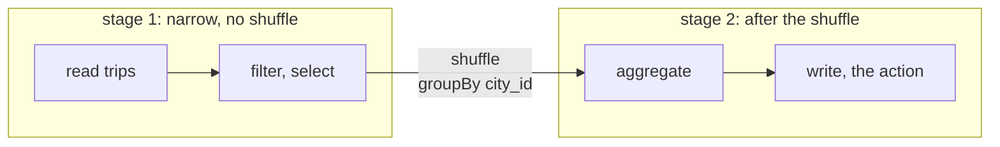
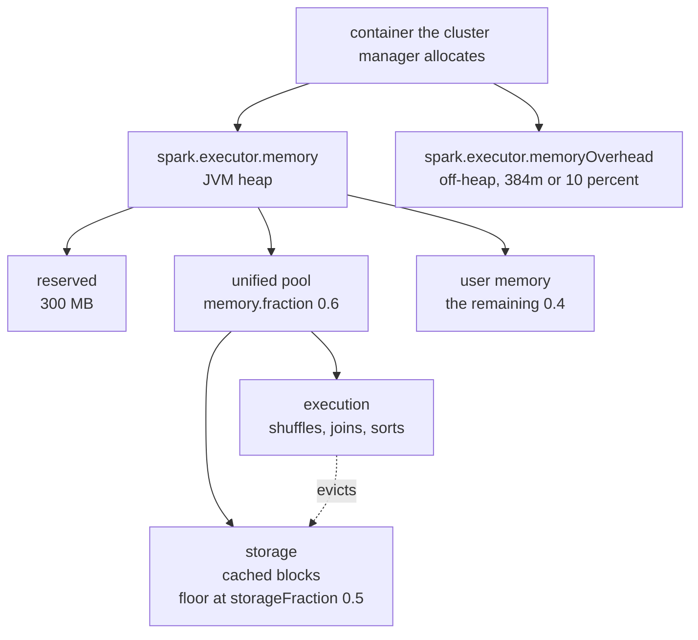
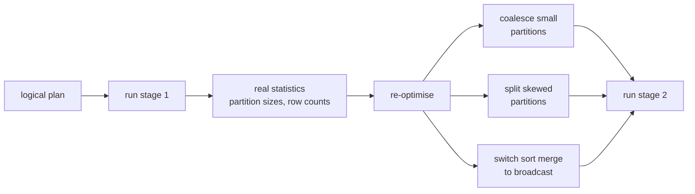

* content
{:toc}

> **TL;DR**
>
> * A job splits into stages at shuffle boundaries, and a stage runs one task per partition. Almost every Spark performance question is really a question about partitions.
> * ANSI mode is on by default from Spark 4.0. `spark.sql.ansi.enabled` defaults to true unless the `SPARK_ANSI_SQL_MODE` environment variable is set to `false`, and it turns silent nulls into runtime errors.
> * Adaptive query execution has been on by default since 3.2, and it coalesces partitions, splits skew and re-picks join strategies at runtime using real statistics.
> * Defaults worth memorising: `spark.executor.memory` and `spark.driver.memory` are 1g, `spark.executor.cores` is 1, `spark.sql.shuffle.partitions` is 200, and broadcast joins kick in under 10 MB.
> * The advisory shuffle partition size AQE aims for is 64 MB, not the 200-partition figure, so `spark.sql.shuffle.partitions` matters much less than it used to.

This is the Spark companion to the [Hudi]() and
[Iceberg]() cheat sheets, in the
same shape: every row gives you the concept, a literal example, and the sentence
that tells you whether you want it.

Written against the **latest Spark release, 4.2.0 as of now**. Every config key,
default and since-version below was read from the `v4.2.0` tag rather than
recalled. Diagrams captioned *Source: Apache Spark documentation* come
from `docs/img` in the Apache Spark source tree at that tag, &copy; The Apache
Software Foundation, used under the
[Apache License 2.0](https://www.apache.org/licenses/LICENSE-2.0); the rest are
my own. Where a default changed in Spark 4, it is called out, because those are
the ones that break a job on upgrade.

## 1. Architecture: the execution model

| Concept | Example | Description |
|:--|:--|:--|
| Driver | the JVM running your `main` | Builds the plan, schedules tasks, holds the `SparkSession`. Collecting a large result here is how you OOM it |
| Executor | one JVM per container | Runs tasks and holds cached blocks. Lives for the application, not the job |
| Job | one per action, such as `count()` | An action triggers a job. Transformations alone build a plan and run nothing |
| Stage | the boxes in the Spark UI DAG | A run of tasks with no shuffle between them. A new stage starts at every shuffle boundary |
| Task | one per partition, per stage | The unit of work sent to an executor slot. 200 partitions means 200 tasks |
| Partition | `df.rdd.getNumPartitions()` | The unit of parallelism. Too few starves the cluster, too many drowns it in scheduling |
| Shuffle | `groupBy`, `join`, `repartition` | Redistributes data across executors over the network. The expensive thing you are usually tuning around |
| Slot | `spark.executor.cores` per executor | How many tasks one executor runs at once. Total parallelism is executors times cores |


*Source: Apache Spark documentation.*



Everything between two shuffles is one stage, and a stage runs one task per
partition. That is the whole scheduling model, and it is why "how many
partitions" is the question behind most tuning.

Transformations are lazy and actions are eager. `filter`, `select`, `join` and
`withColumn` add to a plan; `count`, `collect`, `show` and `write` execute it.
That is why a typo in a `filter` often surfaces at the `write`, several lines
later.

## 2. spark-submit

```bash
spark-submit \
  --master yarn \
  --deploy-mode cluster \
  --name daily_trips_rollup \
  --class com.example.TripsRollup \
  --num-executors 20 \
  --executor-cores 4 \
  --executor-memory 16g \
  --driver-memory 8g \
  --conf spark.sql.shuffle.partitions=400 \
  --conf spark.dynamicAllocation.enabled=true \
  --jars /opt/jars/postgresql-42.7.3.jar \
  --files /etc/app/log4j2.properties \
  /opt/apps/trips-rollup-2.4.1.jar --run-date 2026-09-15
```

| Flag | Example | Description |
|:--|:--|:--|
| `--master` | `yarn`, `k8s://https://...`, `local[*]` | Which cluster manager to talk to |
| `--deploy-mode` | `cluster` or `client` | `cluster` runs the driver inside the cluster; `client` runs it where you typed the command |
| `--num-executors` | `20` | Static executor count. Ignored when dynamic allocation is on |
| `--executor-cores` | `4` | Slots per executor. Four to five is the usual sweet spot before HDFS throughput suffers |
| `--executor-memory` | `16g` | Heap per executor. Default `1g`, which is almost never what you want |
| `--driver-memory` | `8g` | Driver heap. Default `1g`. Raise it if you `collect` or broadcast large data |
| `--jars` | `/opt/jars/postgresql-42.7.3.jar` | Extra jars on the classpath of driver and executors |
| `--packages` | `org.apache.hudi:hudi-spark3.5-bundle_2.12:1.2.0` | Maven coordinates, resolved at submit time |
| `--files` | `/etc/app/log4j2.properties` | Files shipped to every working directory |
| `--conf` | `spark.sql.shuffle.partitions=400` | Any Spark property. Repeatable |

On Kubernetes the same roles map onto pods, with the driver pod creating and
owning the executor pods:


*Source: Apache Spark documentation.*

> **Note:** Arguments after the application jar go to your `main`, not to Spark.
> Anything Spark-facing must come before the jar, which is the most common
> `spark-submit` mistake.

## 3. Memory model

| Concept | Config | Default | Description |
|:--|:--|:--|:--|
| Executor heap | `spark.executor.memory` | `1g` | The JVM heap. Minimum accepted is 450m |
| Executor overhead | `spark.executor.memoryOverhead` | `384m` | Off-heap: VM overhead, interned strings, native libraries |
| Overhead factor | `spark.executor.memoryOverheadFactor` | `0.10` | Used instead of the flat value when larger. `0.40` for Kubernetes non-JVM jobs |
| Driver heap | `spark.driver.memory` | `1g` | Raise before you `collect` |
| Unified pool | `spark.memory.fraction` | `0.6` | Share of (heap minus 300 MB reserved) available for execution plus storage |
| Storage floor | `spark.memory.storageFraction` | `0.5` | The part of the unified pool that caching can hold against eviction |
| Cores per executor | `spark.executor.cores` | `1` | Concurrent tasks per executor. Each task shares the same heap |



The container your cluster manager sees is `spark.executor.memory` **plus**
overhead, so a `16g` executor with the default factor asks for about 17.6g. When
a job is killed for exceeding its container limit and the heap looked fine, the
overhead is the first thing to check.

Execution memory (shuffles, joins, sorts) and storage memory (cached blocks)
share one pool and borrow from each other. Execution can evict cached blocks down
to the storage floor; storage can never evict execution. That is why caching a
large DataFrame can quietly make a shuffle-heavy stage spill.

## 4. Reading and writing

| Operation | Example | Description |
|:--|:--|:--|
| Read Parquet | `spark.read.parquet("s3a://lakehouse-prod/raw/trips/")` | Schema comes from the footer. No inference pass |
| Read CSV with schema | `spark.read.schema(s).csv(path)` | Always supply a schema. Inference reads the file twice |
| Read JSON | `spark.read.json(path)` | Inference scans everything; supply a schema in production |
| Read JDBC | `.option("partitionColumn","id").option("numPartitions","8")` | Without a partition column the whole table arrives on one task |
| Write partitioned | `df.write.partitionBy("city_id").parquet(path)` | Directory-per-value. Keep cardinality low |
| Overwrite one partition | `spark.sql.sources.partitionOverwriteMode=dynamic` | Default is `STATIC`, which wipes the whole table on overwrite. This is a data-loss footgun |
| Control output files | `df.repartition(200).write...` | One output file per partition at write time |
| Max split size | `spark.sql.files.maxPartitionBytes` | `128MB` default. Sets how large an input partition gets |
| Open cost | `spark.sql.files.openCostInBytes` | `4MB` default. Estimated cost of opening a file, used to pack small files together |

```python
# The single most useful read option for JDBC: parallelism
trips = (spark.read.format("jdbc")
    .option("url", "jdbc:postgresql://db.internal:5432/rides")
    .option("dbtable", "public.trips")
    .option("user", "etl")
    .option("partitionColumn", "trip_id")
    .option("lowerBound", "1")
    .option("upperBound", "40000000")
    .option("numPartitions", "16")
    .load())
```

> **Note:** `spark.sql.sources.partitionOverwriteMode` defaults to `STATIC`, so
> `INSERT OVERWRITE` on a partitioned table replaces every partition, not just
> the ones in your DataFrame. Set it to `dynamic` for partition-scoped
> overwrites.

## 5. Joins

| Strategy | Hint | Description |
|:--|:--|:--|
| Broadcast hash join | `/*+ BROADCAST(d) */` | Ships the small side to every executor. No shuffle. The fastest option when one side fits |
| Shuffle hash join | `/*+ SHUFFLE_HASH(a, b) */` | Shuffles both sides, builds a hash table on one. Good when one side is much smaller but too big to broadcast |
| Sort merge join | `/*+ MERGE(a, b) */` | Shuffles and sorts both sides. The default for large-to-large joins |
| Broadcast nested loop | `/*+ SHUFFLE_REPLICATE_NL(a, b) */` | The fallback for non-equi joins. Quadratic, so watch it |

| Concept | Example | Description |
|:--|:--|:--|
| Broadcast threshold | `spark.sql.autoBroadcastJoinThreshold` | `10MB` default. Raise it when the small side is well-known and stats are reliable |
| Disable broadcast | set the threshold to `-1` | Useful when a bad size estimate keeps broadcasting something large and OOMing the driver |
| AQE broadcast threshold | `spark.sql.adaptive.autoBroadcastJoinThreshold` | No static default; falls back to the non-AQE threshold. Applies using runtime sizes |
| Join hint in SQL | `SELECT /*+ BROADCAST(cities) */ ...` | Hints go right after `SELECT` |
| Join hint in Python | `trips.join(broadcast(cities), "city_id")` | `from pyspark.sql.functions import broadcast` |

```sql
SELECT /*+ BROADCAST(c) */ t.trip_id, t.fare_amount, c.city_name
FROM trips t JOIN cities c ON t.city_id = c.city_id;
```

The join that hurts is the one where both sides are large and the key is skewed.
AQE handles the common case automatically; see the skew settings below.

## 6. Shuffle and partitioning

| Operation | Example | Description |
|:--|:--|:--|
| `repartition(n)` | `df.repartition(200)` | Full shuffle to exactly n partitions. Use to increase parallelism or even out skew |
| `repartition(col)` | `df.repartition("city_id")` | Hash-partition by column. Co-locates a key before a join or a write |
| `coalesce(n)` | `df.coalesce(10)` | Merges partitions without a full shuffle. Cheap, but can starve upstream parallelism |
| `partitionBy` | `df.write.partitionBy("dt")` | A write-time directory layout, unrelated to `repartition` |
| Shuffle partitions | `spark.sql.shuffle.partitions` | `200` default since 1.1.0. The post-shuffle partition count when AQE is not coalescing |
| Default parallelism | `spark.default.parallelism` | RDD-level default. Ignored by DataFrame shuffles |

The `coalesce` trap is worth spelling out: `df.repartition(1000).coalesce(1)`
does not give you 1000-way parallelism then one file. Because `coalesce` avoids
the shuffle, it pushes the narrow partition count up the DAG, and the upstream
work runs with one task. Use `repartition(1)` when you genuinely want the shuffle.

## 7. Adaptive query execution

AQE re-optimises the plan mid-flight using statistics from completed stages,
which is why it beats anything you can set by hand ahead of time.



| Feature | Config | Default | Description |
|:--|:--|:--|:--|
| Enable AQE | `spark.sql.adaptive.enabled` | `true` | On by default since 3.2 |
| Coalesce partitions | `spark.sql.adaptive.coalescePartitions.enabled` | `true` | Merges small post-shuffle partitions, so an over-large `shuffle.partitions` stops mattering |
| Advisory size | `spark.sql.adaptive.advisoryPartitionSizeInBytes` | `64MB` | The post-shuffle partition size AQE aims for |
| Minimum size | `spark.sql.adaptive.coalescePartitions.minPartitionSize` | `1MB` | Floor, so coalescing does not produce tiny partitions |
| Skew join handling | `spark.sql.adaptive.skewJoin.enabled` | `true` | Splits oversized partitions on the skewed side |
| Skew factor | `spark.sql.adaptive.skewJoin.skewedPartitionFactor` | `5.0` | A partition is skewed at this multiple of the median |
| Skew threshold | `spark.sql.adaptive.skewJoin.skewedPartitionThresholdInBytes` | `256MB` | And it must also exceed this absolute size |
| Local shuffle reader | `spark.sql.adaptive.localShuffleReader.enabled` | `true` | Avoids a network fetch when a sort merge join becomes a broadcast join |

Both skew conditions must hold: a partition is treated as skewed only when it is
larger than 5 times the median **and** larger than 256 MB. On a job whose
partitions are all under 256 MB, skew handling never fires no matter how uneven
they are, which is the usual reason "AQE skew join is on but nothing happened".

## 8. Caching

| Level | Example | Description |
|:--|:--|:--|
| `MEMORY_AND_DISK` | `df.cache()` | The default for DataFrames. Spills to disk rather than recomputing |
| `MEMORY_ONLY` | `df.persist(StorageLevel.MEMORY_ONLY)` | Recomputes anything that does not fit. The RDD default |
| `MEMORY_AND_DISK_SER` | `persist(StorageLevel.MEMORY_AND_DISK_SER)` | Serialised: smaller, more CPU |
| `DISK_ONLY` | `persist(StorageLevel.DISK_ONLY)` | For expensive-to-recompute data too big for memory |
| Release it | `df.unpersist()` | Cached blocks compete with execution memory. Free them when the branch is done |
| Checkpoint | `df.checkpoint()` | Writes to reliable storage and truncates the lineage. For very long or iterative plans |

Cache when a DataFrame is used more than once **and** producing it was expensive.
Caching something read once makes the job slower, because you pay the write and
give up memory that execution wanted.

## 9. Spark SQL and ANSI mode

The biggest behavioural change in the Spark 4 line is ANSI mode.
`spark.sql.ansi.enabled` now defaults to true, and the default is computed as
"true unless the `SPARK_ANSI_SQL_MODE` environment variable is set to `false`".

| Behaviour | ANSI off, Spark 3 style | ANSI on, Spark 4 default |
|:--|:--|:--|
| Integer overflow | Wraps silently | Raises an arithmetic overflow error |
| Divide by zero | Returns `NULL` | Raises a divide-by-zero error |
| `CAST('abc' AS INT)` | Returns `NULL` | Raises a cast error |
| Out-of-range store | Silently truncates or nulls | Rejected at analysis time |

| Concept | Example | Description |
|:--|:--|:--|
| Turn ANSI off per session | `SET spark.sql.ansi.enabled=false` | The quick unblock when an upgrade surfaces bad data |
| Turn it off cluster-wide | `SPARK_ANSI_SQL_MODE=false` | The environment escape hatch the default reads |
| Safe cast | `try_cast(x AS INT)` | Returns `NULL` instead of raising, without disabling ANSI globally |
| Safe arithmetic | `try_divide(a, b)`, `try_add(a, b)` | Per-expression opt-out. The better fix than a global switch |
| Store assignment | `spark.sql.storeAssignmentPolicy` | `ANSI`. Governs what an `INSERT` will implicitly coerce |
| Cost-based optimiser | `spark.sql.cbo.enabled` | `false`. Needs `ANALYZE TABLE ... COMPUTE STATISTICS` to be worth enabling |

Treat an ANSI failure on upgrade as a finding rather than a blocker: the error is
usually pointing at data that was silently becoming `NULL` before. Reach for
`try_cast` and `try_divide` at the specific expression before turning the flag
off everywhere.

## 10. Structured Streaming

The model to hold in your head is that a stream is an unbounded table, with each
arriving batch appended as new rows:


*Source: Apache Spark documentation.*

A query over that table produces a result table, recomputed incrementally each
trigger, and the output mode decides which of its rows get written out:


*Source: Apache Spark documentation.*

| Concept | Example | Description |
|:--|:--|:--|
| Source | `spark.readStream.format("kafka")` | Kafka, files, rate, socket. Same DataFrame API as batch |
| Sink | `.writeStream.format("delta")` | Files, Kafka, `foreachBatch`, console, memory |
| Checkpoint | `.option("checkpointLocation", path)` | Required for fault tolerance. One per query, never shared |
| Trigger: micro-batch | `.trigger(processingTime="1 minute")` | Fixed cadence. The default is as fast as possible |
| Trigger: once | `.trigger(availableNow=True)` | Process everything outstanding and stop. The batch-shaped way to run a stream |
| Output: append | `.outputMode("append")` | New rows only. The default, and the only one many sinks accept |
| Output: update | `.outputMode("update")` | Rows whose aggregate changed |
| Output: complete | `.outputMode("complete")` | The whole result table every batch. Aggregations only |
| Watermark | `.withWatermark("event_time", "10 minutes")` | How late an event may arrive. Bounds the state store |
| Arbitrary sink logic | `.foreachBatch(fn)` | Gives you a batch DataFrame per micro-batch. How you write to a sink with no native connector |

```python
(spark.readStream.format("kafka")
    .option("kafka.bootstrap.servers", "kafka-broker1:9092")
    .option("subscribe", "trips")
    .option("startingOffsets", "latest")
    .load()
    .selectExpr("CAST(value AS STRING) AS payload", "timestamp AS event_time")
    .withWatermark("event_time", "10 minutes")
    .writeStream
    .format("parquet")
    .option("checkpointLocation", "s3a://lakehouse-prod/checkpoints/trips")
    .option("path", "s3a://lakehouse-prod/warehouse/trips_raw")
    .trigger(processingTime="1 minute")
    .outputMode("append")
    .start())
```

Event-time windows come in three shapes, and the choice changes how many windows
a single record lands in:


*Source: Apache Spark documentation.*

The watermark is what lets Spark finalise a window and drop its state. Anything
arriving behind the watermark is too late to be counted:


*Source: Apache Spark documentation.*

Without a watermark, a streaming aggregation keeps state forever and the job
degrades over days rather than failing outright. The watermark is what lets Spark
drop state it will never need again.

## 11. Useful functions and patterns

| Pattern | Example | Description |
|:--|:--|:--|
| Window ranking | `row_number().over(Window.partitionBy("city_id").orderBy(desc("fare")))` | Deduplicate or top-N per group. One shuffle, unlike a self-join |
| Deduplicate by key | `dropDuplicates(["trip_id"])` | Keeps an arbitrary row. Use a window with an explicit order when which row wins matters |
| Explode arrays | `select(explode("items").alias("item"))` | One output row per element |
| Pivot | `groupBy("city_id").pivot("status").count()` | Supply the value list to avoid a pass that discovers it |
| Conditional | `when(col("fare") > 50, "high").otherwise("low")` | The SQL `CASE` equivalent |
| Null-safe equality | `col("a").eqNullSafe(col("b"))` | `<=>` in SQL. Treats null equal to null, unlike `=` |
| Coalesce nulls | `coalesce(col("a"), col("b"), lit(0))` | First non-null. Unrelated to `DataFrame.coalesce` |
| Salting a skewed key | `concat(col("k"), lit("_"), (rand()*16).cast("int"))` | Spreads a hot key across partitions when AQE skew handling does not fire |
| Broadcast a small side | `join(broadcast(dim), "city_id")` | Forces the strategy when statistics are unreliable |
| Inspect the plan | `df.explain("formatted")` | `formatted`, `extended` or `cost`. The fastest way to check a pushdown |

```python
from pyspark.sql import Window
from pyspark.sql.functions import row_number, desc, col

# Latest row per trip, which is the shape most CDC dedup takes
latest = (trips
    .withColumn("rn", row_number().over(
        Window.partitionBy("trip_id").orderBy(desc("updated_at"))))
    .where(col("rn") == 1)
    .drop("rn"))
```

## 12. Diagnosing a slow job

| Symptom | Where to look | Likely cause |
|:--|:--|:--|
| A few tasks take far longer than the rest | Stage page, task duration percentiles | Skew. Check AQE skew thresholds, or salt the key |
| Huge spill to disk | Stage page, spill columns | Partitions too large. Raise parallelism or lower the advisory size |
| Thousands of tiny tasks | Stage page, task count and median duration | Over-partitioned input, or too many small files |
| Driver out of memory | Driver logs | A `collect`, or a broadcast of something much larger than estimated |
| Container killed, heap looked fine | Cluster manager logs | `memoryOverhead` too small for the workload |
| Stage retries repeatedly | Stage page, failure reason | Executor loss, often overhead or a shuffle fetch failure |
| Planning slower than execution | SQL tab, plan time | Too many files or partitions. Compact, or prune harder |
| Reads scan everything | SQL tab, physical plan | Predicate not pushed down. Check the filter is on a partition or statistics column |

The stages page is where skew and spill show up, because it gives you the task
duration percentiles rather than just an average:


*Source: Apache Spark documentation.*

And the SQL tab lists each query with its duration and plan:


*Source: Apache Spark documentation.*

Opening one gives you the physical plan annotated with row counts per node, which
answers "did my filter push down" and "which side got broadcast" directly:


*Source: Apache Spark documentation.*

The Spark UI SQL tab is the most useful page and the least used. It shows the
physical plan with row counts per node, which answers "did my filter push down"
and "which side got broadcast" directly, rather than by inference.

## 13. What changed in Spark 4

| Change | Description |
|:--|:--|
| ANSI mode on by default | `spark.sql.ansi.enabled` is now true. Silent nulls become runtime errors. The single most likely upgrade break |
| `VARIANT` type | Semi-structured data as a first-class type, without parsing JSON on every read |
| Spark Connect matured | A thin client protocol, so the driver no longer has to run in your application process |
| Python data sources | Custom sources and sinks in pure Python, without writing Scala |
| Collations | String comparison and sorting rules per column, including case-insensitive |

When upgrading from the 3.x line, test with `spark.sql.ansi.enabled=true` under
your old runtime first. That isolates ANSI failures from everything else in the
upgrade and turns one large change into two small ones.

## Conclusion

Most Spark tuning reduces to three questions: how many partitions, how large, and
is the data evenly spread across them. Executor sizing and memory fractions
matter, but they matter because they decide how much work a single task can hold
before it spills.

Adaptive query execution has absorbed most of what used to be manual tuning. It
coalesces small partitions, splits skew and re-picks join strategies from real
statistics, which means `spark.sql.shuffle.partitions` is far less load-bearing
than the tuning guides of a few years ago suggest. Set it roughly and let AQE
adjust.

The one thing to plan for deliberately on the 4.x line is ANSI mode. It is a good
default and it will surface data problems that the 3.x line hid, so give it a
dedicated test pass rather than meeting it during an upgrade.

## References

* [Spark configuration reference](https://spark.apache.org/docs/latest/configuration.html) for every property, its default and the version it appeared in
* [SQL performance tuning](https://spark.apache.org/docs/latest/sql-performance-tuning.html) for adaptive query execution, join hints and partition coalescing
* [Structured Streaming programming guide](https://spark.apache.org/docs/latest/structured-streaming-programming-guide.html) for triggers, watermarks and output modes
* [ANSI compliance](https://spark.apache.org/docs/latest/sql-ref-ansi-compliance.html) for the full list of behaviours the Spark 4 default changes
* [Apache Hudi on Spark: the complete cheat sheet]() for the lakehouse layer on top of this
